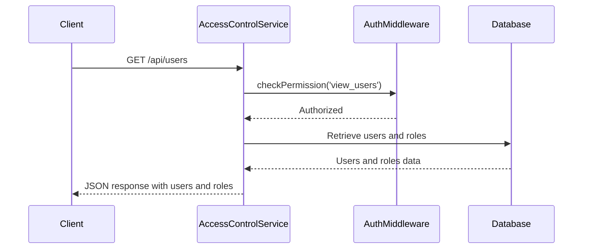
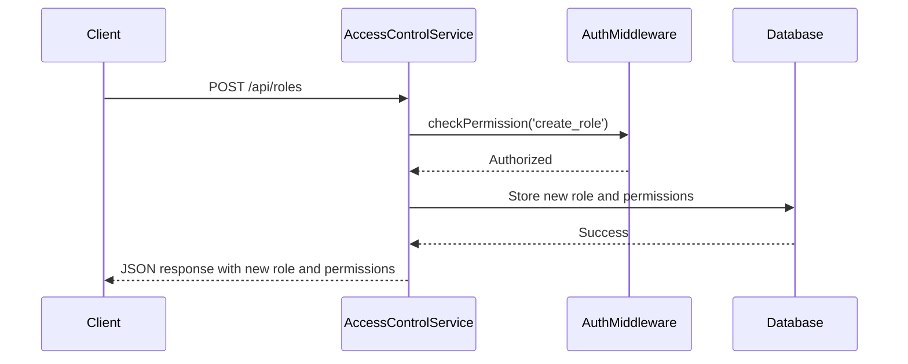
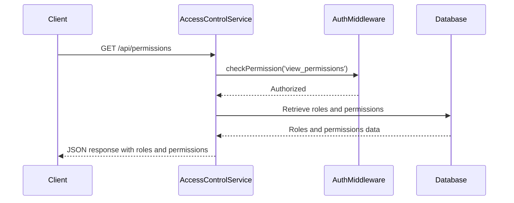
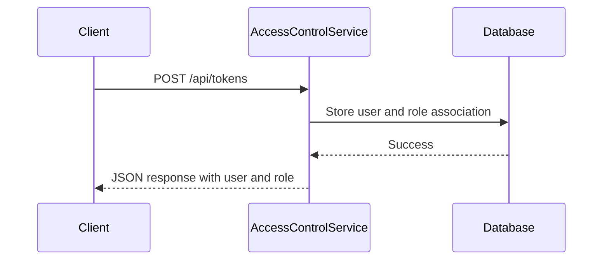
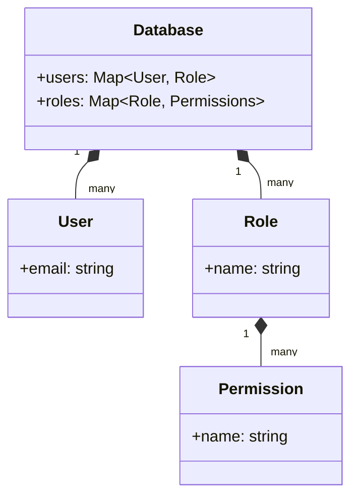
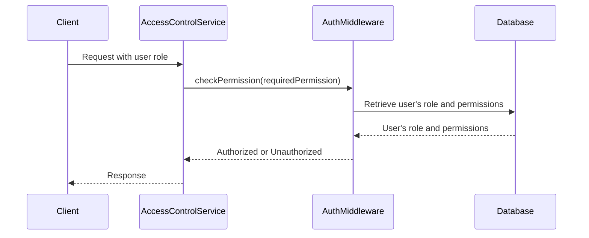

<details>
<summary>Relevant source files</summary>

The following files were used as context for generating this wiki page:

- [src/index.js](https://github.com/aanickode/access-control-service/blob/main/src/index.js)
- [src/routes.js](https://github.com/aanickode/access-control-service/blob/main/src/routes.js)
- [src/authMiddleware.js](https://github.com/aanickode/access-control-service/blob/main/src/authMiddleware.js)
- [src/db.js](https://github.com/aanickode/access-control-service/blob/main/src/db.js)
- [package.json](https://github.com/aanickode/access-control-service/blob/main/package.json)
</details>

# Architecture Overview

The Access Control Service is a Node.js application built with Express.js that provides a RESTful API for managing user roles, permissions, and access tokens. It serves as a centralized access control system for other applications or services within a larger project.

Sources: [src/index.js](), [src/routes.js](), [package.json]()

## Application Structure

The application follows a modular structure with separate files for different concerns:

- `index.js`: The entry point that sets up the Express application, loads environment variables, and starts the server.
- `routes.js`: Defines the API routes and their respective handlers.
- `authMiddleware.js`: Contains a middleware function for checking user permissions.
- `db.js`: Provides an in-memory data store for users, roles, and permissions.

Sources: [src/index.js](), [src/routes.js](), [src/authMiddleware.js](), [src/db.js]()

## API Routes

The application exposes the following API routes:

```mermaid
graph TD
    A[/api] --> B[/users]
    A --> C[/roles]
    A --> D[/permissions]
    A --> E[/tokens]
    B --> F[GET /users]
    C --> G[POST /roles]
    D --> H[GET /permissions]
    E --> I[POST /tokens]
    F --> J[Retrieve list of users and roles]
    G --> K[Create a new role with permissions]
    H --> L[Retrieve all defined roles and permissions]
    I --> M[Create a new access token for a user]
```

Sources: [src/routes.js:5-29]()

### GET /users

Retrieves a list of all users and their associated roles. This route requires the `view_users` permission.



Sources: [src/routes.js:5-7](), [src/authMiddleware.js]()

### POST /roles

Creates a new role with a set of permissions. This route requires the `create_role` permission.



Sources: [src/routes.js:9-15](), [src/authMiddleware.js]()

### GET /permissions

Retrieves all defined roles and their associated permissions. This route requires the `view_permissions` permission.



Sources: [src/routes.js:17-19](), [src/authMiddleware.js]()

### POST /tokens

Creates a new access token for a user by associating the user with a role. No permission is required for this route.



Sources: [src/routes.js:21-27]()

## Data Storage

The application uses an in-memory data store (`db.js`) to store users, roles, and permissions. In a production environment, this should be replaced with a persistent data store like a database.



Sources: [src/db.js]()

## Authentication and Authorization

The application uses a simple permission-based access control system. Each role is associated with a set of permissions, and users are assigned roles.

The `authMiddleware.js` module provides a middleware function `checkPermission` that checks if the user has the required permission for a given route. The middleware assumes that the user's role is available in the request object (e.g., through an authentication mechanism not shown in the provided files).



Sources: [src/authMiddleware.js](), [src/db.js]()

## Summary

The Access Control Service provides a centralized API for managing user roles, permissions, and access tokens. It follows a modular structure and uses an in-memory data store for simplicity. The application implements a permission-based access control system, where users are assigned roles, and roles are associated with specific permissions. The API endpoints allow creating and retrieving roles, permissions, and access tokens, as well as retrieving a list of users and their roles.

Sources: [src/index.js](), [src/routes.js](), [src/authMiddleware.js](), [src/db.js]()