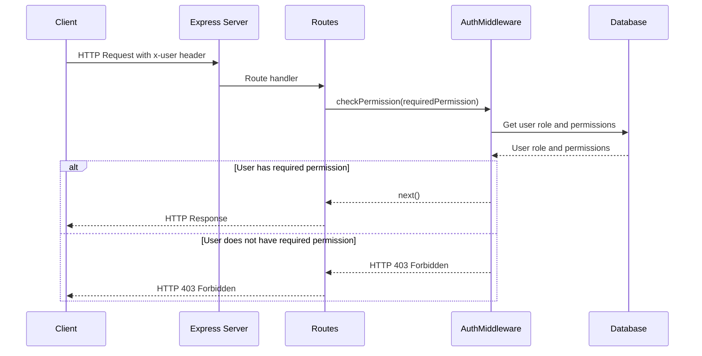
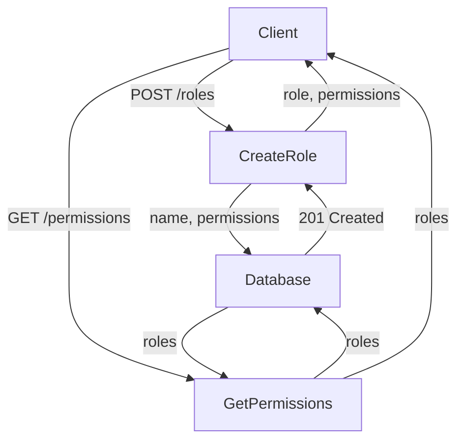
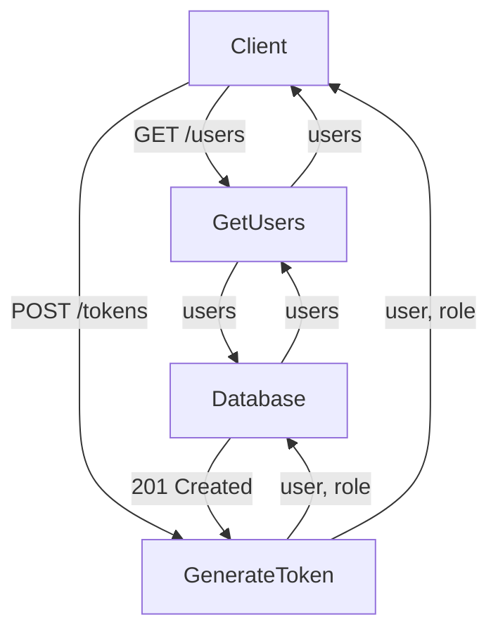

<details>
<summary>Relevant source files</summary>

The following files were used as context for generating this wiki page:

- [src/index.js](https://github.com/aanickode/access-control-service/blob/main/src/index.js)
- [src/routes.js](https://github.com/aanickode/access-control-service/blob/main/src/routes.js)
- [src/authMiddleware.js](https://github.com/aanickode/access-control-service/blob/main/src/authMiddleware.js)
- [src/db.js](https://github.com/aanickode/access-control-service/blob/main/src/db.js)
- [package.json](https://github.com/aanickode/access-control-service/blob/main/package.json)
</details>

# Architecture Overview

## Introduction

This project is an Access Control Service built with Node.js and Express.js. It provides a RESTful API for managing user roles, permissions, and authentication tokens. The service allows authorized users to view a list of registered users, create new roles with associated permissions, view defined permissions, and generate authentication tokens for users with specific roles.

Sources: [src/index.js](), [src/routes.js](), [package.json]()

## Express.js Server

The main entry point of the application is `src/index.js`, which sets up an Express.js server and configures the API routes.

```js
import express from 'express';
import dotenv from 'dotenv';
import routes from './routes.js';

dotenv.config();

const app = express();
app.use(express.json());
app.use('/allapis', routes);

const port = process.env.PORT || 8080;

app.listen(port, () => {
  console.log(`Access Control Service listening on port ${port}`);
});
```

The server listens on the port specified by the `PORT` environment variable or defaults to `8080`. It uses the `express.json()` middleware to parse JSON request bodies and mounts the API routes defined in `src/routes.js` at the `/allapis` path.

Sources: [src/index.js]()

## API Routes

The `src/routes.js` file defines the API routes and their corresponding handlers.

```js
import express from 'express';
import { checkPermission } from './authMiddleware.js';
import db from './db.js';

const router = express.Router();

router.get('/users', checkPermission('view_users'), (req, res) => {
  res.json(Object.entries(db.users).map(([email, role]) => ({ email, role })));
});

router.post('/roles', checkPermission('create_role'), (req, res) => {
  const { name, permissions } = req.body;
  if (!name || !Array.isArray(permissions)) {
    return res.status(400).json({ error: 'Invalid role definition' });
  }
  db.roles[name] = permissions;
  res.status(201).json({ role: name, permissions });
});

router.get('/permissions', checkPermission('view_permissions'), (req, res) => {
  res.json(db.roles);
});

router.post('/tokens', (req, res) => {
  const { user, role } = req.body;
  if (!user || !role) {
    return res.status(400).json({ error: 'Missing user or role' });
  }
  db.users[user] = role;
  res.status(201).json({ user, role });
});

export default router;
```

The routes are:

1. `GET /users`: Retrieves a list of registered users and their roles. Requires the `view_users` permission.
2. `POST /roles`: Creates a new role with specified permissions. Requires the `create_role` permission.
3. `GET /permissions`: Retrieves a list of defined roles and their associated permissions. Requires the `view_permissions` permission.
4. `POST /tokens`: Generates an authentication token for a user with a specific role.

The `checkPermission` middleware from `src/authMiddleware.js` is used to enforce permission checks for certain routes.

Sources: [src/routes.js](), [src/authMiddleware.js]()

## Data Storage

The application uses an in-memory data store defined in `src/db.js` to store user roles, permissions, and authentication tokens.

```js
const db = {
  users: {},
  roles: {},
};

export default db;
```

The `users` object maps user identifiers (e.g., email addresses) to their assigned roles, while the `roles` object maps role names to their associated permissions.

Sources: [src/db.js]()

## Authentication and Authorization

The `src/authMiddleware.js` file contains a middleware function `checkPermission` that checks if a user has the required permission to access a specific route.

```js
import db from './db.js';

export const checkPermission = (requiredPermission) => (req, res, next) => {
  const user = req.headers['x-user'] || '';
  const role = db.users[user];
  if (!role) {
    return res.status(403).json({ error: 'Unauthorized' });
  }
  const permissions = db.roles[role];
  if (!permissions || !permissions.includes(requiredPermission)) {
    return res.status(403).json({ error: 'Forbidden' });
  }
  next();
};
```

The middleware expects the user identifier to be provided in the `x-user` header of the request. It retrieves the user's role from the `db.users` object and checks if the associated permissions in `db.roles` include the required permission. If the user is not authorized, the middleware returns a `403 Forbidden` or `403 Unauthorized` response.

Sources: [src/authMiddleware.js]()

## Data Flow

The following sequence diagram illustrates the flow of data and interactions between the components when a user attempts to access a protected route:



1. The client sends an HTTP request with the `x-user` header containing the user identifier.
2. The Express server routes the request to the appropriate route handler in `src/routes.js`.
3. The route handler calls the `checkPermission` middleware from `src/authMiddleware.js` with the required permission.
4. The `checkPermission` middleware retrieves the user's role and associated permissions from the in-memory database (`src/db.js`).
5. If the user has the required permission, the middleware calls `next()`, allowing the route handler to execute and send the response.
6. If the user does not have the required permission, the middleware sends a `403 Forbidden` response.

Sources: [src/routes.js](), [src/authMiddleware.js](), [src/db.js]()

## Role and Permission Management

The application provides endpoints for managing roles and permissions:



1. `POST /roles`: Allows authorized users to create a new role with specified permissions.
   - The client sends a `POST` request to `/roles` with the role name and an array of permissions in the request body.
   - The `CreateRole` route handler validates the request body and stores the new role and permissions in the in-memory database.
   - The route handler responds with a `201 Created` status and the created role and permissions.

2. `GET /permissions`: Allows authorized users to retrieve a list of defined roles and their associated permissions.
   - The client sends a `GET` request to `/permissions`.
   - The `GetPermissions` route handler retrieves the roles and permissions from the in-memory database.
   - The route handler responds with the roles and permissions.

Sources: [src/routes.js](), [src/db.js]()

## User Management

The application provides endpoints for managing users and generating authentication tokens:



1. `GET /users`: Allows authorized users to retrieve a list of registered users and their roles.
   - The client sends a `GET` request to `/users`.
   - The `GetUsers` route handler retrieves the users and their roles from the in-memory database.
   - The route handler responds with the list of users and their roles.

2. `POST /tokens`: Allows clients to generate an authentication token for a user with a specific role.
   - The client sends a `POST` request to `/tokens` with the user identifier and role in the request body.
   - The `GenerateToken` route handler stores the user and role in the in-memory database.
   - The route handler responds with a `201 Created` status and the user and role.

Sources: [src/routes.js](), [src/db.js]()

## Conclusion

The Access Control Service provides a RESTful API for managing user roles, permissions, and authentication tokens. It enforces authorization checks using a middleware and stores data in an in-memory database. The service allows authorized users to create and view roles and permissions, as well as generate authentication tokens for users with specific roles.

Sources: [src/index.js](), [src/routes.js](), [src/authMiddleware.js](), [src/db.js]()