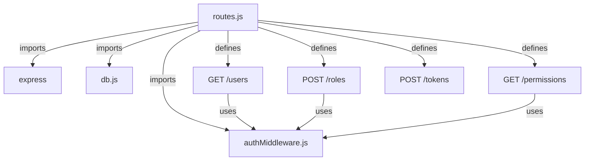
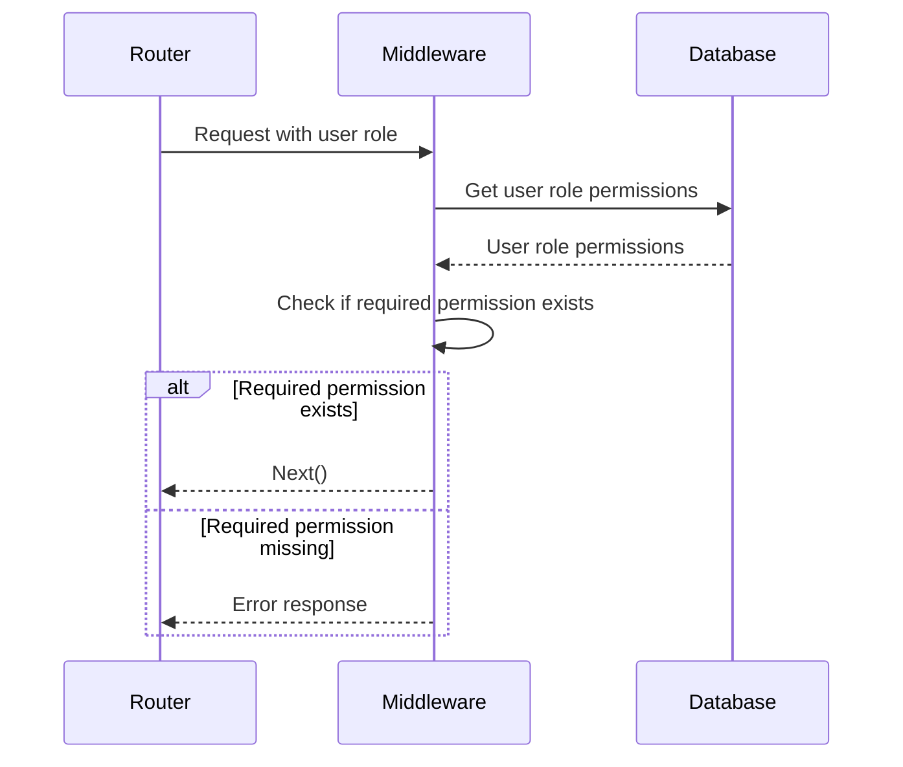
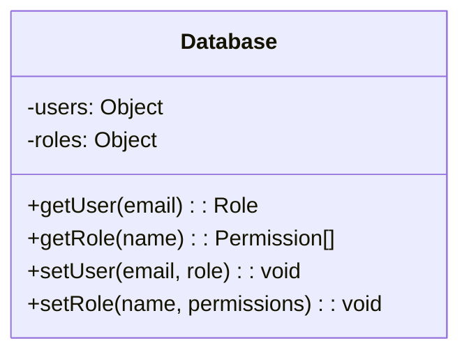
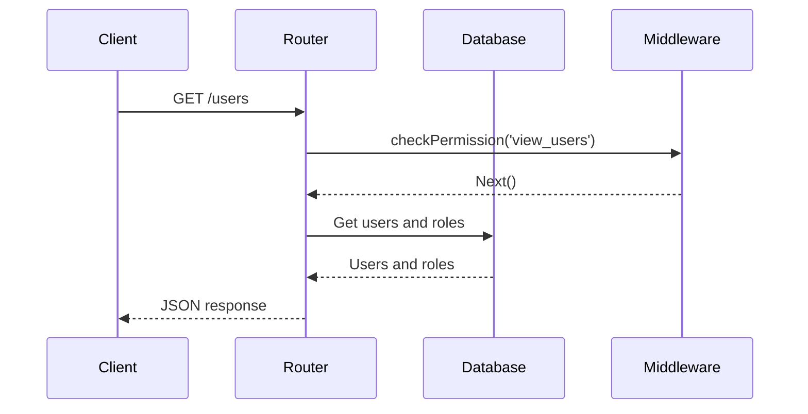
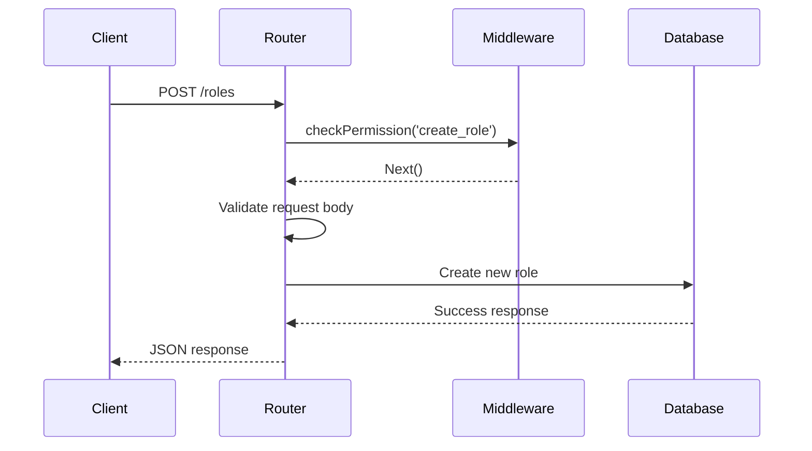
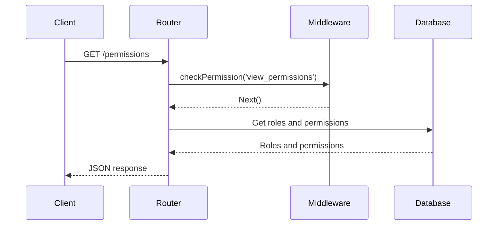
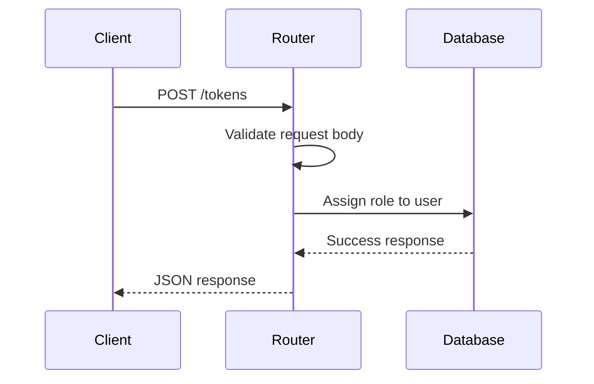

<details>
<summary>Relevant source files</summary>

The following files were used as context for generating this wiki page:

- [src/index.js](https://github.com/aanickode/access-control-service/blob/main/src/index.js)
- [src/routes.js](https://github.com/aanickode/access-control-service/blob/main/src/routes.js)
- [src/authMiddleware.js](https://github.com/aanickode/access-control-service/blob/main/src/authMiddleware.js)
- [src/db.js](https://github.com/aanickode/access-control-service/blob/main/src/db.js)
- [package.json](https://github.com/aanickode/access-control-service/blob/main/package.json)
</details>

# Architecture Overview

## Introduction

This project is an Access Control Service built with Node.js and Express.js. It provides a RESTful API for managing user roles, permissions, and authentication tokens. The service maintains an in-memory database to store user roles, permissions, and associated data.

The primary purpose of the Access Control Service is to enforce role-based access control (RBAC) for other applications or services within the same system. It allows defining roles with specific permissions, assigning roles to users, and verifying user permissions before granting access to protected resources or operations.

Sources: [src/index.js](), [src/routes.js](), [package.json]()

## Application Structure

The application follows a typical Express.js structure with the following key components:

### Entry Point (`src/index.js`)

The `index.js` file serves as the entry point for the application. It sets up the Express.js server, configures middleware, and mounts the API routes.

```mermaid
graph TD
    A[index.js] -->|imports| B[express]
    A -->|imports| C[dotenv]
    A -->|imports| D[routes.js]
    A -->|uses| E[express.json()]
    A -->|mounts| D
    A -->|listens on| F[Port]
```

Sources: [src/index.js]()

### Routes (`src/routes.js`)

The `routes.js` file defines the API routes and their corresponding handlers. It imports the `checkPermission` middleware from `authMiddleware.js` and the in-memory database from `db.js`.



Sources: [src/routes.js]()

### Authentication Middleware (`src/authMiddleware.js`)

The `authMiddleware.js` file contains the `checkPermission` middleware function, which verifies if a user has the required permission based on their assigned role.



Sources: [src/authMiddleware.js]()

### In-Memory Database (`src/db.js`)

The `db.js` file provides a simple in-memory database implementation using JavaScript objects. It stores user roles, permissions, and user-role assignments.



Sources: [src/db.js]()

## API Endpoints

The Access Control Service exposes the following API endpoints:

| Endpoint       | Method | Description                                                  |
|-----------------|--------|--------------------------------------------------------------|
| `/users`        | GET    | Retrieve a list of users and their assigned roles.           |
| `/roles`        | POST   | Create a new role with a set of permissions.                 |
| `/permissions`  | GET    | Retrieve a list of all defined roles and their permissions.  |
| `/tokens`       | POST   | Assign a role to a user (simulating token generation).       |

Sources: [src/routes.js]()

### GET `/users`

This endpoint retrieves a list of users and their assigned roles from the in-memory database.



Sources: [src/routes.js:5-8]()

### POST `/roles`

This endpoint creates a new role with a set of permissions in the in-memory database.



Sources: [src/routes.js:10-17]()

### GET `/permissions`

This endpoint retrieves a list of all defined roles and their associated permissions from the in-memory database.



Sources: [src/routes.js:19-22]()

### POST `/tokens`

This endpoint simulates the generation of an authentication token by assigning a role to a user in the in-memory database.



Sources: [src/routes.js:24-31]()

## Conclusion

The Access Control Service provides a simple yet functional implementation of role-based access control (RBAC) using Node.js and Express.js. It allows defining roles with specific permissions, assigning roles to users, and verifying user permissions before granting access to protected resources or operations. The service uses an in-memory database for storing user roles, permissions, and associated data, making it suitable for small-scale or prototyping purposes.

Sources: [src/index.js](), [src/routes.js](), [src/authMiddleware.js](), [src/db.js]()