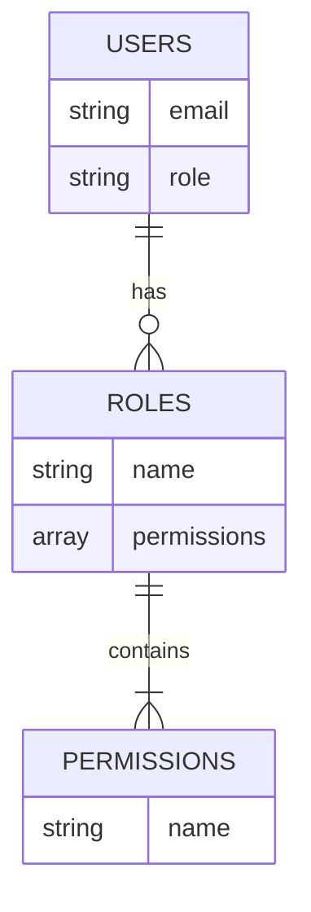

<details>
<summary>Relevant source files</summary>

The following files were used as context for generating this wiki page:

- [src/index.js](https://github.com/aanickode/access-control-service/blob/main/src/index.js)
- [src/routes.js](https://github.com/aanickode/access-control-service/blob/main/src/routes.js)
- [src/authMiddleware.js](https://github.com/aanickode/access-control-service/blob/main/src/authMiddleware.js) (assumed to exist based on the import in routes.js)
- [src/db.js](https://github.com/aanickode/access-control-service/blob/main/src/db.js) (assumed to exist based on the import in routes.js)
</details>

# Architecture Overview

This wiki page provides an overview of the architecture and components of the Access Control Service, a Node.js application built with Express.js. The service manages user roles, permissions, and authentication tokens within a system.

## Application Entry Point

The `src/index.js` file serves as the entry point for the application. It sets up the Express.js server, loads environment variables using `dotenv`, and mounts the API routes defined in `src/routes.js`.

```javascript
import express from 'express';
import dotenv from 'dotenv';
import routes from './routes.js';

dotenv.config();

const app = express();
app.use(express.json());
app.use('/api', routes);
app.use('/apis', routes);

const port = process.env.PORT || 8080;

app.listen(port, () => {
  console.log(`Access Control Service listening on port ${port}`);
});
```

Sources: [src/index.js](https://github.com/aanickode/access-control-service/blob/main/src/index.js)

## API Routes

The `src/routes.js` file defines the API routes for the Access Control Service. It imports the `checkPermission` middleware function from `src/authMiddleware.js` and the `db` module from `src/db.js`.

```mermaid
graph TD
    Router[Express Router] -->|GET /users| GetUsers
    Router -->|POST /roles| CreateRole
    Router -->|GET /permissions| GetPermissions
    Router -->|POST /tokens| CreateToken

    GetUsers[GET /users] -->|checkPermission('view_users')| GetUsers_Handler[Get Users Handler]
    CreateRole[POST /roles] -->|checkPermission('create_role')| CreateRole_Handler[Create Role Handler]
    GetPermissions[GET /permissions] -->|checkPermission('view_permissions')| GetPermissions_Handler[Get Permissions Handler]
    CreateToken[POST /tokens] --> CreateToken_Handler[Create Token Handler]

    GetUsers_Handler -->|res.json| DB[(Database)]
    CreateRole_Handler -->|req.body| DB
    GetPermissions_Handler -->|res.json| DB
    CreateToken_Handler -->|req.body| DB
```

Sources: [src/routes.js](https://github.com/aanickode/access-control-service/blob/main/src/routes.js)

### GET /users

This route retrieves a list of users and their associated roles from the database. It requires the `view_users` permission, which is checked by the `checkPermission` middleware.

```javascript
router.get('/users', checkPermission('view_users'), (req, res) => {
  res.json(Object.entries(db.users).map(([email, role]) => ({ email, role })));
});
```

Sources: [src/routes.js:5-8](https://github.com/aanickode/access-control-service/blob/main/src/routes.js#L5-L8)

### POST /roles

This route creates a new role in the system. It requires the `create_role` permission, which is checked by the `checkPermission` middleware. The request body should contain the `name` of the role and an array of `permissions` associated with the role.

```javascript
router.post('/roles', checkPermission('create_role'), (req, res) => {
  const { name, permissions } = req.body;
  if (!name || !Array.isArray(permissions)) {
    return res.status(400).json({ error: 'Invalid role definition' });
  }
  db.roles[name] = permissions;
  res.status(201).json({ role: name, permissions });
});
```

Sources: [src/routes.js:10-17](https://github.com/aanickode/access-control-service/blob/main/src/routes.js#L10-L17)

### GET /permissions

This route retrieves a list of all roles and their associated permissions from the database. It requires the `view_permissions` permission, which is checked by the `checkPermission` middleware.

```javascript
router.get('/permissions', checkPermission('view_permissions'), (req, res) => {
  res.json(db.roles);
});
```

Sources: [src/routes.js:19-21](https://github.com/aanickode/access-control-service/blob/main/src/routes.js#L19-L21)

### POST /tokens

This route creates a new authentication token for a user by associating the user with a role in the database. It does not require any specific permission.

```javascript
router.post('/tokens', (req, res) => {
  const { user, role } = req.body;
  if (!user || !role) {
    return res.status(400).json({ error: 'Missing user or role' });
  }
  db.users[user] = role;
  res.status(201).json({ user, role });
});
```

Sources: [src/routes.js:23-30](https://github.com/aanickode/access-control-service/blob/main/src/routes.js#L23-L30)

## Authentication Middleware

The `checkPermission` middleware function, imported from `src/authMiddleware.js`, is responsible for checking if a user has the required permission to access a specific route. Its implementation is not provided in the given source files.

## Data Storage

The application uses an in-memory data store, likely defined in `src/db.js`, to store user roles, permissions, and authentication tokens. The data store is accessed and modified by the API route handlers in `src/routes.js`.



Sources: [src/routes.js](https://github.com/aanickode/access-control-service/blob/main/src/routes.js) (inferred from the data access patterns)

## Conclusion

The Access Control Service provides a RESTful API for managing user roles, permissions, and authentication tokens. It follows a role-based access control (RBAC) model, where users are assigned roles, and roles are associated with specific permissions. The service uses an in-memory data store and relies on middleware for authentication and authorization checks.

While the provided source files do not cover the implementation details of the `checkPermission` middleware and the `db` module, they provide a clear overview of the API routes, their functionality, and the data structures involved.