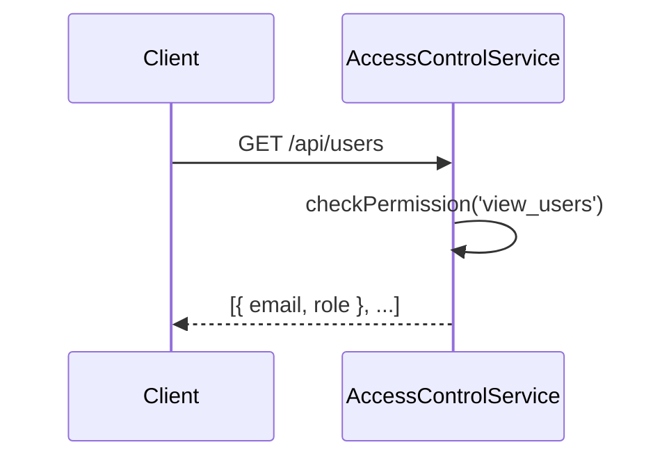
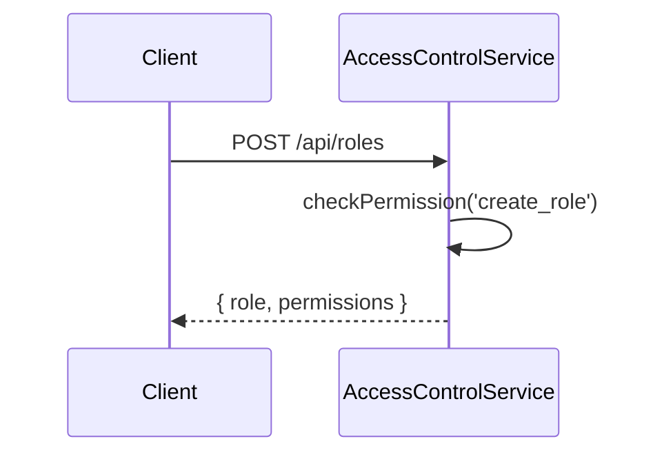
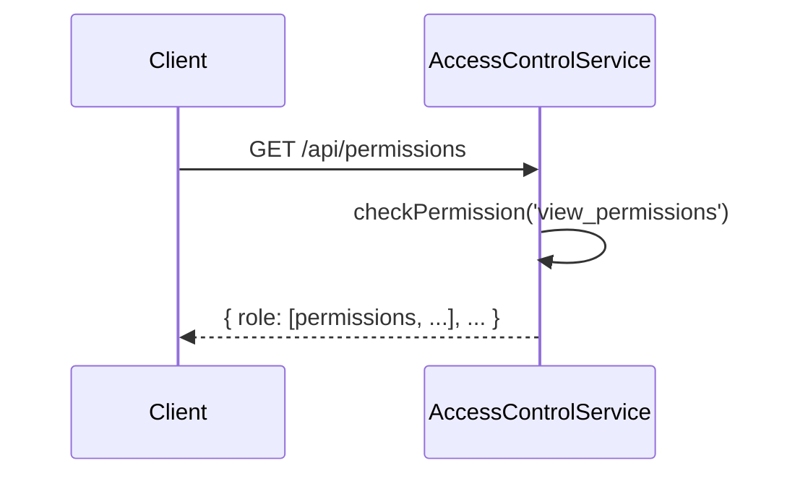
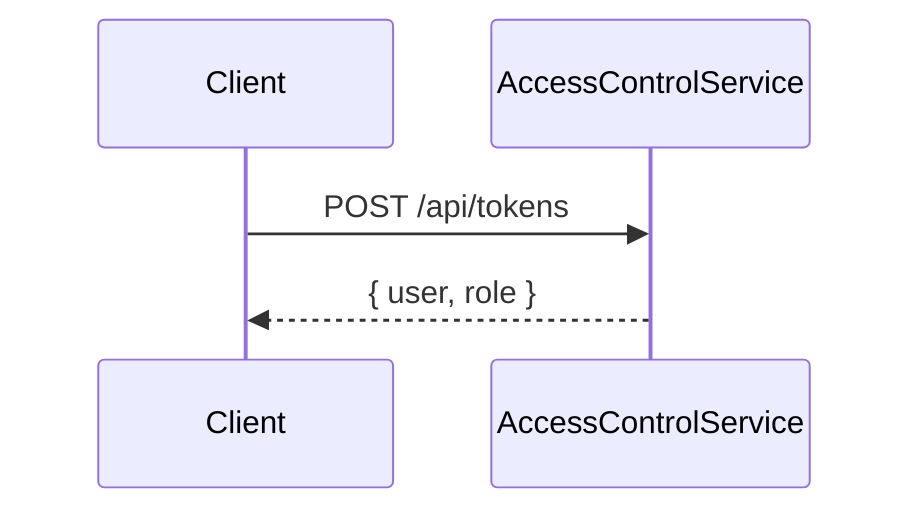
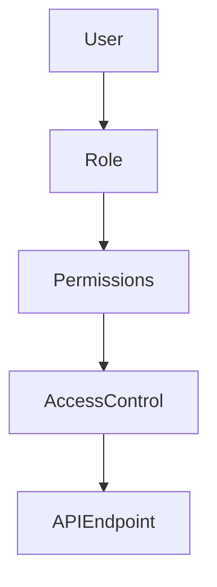

<details>
<summary>Relevant source files</summary>

The following files were used as context for generating this wiki page:

- [src/index.js](https://github.com/aanickode/access-control-service/blob/main/src/index.js)
- [src/routes.js](https://github.com/aanickode/access-control-service/blob/main/src/routes.js)
- [src/authMiddleware.js](https://github.com/aanickode/access-control-service/blob/main/src/authMiddleware.js)
- [src/db.js](https://github.com/aanickode/access-control-service/blob/main/src/db.js)
- [package.json](https://github.com/aanickode/access-control-service/blob/main/package.json)
</details>

# Architecture Overview

## Introduction

This wiki page provides an overview of the architecture and components of the Access Control Service, a Node.js application built with Express.js. The service is responsible for managing user roles, permissions, and access tokens within a system. It exposes a RESTful API for creating roles, assigning roles to users, and retrieving user and permission information.

Sources: [src/index.js](), [src/routes.js](), [package.json]()

## Application Structure

The application follows a modular structure, with the main components organized as follows:

### Entry Point

The `src/index.js` file serves as the entry point of the application. It sets up the Express.js server, loads environment variables using `dotenv`, and mounts the API routes.

```javascript
import express from 'express';
import dotenv from 'dotenv';
import routes from './routes.js';

dotenv.config();

const app = express();
app.use(express.json());
app.use('/api', routes);
app.use('/apis', routes);

const port = process.env.PORT || 8080;

app.listen(port, () => {
  console.log(`Access Control Service listening on port ${port}`);
});
```

Sources: [src/index.js]()

### API Routes

The `src/routes.js` file defines the API routes and their corresponding handlers. It imports the `checkPermission` middleware from `authMiddleware.js` and the in-memory database from `db.js`.

```javascript
import express from 'express';
import { checkPermission } from './authMiddleware.js';
import db from './db.js';

const router = express.Router();

// Routes for managing users, roles, permissions, and tokens
```

Sources: [src/routes.js]()

### Authentication Middleware

The `src/authMiddleware.js` file (not provided) likely contains the implementation of the `checkPermission` middleware function, which is used to enforce role-based access control for certain API routes.

### In-Memory Database

The `src/db.js` file (not provided) likely contains an in-memory data structure (e.g., an object) representing the application's database for storing user roles, permissions, and access tokens.

## API Endpoints

The Access Control Service exposes the following API endpoints:

### GET /api/users

Retrieves a list of all users and their assigned roles.



This endpoint requires the `view_users` permission.

Sources: [src/routes.js:5-8]()

### POST /api/roles

Creates a new role with the specified name and permissions.



This endpoint requires the `create_role` permission.

Sources: [src/routes.js:10-16]()

### GET /api/permissions

Retrieves a list of all roles and their associated permissions.



This endpoint requires the `view_permissions` permission.

Sources: [src/routes.js:18-20]()

### POST /api/tokens

Assigns a role to a user, effectively creating an access token for that user.



This endpoint does not require any specific permission.

Sources: [src/routes.js:22-28]()

## Data Models

### Users

The application stores user information in the following format:

| Field | Type | Description |
| --- | --- | --- |
| email | string | The user's email address (used as the user identifier) |
| role | string | The name of the role assigned to the user |

Sources: [src/routes.js:6]()

### Roles

The application stores role information in the following format:

| Field | Type | Description |
| --- | --- | --- |
| name | string | The name of the role |
| permissions | string[] | An array of permission names associated with the role |

Sources: [src/routes.js:12-13]()

## Role-Based Access Control (RBAC)

The Access Control Service implements role-based access control (RBAC) to manage user permissions. Each user is assigned a role, and each role is associated with a set of permissions. The `checkPermission` middleware is used to enforce access control based on the user's role and the required permissions for a specific API endpoint.



Sources: [src/routes.js:5,10,18](), [src/authMiddleware.js]()

## Conclusion

The Access Control Service provides a centralized way to manage user roles, permissions, and access tokens within a system. It follows a modular architecture with separate components for handling API routes, authentication middleware, and data storage. The service implements role-based access control (RBAC) to enforce permissions for various API endpoints, ensuring secure access to sensitive operations.