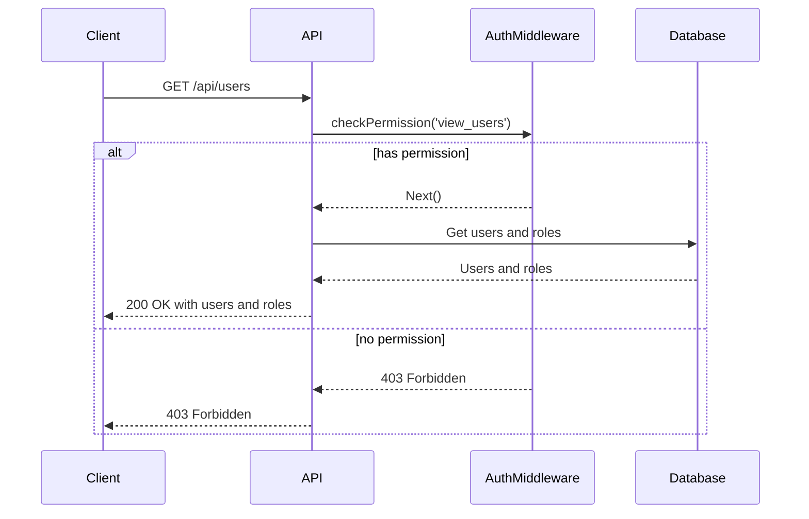
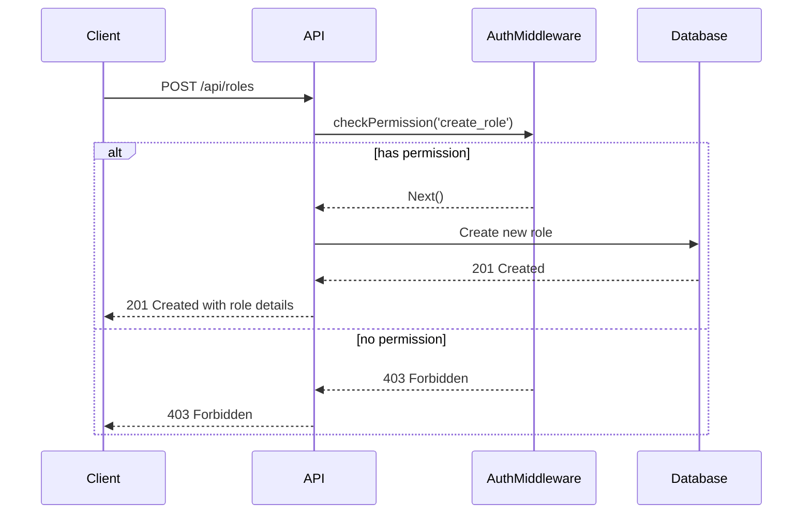
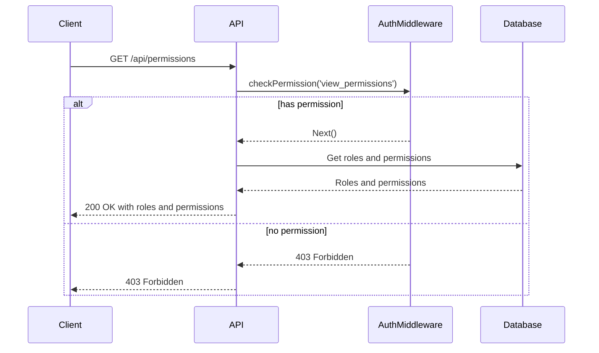
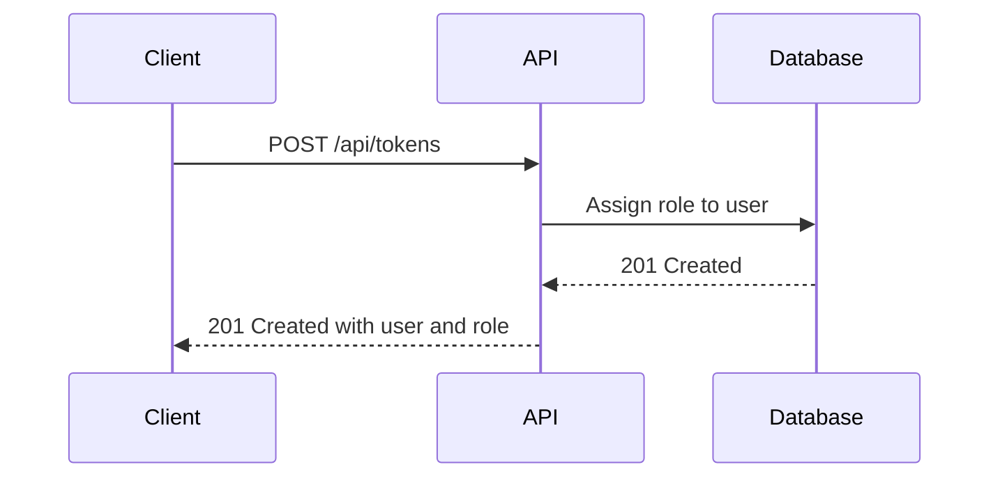
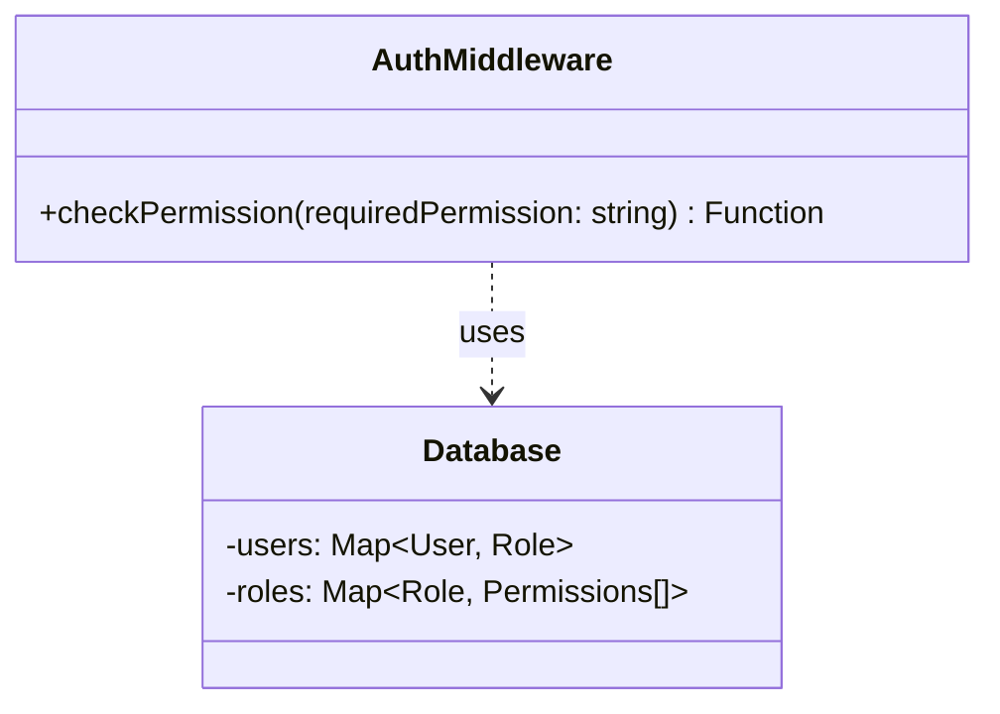
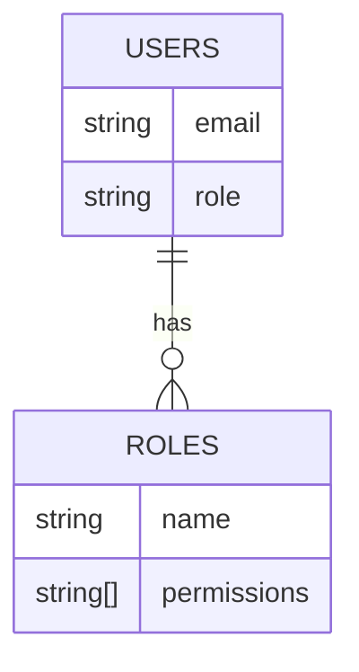

<details>
<summary>Relevant source files</summary>

The following files were used as context for generating this wiki page:

- [src/index.js](https://github.com/aanickode/access-control-service/blob/main/src/index.js)
- [src/routes.js](https://github.com/aanickode/access-control-service/blob/main/src/routes.js)
- [src/authMiddleware.js](https://github.com/aanickode/access-control-service/blob/main/src/authMiddleware.js) (assumed to exist based on import statement)
- [src/db.js](https://github.com/aanickode/access-control-service/blob/main/src/db.js) (assumed to exist based on import statement)
</details>

# Architecture Overview

## Introduction

This wiki page provides an overview of the architecture and components of the Access Control Service, a Node.js Express application responsible for managing user roles, permissions, and authentication tokens. The service exposes a RESTful API for creating roles, assigning roles to users, and retrieving user and permission information. It also includes an authentication middleware to enforce permission-based access control.

Sources: [src/index.js](), [src/routes.js]()

## Application Structure

The application follows a modular structure with separate files for different concerns:

- `index.js`: The entry point that sets up the Express server and configures middleware.
- `routes.js`: Defines the API routes and their corresponding handlers.
- `authMiddleware.js`: Implements the permission-checking middleware.
- `db.js`: Provides an in-memory data store for users, roles, and permissions.

Sources: [src/index.js](), [src/routes.js]()

## API Endpoints

The Access Control Service exposes the following API endpoints:

### `GET /api/users`

Retrieves a list of all registered users and their assigned roles.

**Permissions Required:** `view_users`



Sources: [src/routes.js:5-8]()

### `POST /api/roles`

Creates a new role with the specified name and permissions.

**Permissions Required:** `create_role`

**Request Body:**

```json
{
  "name": "string",
  "permissions": ["string"]
}
```



Sources: [src/routes.js:10-17]()

### `GET /api/permissions`

Retrieves a list of all defined roles and their associated permissions.

**Permissions Required:** `view_permissions`



Sources: [src/routes.js:19-22]()

### `POST /api/tokens`

Assigns a role to a user, effectively creating an authentication token.

**Permissions Required:** None

**Request Body:**

```json
{
  "user": "string",
  "role": "string"
}
```



Sources: [src/routes.js:24-31]()

## Authentication and Authorization

The Access Control Service implements permission-based access control using a custom middleware function `checkPermission`. This middleware checks if the authenticated user has the required permission to access a specific route.



The `checkPermission` middleware function:

1. Retrieves the user's role from the request context (e.g., JWT token).
2. Looks up the user's role in the `users` map in the `Database` to get the associated permissions.
3. Checks if the required permission is present in the user's permissions.
4. If the user has the required permission, the request is allowed to proceed to the next middleware or route handler.
5. If the user does not have the required permission, a `403 Forbidden` response is sent.

Sources: [src/authMiddleware.js]() (assumed to exist based on import statement)

## Data Storage

The Access Control Service uses an in-memory data store (`db.js`) to store user information, roles, and permissions. This data store is a simple JavaScript object with two properties:

- `users`: A map of user email addresses to their assigned roles.
- `roles`: A map of role names to their associated permissions (an array of strings).



While this in-memory data store is suitable for demonstration purposes, a production-ready implementation would likely use a more robust and persistent data storage solution, such as a relational database or a NoSQL database.

Sources: [src/db.js]() (assumed to exist based on import statement)

## Conclusion

The Access Control Service provides a RESTful API for managing user roles, permissions, and authentication tokens. It implements permission-based access control using a custom middleware function and an in-memory data store. The service follows a modular structure with separate files for different concerns, making it easier to maintain and extend.

Sources: [src/index.js](), [src/routes.js](), [src/authMiddleware.js]() (assumed), [src/db.js]() (assumed)