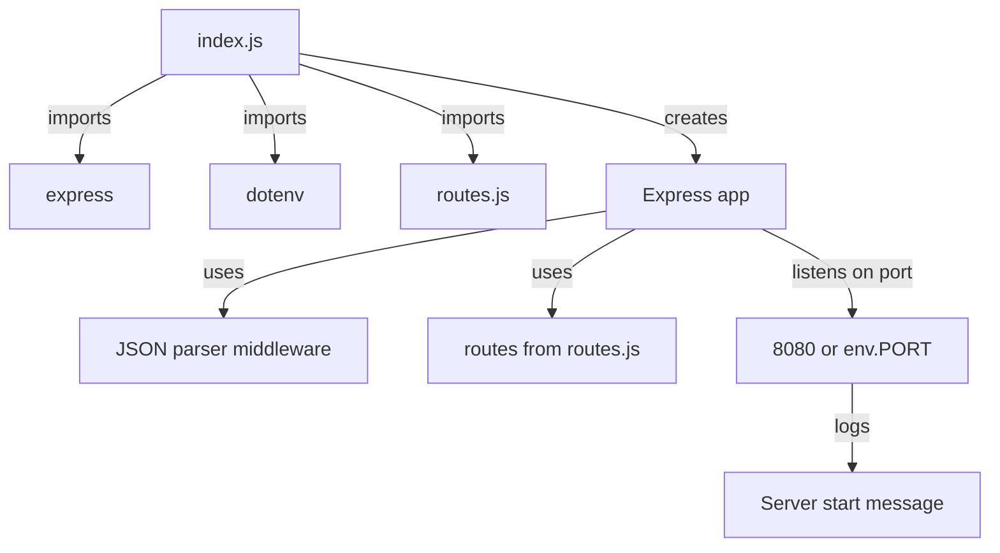
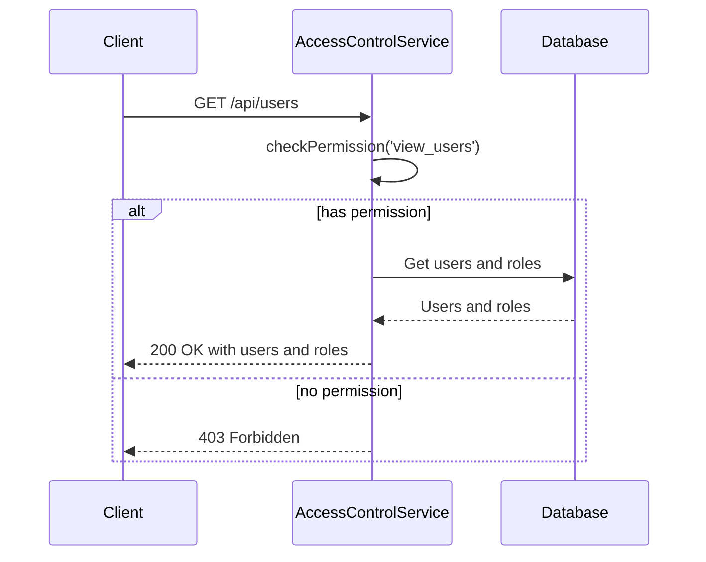
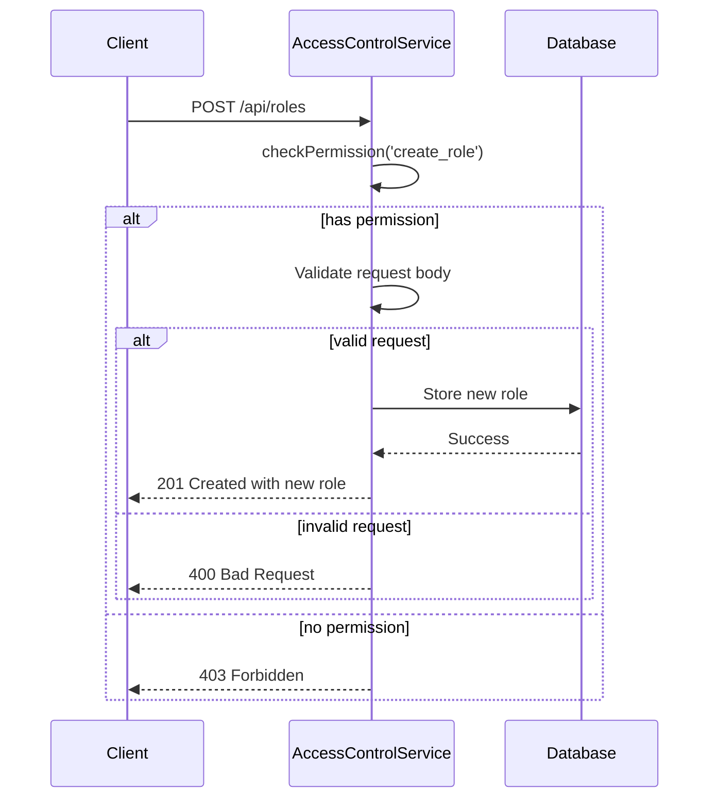
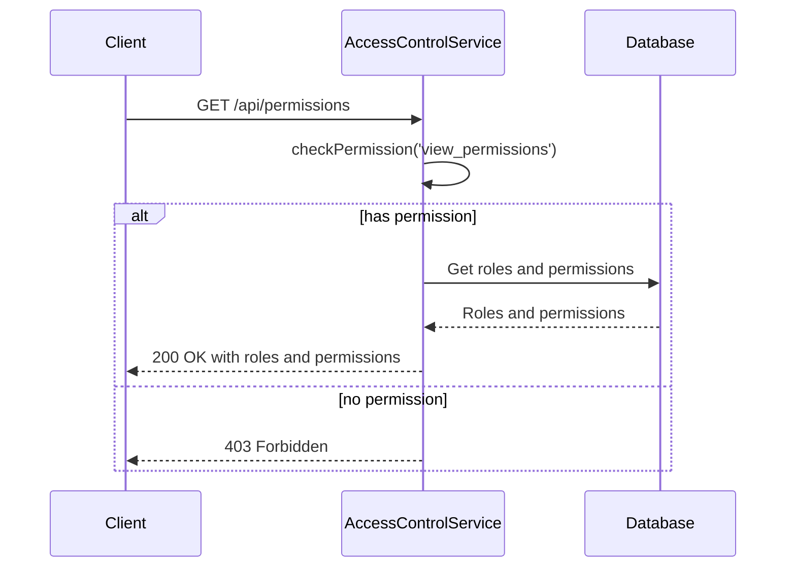
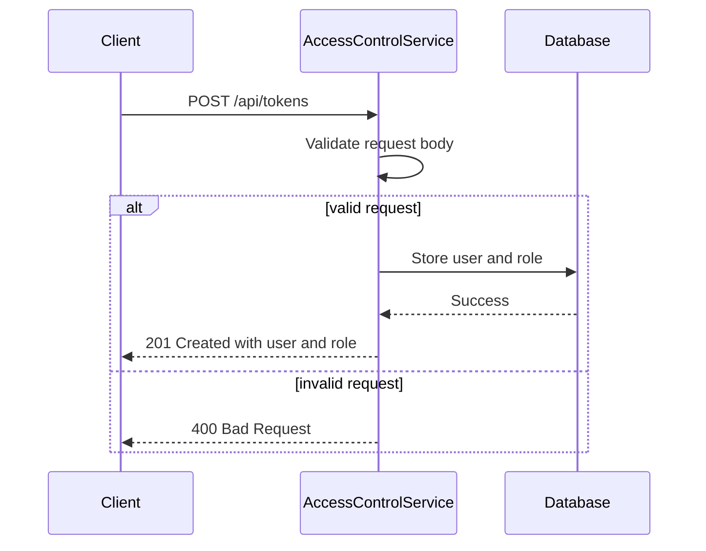
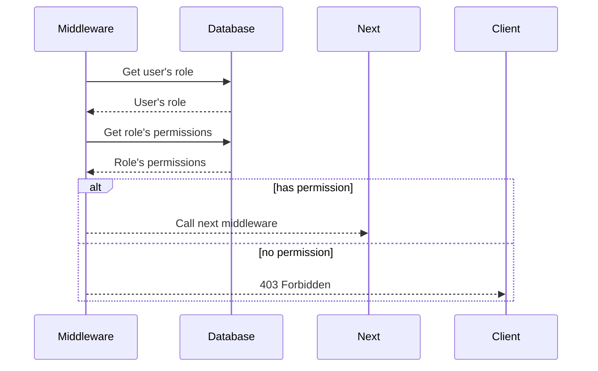

<details>
<summary>Relevant source files</summary>

The following files were used as context for generating this wiki page:

- [src/index.js](https://github.com/aanickode/access-control-service/blob/main/src/index.js)
- [src/routes.js](https://github.com/aanickode/access-control-service/blob/main/src/routes.js)
- [src/authMiddleware.js](https://github.com/aanickode/access-control-service/blob/main/src/authMiddleware.js)
- [src/db.js](https://github.com/aanickode/access-control-service/blob/main/src/db.js)
- [package.json](https://github.com/aanickode/access-control-service/blob/main/package.json)
</details>

# Architecture Overview

The Access Control Service is a Node.js application built with Express.js that provides a RESTful API for managing user roles, permissions, and authentication tokens. It serves as a centralized access control system for other applications or services within the project.

Sources: [src/index.js](), [src/routes.js](), [package.json]()

## Application Setup

The application is initialized in `src/index.js`, where the Express app is created, and middleware for parsing JSON request bodies is configured. The application listens on a specified port (default 8080) and logs a message when the server starts.



Sources: [src/index.js]()

## Routing and Endpoints

The `src/routes.js` file defines the API routes and handlers for various access control operations. The routes are mounted on the `/api` path.

```mermaid
graph TD
    A[routes.js] -->|imports| B[express]
    A -->|imports| C[authMiddleware.js]
    A -->|imports| D[db.js]
    A -->|creates| E[Express Router]
    E -->|GET /users| F[Get all users and roles]
    F -->|uses| G[checkPermission('view_users')]
    E -->|POST /roles| H[Create a new role]
    H -->|uses| I[checkPermission('create_role')]
    E -->|GET /permissions| J[Get all roles and permissions]
    J -->|uses| K[checkPermission('view_permissions')]
    E -->|POST /tokens| L[Create a new user token]
```

Sources: [src/routes.js]()

### GET /users

This endpoint retrieves a list of all users and their associated roles. It requires the `view_users` permission, which is checked by the `checkPermission` middleware imported from `authMiddleware.js`.



Sources: [src/routes.js:5-8](), [src/authMiddleware.js]()

### POST /roles

This endpoint creates a new role with a specified name and set of permissions. It requires the `create_role` permission, which is checked by the `checkPermission` middleware.



Sources: [src/routes.js:10-17](), [src/authMiddleware.js]()

### GET /permissions

This endpoint retrieves a list of all roles and their associated permissions. It requires the `view_permissions` permission, which is checked by the `checkPermission` middleware.



Sources: [src/routes.js:19-21](), [src/authMiddleware.js]()

### POST /tokens

This endpoint creates a new user token by associating a user with a role. It does not require any specific permission.



Sources: [src/routes.js:23-30]()

## Data Storage

The application uses an in-memory data store defined in `src/db.js` to store user roles, permissions, and user-role associations.

```mermaid
classDiagram
    class Database {
        +users: Object
        +roles: Object
    }
    Database : users {
        "user@example.com": "admin",
        "user2@example.com": "viewer"
    }
    Database : roles {
        "admin": ["view_users", "create_role", "view_permissions"],
        "viewer": ["view_users", "view_permissions"]
    }
```

Sources: [src/db.js]()

## Authentication Middleware

The `checkPermission` middleware function in `authMiddleware.js` is used to verify if a user has the required permission to access a specific route. It checks the user's role and associated permissions against the required permission.



Sources: [src/authMiddleware.js]()

## Dependencies

The application relies on the following dependencies:

| Dependency | Version | Description |
| --- | --- | --- |
| express | ^4.18.2 | Web application framework for Node.js |
| dotenv | ^16.0.3 | Loads environment variables from a `.env` file |

Sources: [package.json]()

## Summary

The Access Control Service provides a RESTful API for managing user roles, permissions, and authentication tokens. It uses an in-memory data store to store user-role associations, roles, and permissions. The `checkPermission` middleware is used to enforce access control based on user roles and required permissions for specific routes. The application is built with Express.js and follows a modular structure with separate files for routes, middleware, and data storage.