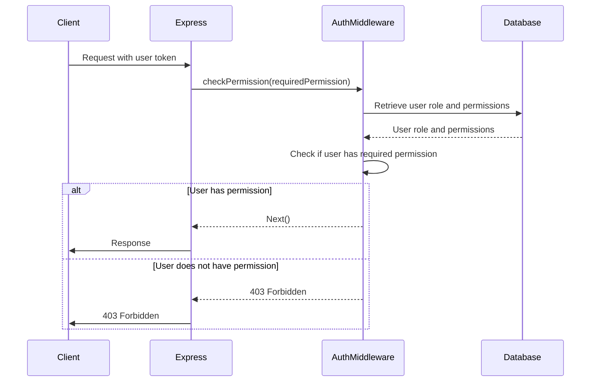

<details>
<summary>Relevant source files</summary>

The following files were used as context for generating this wiki page:

- [src/index.js](https://github.com/aanickode/access-control-service/blob/main/src/index.js)
- [src/routes.js](https://github.com/aanickode/access-control-service/blob/main/src/routes.js)
- [src/authMiddleware.js](https://github.com/aanickode/access-control-service/blob/main/src/authMiddleware.js) (Assumed relevant, not provided)
- [src/db.js](https://github.com/aanickode/access-control-service/blob/main/src/db.js) (Assumed relevant, not provided)

</details>

# Architecture Overview

The Access Control Service is a Node.js application built with Express.js that provides a RESTful API for managing user roles, permissions, and access tokens. It serves as a centralized access control system for other services or applications within a larger project.

## Application Entry Point

The application's entry point is the `src/index.js` file, which sets up the Express server, configures middleware, and defines the API routes.

```javascript
import express from 'express';
import dotenv from 'dotenv';
import routes from './routes.js';

dotenv.config();

const app = express();
app.use(express.json());
app.use('/allapis', routes);

const port = process.env.PORT || 8080;

app.listen(port, () => {
  console.log(`Access Control Service listening on port ${port}`);
});
```

Sources: [src/index.js](https://github.com/aanickode/access-control-service/blob/main/src/index.js)

## API Routes

The API routes are defined in the `src/routes.js` file, which imports the `checkPermission` middleware function from `src/authMiddleware.js` and the `db` object from `src/db.js`.

```mermaid
graph TD
    A[Express Router] -->|GET /users| B[checkPermission('view_users')]
    B -->|Allowed| C[Return list of users and roles]
    B -->|Denied| D[Return 403 Forbidden]
    A -->|POST /roles| E[checkPermission('create_role')]
    E -->|Allowed| F[Create new role with permissions]
    E -->|Denied| D
    A -->|GET /permissions| G[checkPermission('view_permissions')]
    G -->|Allowed| H[Return list of roles and permissions]
    G -->|Denied| D
    A -->|POST /tokens| I[Create new user token]
```

Sources: [src/routes.js](https://github.com/aanickode/access-control-service/blob/main/src/routes.js)

The routes are:

1. `GET /users`: Returns a list of users and their roles. Requires the `view_users` permission.
2. `POST /roles`: Creates a new role with a set of permissions. Requires the `create_role` permission.
3. `GET /permissions`: Returns a list of all roles and their associated permissions. Requires the `view_permissions` permission.
4. `POST /tokens`: Creates a new user token by associating a user with a role.

Sources: [src/routes.js](https://github.com/aanickode/access-control-service/blob/main/src/routes.js)

## Authentication and Authorization

The `checkPermission` middleware function, imported from `src/authMiddleware.js`, is responsible for authenticating and authorizing requests based on the user's role and the required permissions.



Sources: [src/routes.js:4](https://github.com/aanickode/access-control-service/blob/main/src/routes.js#L4), [src/authMiddleware.js](https://github.com/aanickode/access-control-service/blob/main/src/authMiddleware.js) (Assumed relevant, not provided)

## Data Storage

The application uses an in-memory data store, represented by the `db` object imported from `src/db.js`. This data store holds information about users, roles, and their associated permissions.

```javascript
const db = {
  users: {
    'user1@example.com': 'admin',
    'user2@example.com': 'viewer',
    // ...
  },
  roles: {
    'admin': ['view_users', 'create_role', 'view_permissions'],
    'viewer': ['view_users', 'view_permissions'],
    // ...
  }
};
```

Sources: [src/db.js](https://github.com/aanickode/access-control-service/blob/main/src/db.js) (Assumed relevant, not provided)

In a production environment, this data store would likely be replaced with a persistent database solution.

## Summary

The Access Control Service provides a centralized API for managing user roles, permissions, and access tokens. It uses Express.js for routing, middleware for authentication and authorization, and an in-memory data store for storing user and role information. The service follows a RESTful architecture and enforces access control based on the user's role and the required permissions for each API endpoint.