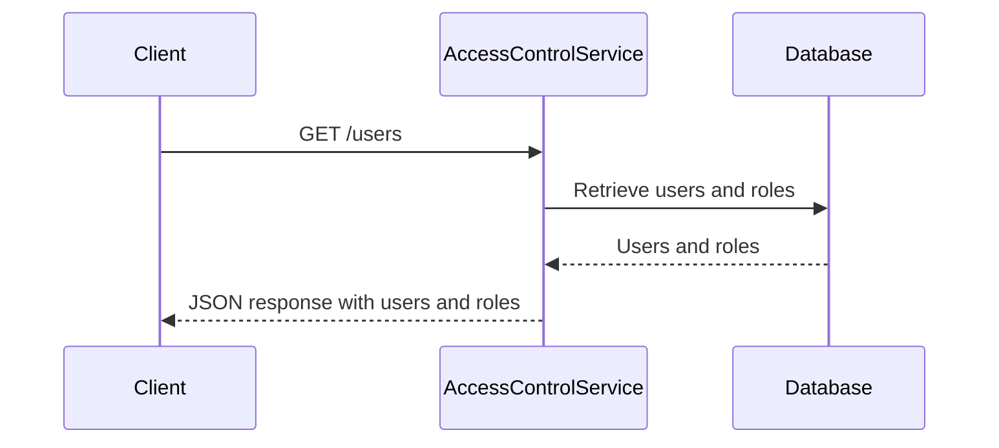
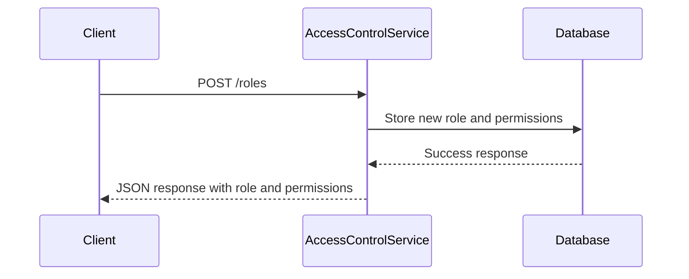
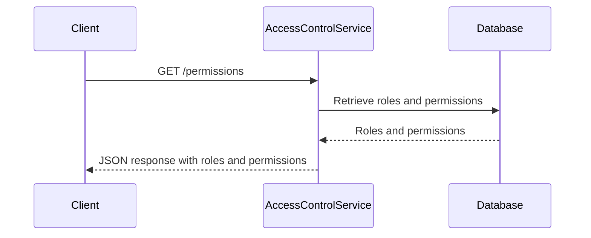
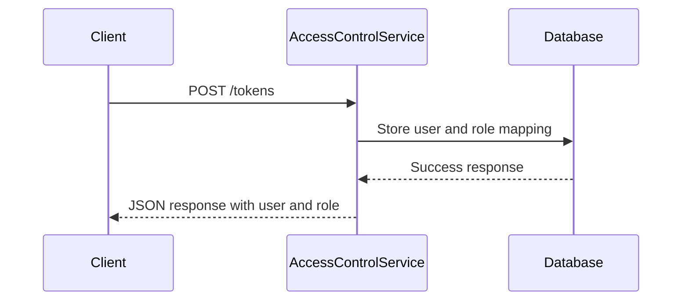
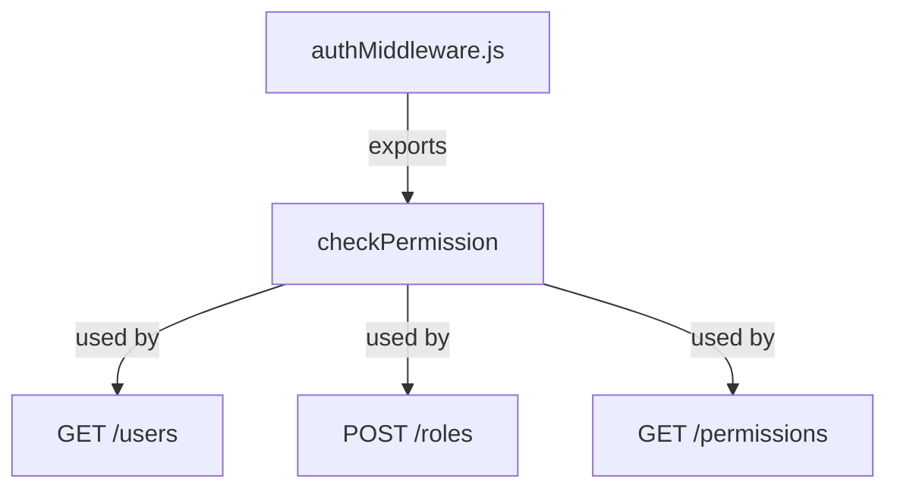
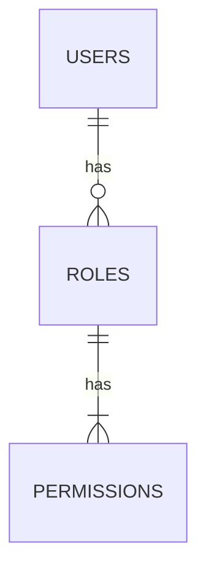

<details>
<summary>Relevant source files</summary>

The following files were used as context for generating this wiki page:

- [src/index.js](https://github.com/aanickode/access-control-service/blob/main/src/index.js)
- [src/routes.js](https://github.com/aanickode/access-control-service/blob/main/src/routes.js)
- [src/authMiddleware.js](https://github.com/aanickode/access-control-service/blob/main/src/authMiddleware.js)
- [src/db.js](https://github.com/aanickode/access-control-service/blob/main/src/db.js)
- [package.json](https://github.com/aanickode/access-control-service/blob/main/package.json)
</details>

# Architecture Overview

The Access Control Service is a Node.js application built with Express.js that provides a RESTful API for managing user roles, permissions, and authentication tokens. It serves as a centralized access control system for other applications or services within a larger project.

## Application Structure

The application follows a modular structure, with the main entry point being `src/index.js`. This file sets up the Express application, configures middleware, and defines the API routes.

```mermaid
graph TD
    A[index.js] -->|imports| B[express]
    A -->|imports| C[dotenv]
    A -->|imports| D[routes.js]
    A -->|uses| E[express.json()]
    A -->|uses| F[app.use('/allapis', routes)]
    A -->|listens on| G[PORT]
```

Sources: [src/index.js](https://github.com/aanickode/access-control-service/blob/main/src/index.js)

## API Routes

The API routes are defined in `src/routes.js`. This file imports the necessary dependencies, including the `checkPermission` middleware function from `authMiddleware.js` and the in-memory database `db.js`.


Sources: [src/routes.js](https://github.com/aanickode/access-control-service/blob/main/src/routes.js)

### User Management

The `/users` endpoint retrieves a list of all registered users and their associated roles.



Sources: [src/routes.js:5-8](https://github.com/aanickode/access-control-service/blob/main/src/routes.js#L5-L8)

### Role Management

The `/roles` endpoint allows creating new roles with associated permissions.



Sources: [src/routes.js:9-15](https://github.com/aanickode/access-control-service/blob/main/src/routes.js#L9-L15)

### Permission Retrieval

The `/permissions` endpoint retrieves all defined roles and their associated permissions.



Sources: [src/routes.js:16-18](https://github.com/aanickode/access-control-service/blob/main/src/routes.js#L16-L18)

### Token Generation

The `/tokens` endpoint generates an authentication token by associating a user with a role.



Sources: [src/routes.js:19-25](https://github.com/aanickode/access-control-service/blob/main/src/routes.js#L19-L25)

## Authentication Middleware

The `checkPermission` middleware function is imported from `authMiddleware.js` and used to protect certain routes based on the user's role and permissions.



Sources: [src/routes.js:5,9,16](https://github.com/aanickode/access-control-service/blob/main/src/routes.js#L5,L9,L16)

## Data Storage

The application uses an in-memory data store defined in `db.js` to store user roles, permissions, and user-role mappings.



Sources: [src/db.js](https://github.com/aanickode/access-control-service/blob/main/src/db.js)

## Dependencies

The application relies on the following dependencies:

| Dependency | Description                                                  |
|------------|--------------------------------------------------------------|
| express    | Fast, unopinionated, minimalist web framework for Node.js    |
| dotenv     | Loads environment variables from a `.env` file into `process.env` |

Sources: [package.json](https://github.com/aanickode/access-control-service/blob/main/package.json)

## Conclusion

The Access Control Service provides a centralized API for managing user roles, permissions, and authentication tokens. It follows a modular structure with separate concerns handled by different modules, such as routing, authentication, and data storage. The service leverages Express.js for building the RESTful API and an in-memory data store for storing user roles, permissions, and user-role mappings.