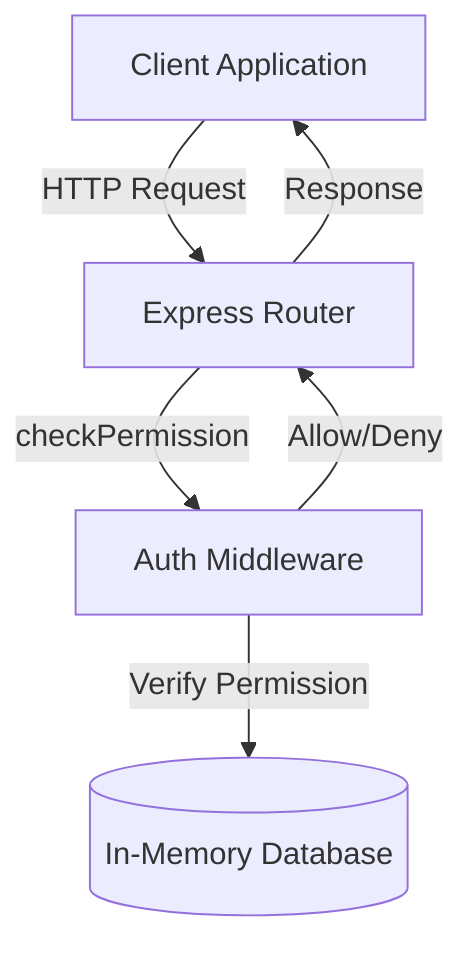
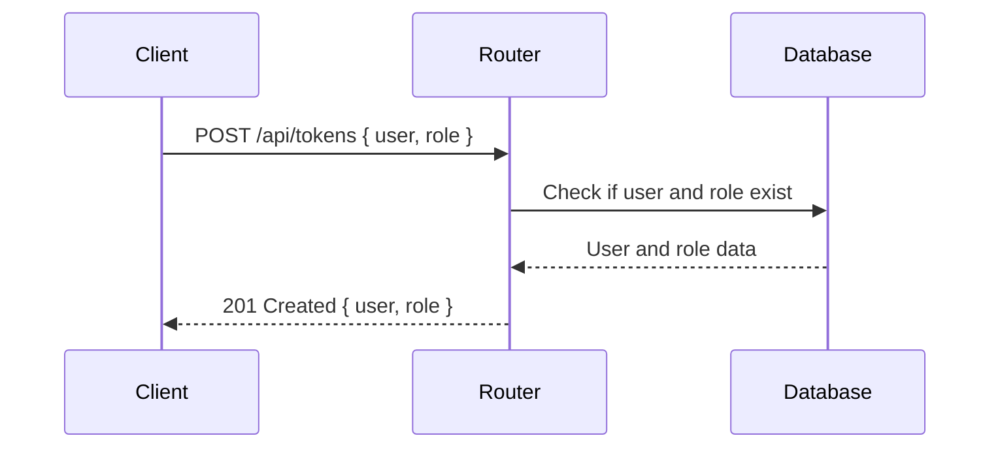
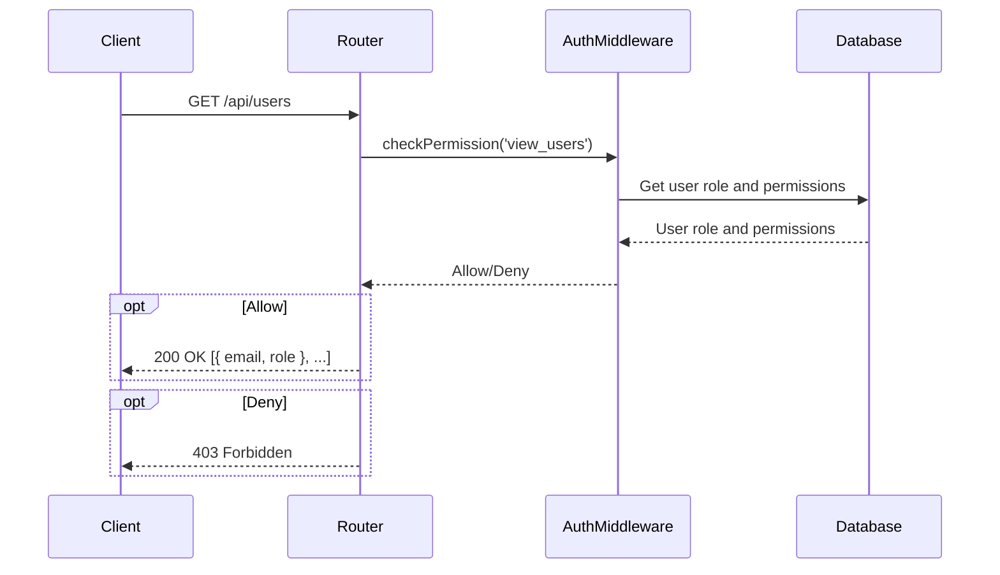

<details>
<summary>Relevant source files</summary>

The following files were used as context for generating this wiki page:

- [src/index.js](https://github.com/aanickode/access-control-service/blob/main/src/index.js)
- [src/routes.js](https://github.com/aanickode/access-control-service/blob/main/src/routes.js)
- [src/authMiddleware.js](https://github.com/aanickode/access-control-service/blob/main/src/authMiddleware.js)
- [src/db.js](https://github.com/aanickode/access-control-service/blob/main/src/db.js)
- [package.json](https://github.com/aanickode/access-control-service/blob/main/package.json)
</details>

# Architecture Overview

The Access Control Service is an Express.js application that provides a RESTful API for managing user roles, permissions, and authentication tokens. It serves as a centralized access control system for other services or applications within the project.

Sources: [src/index.js](), [src/routes.js](), [package.json]()

## Application Setup

The application is set up using the Express.js framework and configured with environment variables loaded from a `.env` file using the `dotenv` library.

```javascript
import express from 'express';
import dotenv from 'dotenv';

dotenv.config();

const app = express();
app.use(express.json());
```

Sources: [src/index.js:1-6]()

## Routing and Middleware

The application defines a set of routes for handling various access control operations. These routes are imported from the `routes.js` file and mounted on the `/api` path.

```javascript
import routes from './routes.js';

app.use('/api', routes);
```

Sources: [src/index.js:7-8]()

The `authMiddleware.js` file exports a `checkPermission` middleware function that is used to protect certain routes by verifying if the requesting user has the required permission.

```javascript
import { checkPermission } from './authMiddleware.js';

router.get('/users', checkPermission('view_users'), (req, res) => {
  // ...
});
```

Sources: [src/routes.js:3,6]()

## Data Storage

The application uses an in-memory data store (`db.js`) to store user roles, permissions, and authentication tokens. This data store is a simple JavaScript object with two properties: `users` and `roles`.

```javascript
const db = {
  users: {},
  roles: {}
};

export default db;
```

Sources: [src/db.js:1-5]()

## API Endpoints

The application exposes the following API endpoints:

### GET `/api/users`

Retrieves a list of all registered users and their roles. This endpoint requires the `view_users` permission.

```javascript
router.get('/users', checkPermission('view_users'), (req, res) => {
  res.json(Object.entries(db.users).map(([email, role]) => ({ email, role })));
});
```

Sources: [src/routes.js:6-9]()

### POST `/api/roles`

Creates a new role with a set of permissions. This endpoint requires the `create_role` permission.

```javascript
router.post('/roles', checkPermission('create_role'), (req, res) => {
  const { name, permissions } = req.body;
  if (!name || !Array.isArray(permissions)) {
    return res.status(400).json({ error: 'Invalid role definition' });
  }
  db.roles[name] = permissions;
  res.status(201).json({ role: name, permissions });
});
```

Sources: [src/routes.js:10-18]()

### GET `/api/permissions`

Retrieves a list of all defined roles and their associated permissions. This endpoint requires the `view_permissions` permission.

```javascript
router.get('/permissions', checkPermission('view_permissions'), (req, res) => {
  res.json(db.roles);
});
```

Sources: [src/routes.js:19-22]()

### POST `/api/tokens`

Assigns a role to a user, effectively creating an authentication token for that user. This endpoint is open and does not require any specific permission.

```javascript
router.post('/tokens', (req, res) => {
  const { user, role } = req.body;
  if (!user || !role) {
    return res.status(400).json({ error: 'Missing user or role' });
  }
  db.users[user] = role;
  res.status(201).json({ user, role });
});
```

Sources: [src/routes.js:23-31]()

## Data Flow Diagram

The following diagram illustrates the high-level data flow and interactions between the components of the Access Control Service:



Sources: [src/index.js](), [src/routes.js](), [src/authMiddleware.js](), [src/db.js]()

## Sequence Diagram: User Role Assignment

The following sequence diagram illustrates the flow of assigning a role to a user, effectively creating an authentication token:



Sources: [src/routes.js:23-31]()

## Sequence Diagram: Protected Route Access

The following sequence diagram illustrates the flow of accessing a protected route that requires a specific permission:



Sources: [src/routes.js:6-9](), [src/authMiddleware.js]()

## Key Components

| Component | Description |
| --- | --- |
| `index.js` | The entry point of the application, sets up the Express server and mounts the API routes. |
| `routes.js` | Defines the API routes and their respective handlers. |
| `authMiddleware.js` | Contains the `checkPermission` middleware function for verifying user permissions. |
| `db.js` | Provides an in-memory data store for storing user roles, permissions, and authentication tokens. |

Sources: [src/index.js](), [src/routes.js](), [src/authMiddleware.js](), [src/db.js]()

## Conclusion

The Access Control Service provides a centralized system for managing user roles, permissions, and authentication tokens within the project. It exposes a RESTful API for creating and retrieving roles, assigning roles to users, and protecting routes based on required permissions. The service uses an in-memory data store for simplicity, but this could be replaced with a more robust database solution in a production environment.

Sources: [src/index.js](), [src/routes.js](), [src/authMiddleware.js](), [src/db.js]()