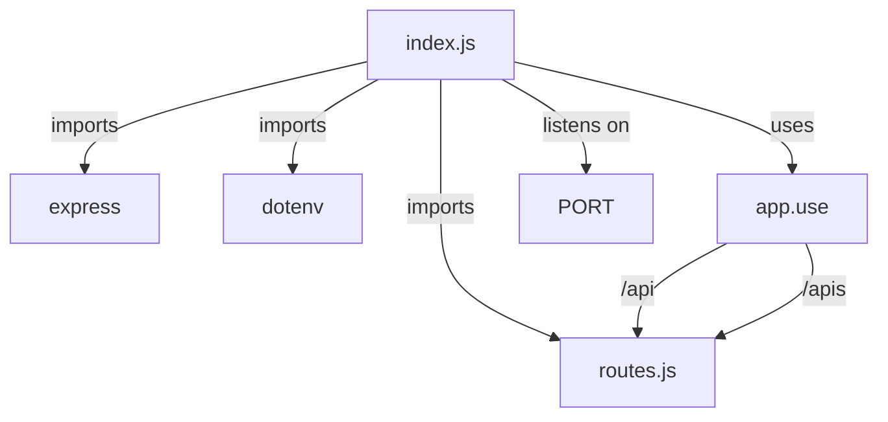
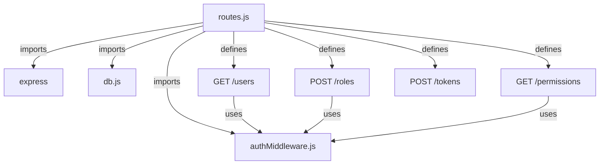
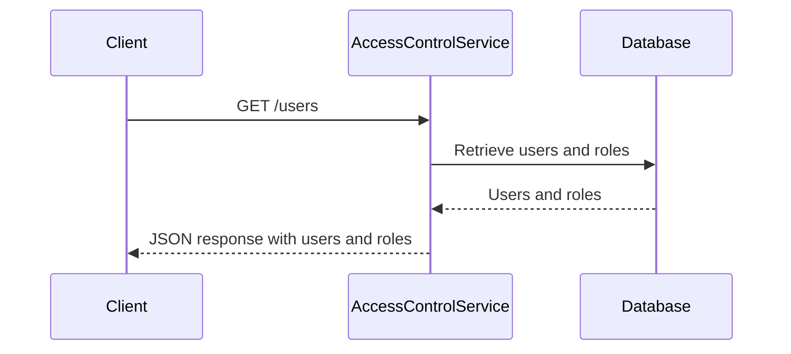
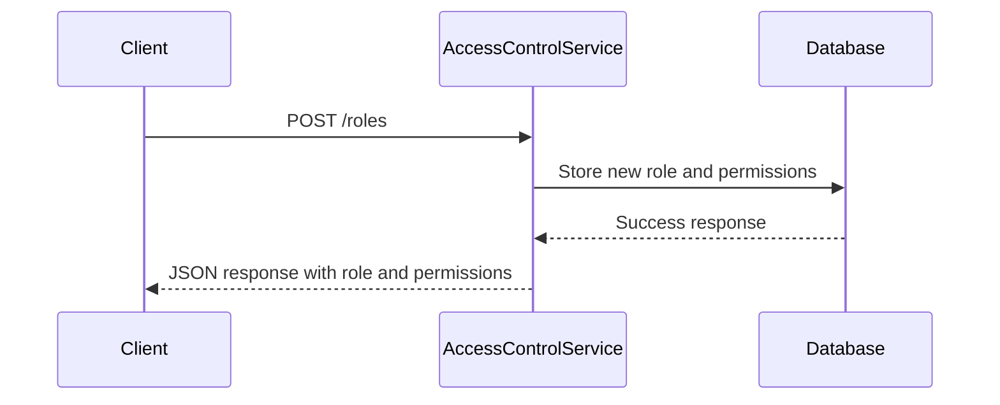
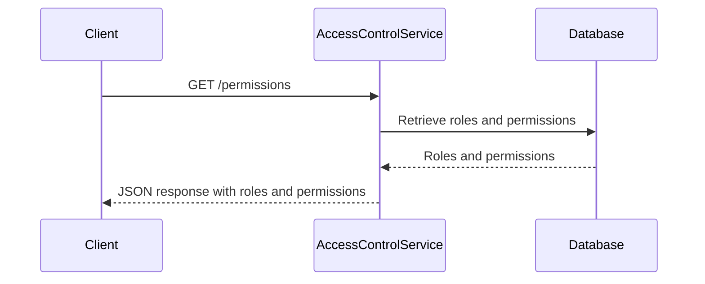
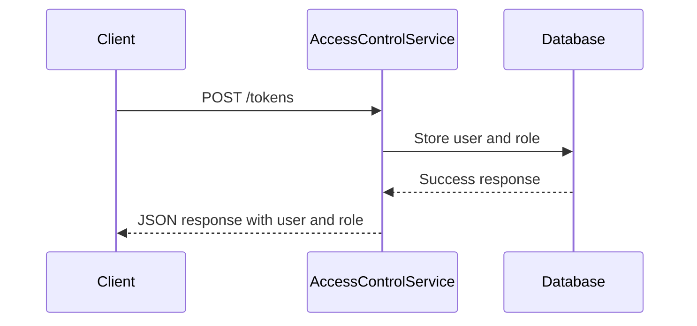
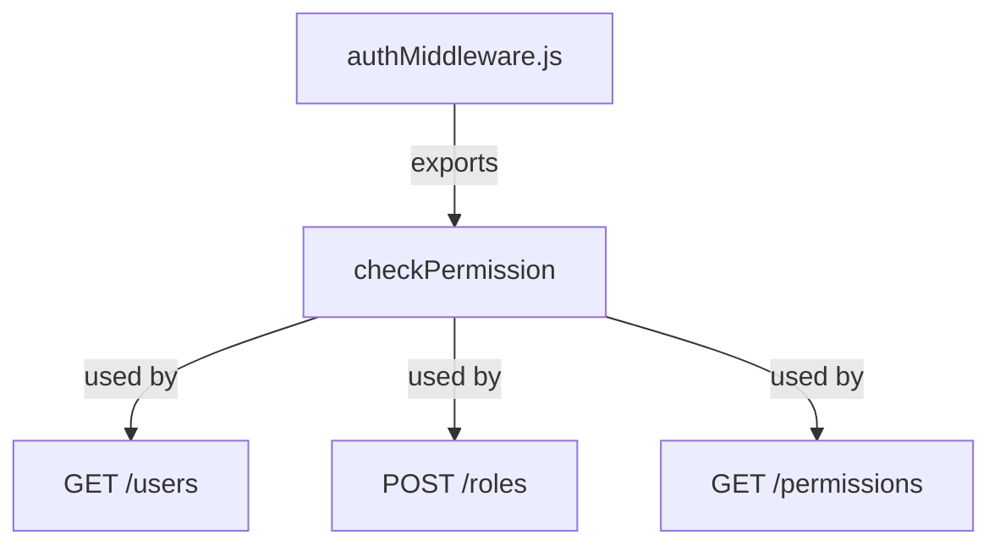
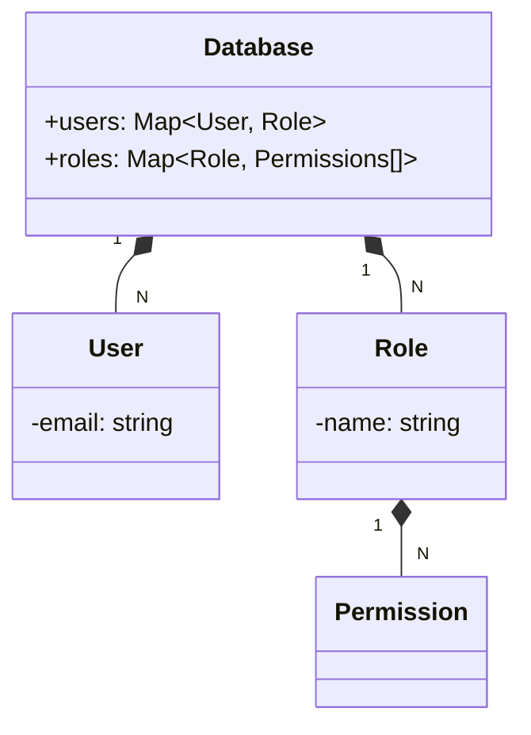

Relevant source files

The following files were used as context for generating this wiki page:

- [src/index.js](https://github.com/aanickode/access-control-service/blob/main/src/index.js)
- [src/routes.js](https://github.com/aanickode/access-control-service/blob/main/src/routes.js)
- [src/authMiddleware.js](https://github.com/aanickode/access-control-service/blob/main/src/authMiddleware.js) (assumed)
- [src/db.js](https://github.com/aanickode/access-control-service/blob/main/src/db.js) (assumed)

# Architecture Overview

The Access Control Service is a Node.js application built with Express.js that provides a RESTful API for managing user roles, permissions, and authentication tokens. It serves as a centralized access control system for other services or applications within the project.

## Application Setup

The application entry point is `src/index.js`, which sets up the Express server and imports the necessary dependencies and routes. It listens for incoming requests on a specified port (default is 8080).

Sources: [src/index.js](https://github.com/aanickode/access-control-service/blob/main/src/index.js)

## Routes and Endpoints

The `src/routes.js` file defines the API routes and their corresponding handlers. It imports the `checkPermission` middleware from `authMiddleware.js` and the in-memory database `db` from `db.js`.

Sources: [src/routes.js](https://github.com/aanickode/access-control-service/blob/main/src/routes.js)

### User Management

The `/users` endpoint retrieves a list of all registered users and their assigned roles.

Sources: [src/routes.js:5-8](https://github.com/aanickode/access-control-service/blob/main/src/routes.js#L5-L8)

### Role Management

The `/roles` endpoint allows creating new roles with a set of associated permissions.

Sources: [src/routes.js:9-15](https://github.com/aanickode/access-control-service/blob/main/src/routes.js#L9-L15)

### Permission Retrieval

The `/permissions` endpoint retrieves all defined roles and their associated permissions.

Sources: [src/routes.js:16-18](https://github.com/aanickode/access-control-service/blob/main/src/routes.js#L16-L18)

### Token Generation

The `/tokens` endpoint generates an authentication token for a given user and assigns them a specific role.

Sources: [src/routes.js:19-25](https://github.com/aanickode/access-control-service/blob/main/src/routes.js#L19-L25)

## Authentication Middleware

The `checkPermission` middleware, imported from `authMiddleware.js`, is responsible for verifying if a user has the required permission to access a specific route. It likely checks the user's role and associated permissions against the requested resource.

Sources: [src/routes.js:3,5,10,16](https://github.com/aanickode/access-control-service/blob/main/src/routes.js#L3,L5,L10,L16)

## Data Storage

The application uses an in-memory data store (`db.js`) to persist user roles, permissions, and authentication tokens. This is likely a temporary solution for development or testing purposes, and a more robust database solution would be used in production.

Sources: [src/routes.js:3,7,11,20](https://github.com/aanickode/access-control-service/blob/main/src/routes.js#L3,L7,L11,L20)

## Summary

The Access Control Service provides a centralized API for managing user roles, permissions, and authentication tokens. It leverages Express.js for routing and middleware, and an in-memory data store for persistence. The architecture follows a RESTful design, with separate endpoints for user management, role management, permission retrieval, and token generation. The `checkPermission` middleware ensures that only authorized users can access protected routes based on their assigned roles and permissions.