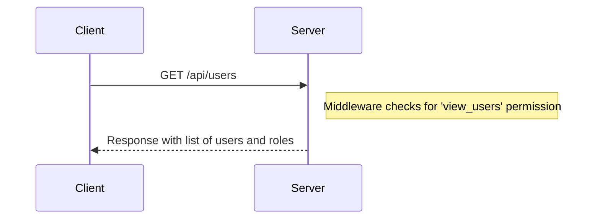
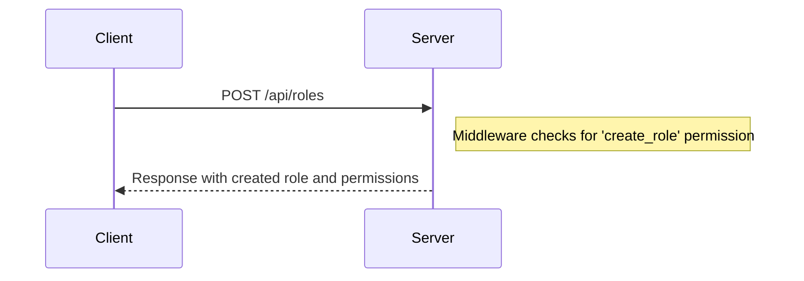
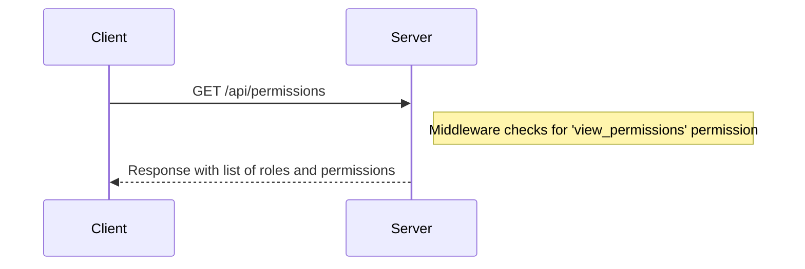
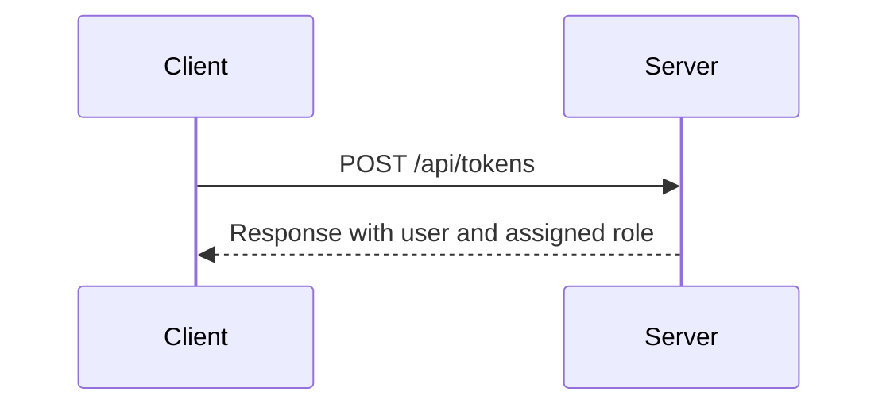

<details>
<summary>Relevant source files</summary>

The following files were used as context for generating this wiki page:

- [src/index.js](https://github.com/aanickode/access-control-service/blob/main/src/index.js)
- [src/routes.js](https://github.com/aanickode/access-control-service/blob/main/src/routes.js)
- [src/authMiddleware.js](https://github.com/aanickode/access-control-service/blob/main/src/authMiddleware.js)
- [src/db.js](https://github.com/aanickode/access-control-service/blob/main/src/db.js)
- [package.json](https://github.com/aanickode/access-control-service/blob/main/package.json)
</details>

# Architecture Overview

## Introduction

This document provides an overview of the architecture and components of the Access Control Service, a Node.js application built using the Express.js framework. The service is responsible for managing user roles, permissions, and authentication tokens within an application or system.

The Access Control Service exposes a RESTful API for interacting with user roles, permissions, and tokens. It uses an in-memory data store to store user information, roles, and permissions.

Sources: [src/index.js](), [src/routes.js](), [package.json]()

## Application Structure

The application follows a modular structure with separate files for different concerns:

- `index.js`: The entry point of the application, which sets up the Express server and starts listening for incoming requests.
- `routes.js`: Defines the API routes and their corresponding handlers.
- `authMiddleware.js`: Contains a middleware function for checking user permissions.
- `db.js`: Provides an in-memory data store for storing user information, roles, and permissions.

Sources: [src/index.js](), [src/routes.js](), [src/authMiddleware.js](), [src/db.js]()

## API Endpoints

The Access Control Service exposes the following API endpoints:

```mermaid
graph TD
    A[/api/users] -->|GET| B[Retrieve list of users and their roles]
    C[/api/roles] -->|POST| D[Create a new role with permissions]
    E[/api/permissions] -->|GET| F[Retrieve list of roles and their permissions]
    G[/api/tokens] -->|POST| H[Create a new authentication token for a user]
```

Sources: [src/routes.js:5-27]()

### GET /api/users

This endpoint retrieves a list of users and their associated roles.



The `checkPermission` middleware is used to ensure that the client has the `'view_users'` permission before accessing this endpoint.

Sources: [src/routes.js:5-7](), [src/authMiddleware.js]()

### POST /api/roles

This endpoint creates a new role with a set of permissions.



The request body must contain a `name` and an array of `permissions`. The `checkPermission` middleware is used to ensure that the client has the `'create_role'` permission before accessing this endpoint.

Sources: [src/routes.js:9-14](), [src/authMiddleware.js]()

### GET /api/permissions

This endpoint retrieves a list of roles and their associated permissions.



The `checkPermission` middleware is used to ensure that the client has the `'view_permissions'` permission before accessing this endpoint.

Sources: [src/routes.js:16-18](), [src/authMiddleware.js]()

### POST /api/tokens

This endpoint creates a new authentication token for a user by associating the user with a role.



The request body must contain a `user` and a `role`. There is no permission check for this endpoint.

Sources: [src/routes.js:20-25]()

## Data Store

The application uses an in-memory data store (`db.js`) to store user information, roles, and permissions. The data store is a simple JavaScript object with the following structure:

```javascript
const db = {
  users: {
    // 'user@example.com': 'admin',
    // 'user2@example.com': 'viewer',
  },
  roles: {
    // 'admin': ['view_users', 'create_role', 'view_permissions'],
    // 'viewer': ['view_users', 'view_permissions'],
  },
};
```

- `users`: An object where the keys are user email addresses, and the values are the corresponding roles.
- `roles`: An object where the keys are role names, and the values are arrays of permissions associated with each role.

Sources: [src/db.js]()

## Authentication and Authorization

The Access Control Service uses a simple role-based access control (RBAC) mechanism for authentication and authorization.

### Authentication

The service does not implement authentication directly. Instead, it assumes that authentication is handled by another service or mechanism, and it receives authenticated user information (e.g., email) when creating authentication tokens.

Sources: [src/routes.js:20-25]()

### Authorization

Authorization is implemented using the `checkPermission` middleware function. This middleware checks if the authenticated user has the required permission to access a specific endpoint.

```javascript
const checkPermission = (requiredPermission) => (req, res, next) => {
  // Assuming the authenticated user's email is available in req.user
  const userEmail = req.user;
  const userRole = db.users[userEmail];
  const rolePermissions = db.roles[userRole] || [];

  if (rolePermissions.includes(requiredPermission)) {
    next(); // Allow access to the endpoint
  } else {
    res.status(403).json({ error: 'Forbidden' });
  }
};
```

The `checkPermission` middleware function retrieves the user's role from the `db.users` object and checks if the associated permissions in `db.roles` include the required permission. If the user has the required permission, the request is allowed to proceed to the endpoint handler. Otherwise, a `403 Forbidden` response is sent.

Sources: [src/authMiddleware.js]()

## Conclusion

The Access Control Service provides a simple and flexible way to manage user roles, permissions, and authentication tokens within an application or system. It follows a modular structure and exposes a RESTful API for interacting with user roles, permissions, and tokens. The service uses an in-memory data store and implements a role-based access control mechanism for authorization.

While the current implementation is basic, it can be extended or integrated with other services or databases to provide more advanced authentication and authorization features, such as user management, token expiration, and more granular permissions.

Sources: [src/index.js](), [src/routes.js](), [src/authMiddleware.js](), [src/db.js]()