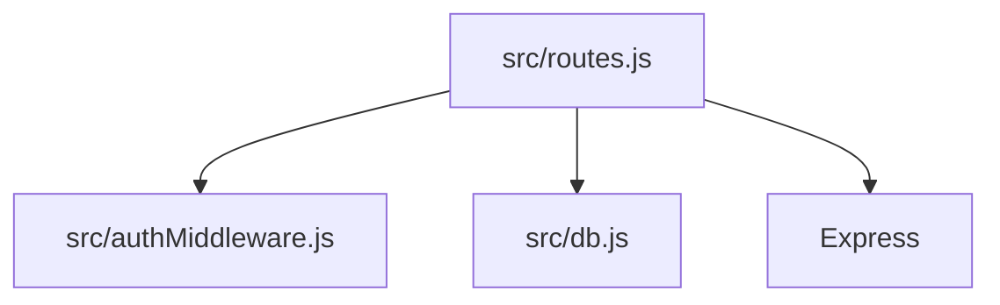
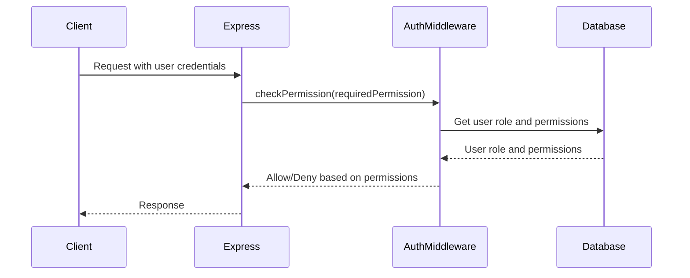

<details>
<summary>Relevant source files</summary>

The following files were used as context for generating this wiki page:

- [src/index.js](https://github.com/aanickode/access-control-service/blob/main/src/index.js)
- [src/routes.js](https://github.com/aanickode/access-control-service/blob/main/src/routes.js)
- [src/authMiddleware.js](https://github.com/aanickode/access-control-service/blob/main/src/authMiddleware.js)
- [src/db.js](https://github.com/aanickode/access-control-service/blob/main/src/db.js)
- [package.json](https://github.com/aanickode/access-control-service/blob/main/package.json)
</details>

# Architecture Overview

## Introduction

This wiki page provides an overview of the architecture and components of the Access Control Service, a Node.js Express application responsible for managing user roles, permissions, and access tokens. The service allows authorized users to view existing users and their roles, create new roles with associated permissions, view available permissions, and generate access tokens for users based on their assigned roles.

Sources: [src/index.js](), [src/routes.js](), [package.json]()

## Application Structure

### Entry Point

The application's entry point is the `src/index.js` file, which sets up the Express server, loads environment variables using `dotenv`, and imports and mounts the routes defined in `src/routes.js`.

```javascript
import express from 'express';
import dotenv from 'dotenv';
import routes from './routes.js';

dotenv.config();

const app = express();
app.use(express.json());
app.use('/api', routes);

const port = process.env.PORT || 8080;

app.listen(port, () => {
  console.log(`Access Control Service listening on port ${port}`);
});
```

Sources: [src/index.js]()

### Routes

The `src/routes.js` file defines the API routes and their corresponding handlers. It imports the `checkPermission` middleware from `src/authMiddleware.js` and the in-memory database from `src/db.js`.



Sources: [src/routes.js]()

## API Endpoints

### GET /api/users

This endpoint retrieves a list of all registered users and their roles. It requires the `view_users` permission, which is checked by the `checkPermission` middleware.

```javascript
router.get('/users', checkPermission('view_users'), (req, res) => {
  res.json(Object.entries(db.users).map(([email, role]) => ({ email, role })));
});
```

Sources: [src/routes.js:5-8]()

### POST /api/roles

This endpoint allows creating a new role with a set of associated permissions. It requires the `create_role` permission.

```javascript
router.post('/roles', checkPermission('create_role'), (req, res) => {
  const { name, permissions } = req.body;
  if (!name || !Array.isArray(permissions)) {
    return res.status(400).json({ error: 'Invalid role definition' });
  }
  db.roles[name] = permissions;
  res.status(201).json({ role: name, permissions });
});
```

Sources: [src/routes.js:10-17]()

### GET /api/permissions

This endpoint retrieves a list of all available roles and their associated permissions. It requires the `view_permissions` permission.

```javascript
router.get('/permissions', checkPermission('view_permissions'), (req, res) => {
  res.json(db.roles);
});
```

Sources: [src/routes.js:19-21]()

### POST /api/tokens

This endpoint generates an access token for a user by assigning them a role. It does not require any specific permission.

```javascript
router.post('/tokens', (req, res) => {
  const { user, role } = req.body;
  if (!user || !role) {
    return res.status(400).json({ error: 'Missing user or role' });
  }
  db.users[user] = role;
  res.status(201).json({ user, role });
});
```

Sources: [src/routes.js:23-30]()

## Authentication and Authorization

The `checkPermission` middleware, imported from `src/authMiddleware.js`, is responsible for checking if the user has the required permission to access a specific route. It likely retrieves the user's role from the request and checks if the associated permissions include the required permission.



Sources: [src/routes.js](), [src/authMiddleware.js]()

## Data Storage

The application uses an in-memory data store defined in `src/db.js` to store user roles, permissions, and user-role mappings. This is likely a simplified implementation for demonstration purposes, and a production system would use a more robust and persistent data storage solution.

```javascript
const db = {
  users: {},
  roles: {},
};

export default db;
```

Sources: [src/db.js]()

## Dependencies

The application uses the following dependencies:

| Dependency | Description                                                  |
|------------|--------------------------------------------------------------|
| express    | Fast, unopinionated, minimalist web framework for Node.js   |
| dotenv     | Loads environment variables from a `.env` file              |

Sources: [package.json]()

## Conclusion

The Access Control Service provides a simple API for managing user roles, permissions, and access tokens. It follows a modular structure with separate files for routes, middleware, and data storage. The architecture allows for easy extension and integration with other components or services, such as authentication providers or persistent data stores.