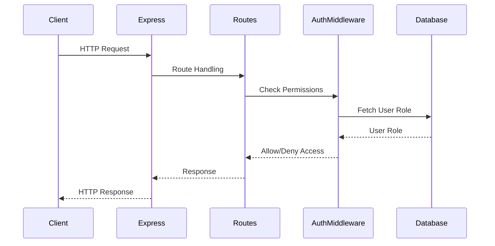

<details>
<summary>Relevant source files</summary>

The following files were used as context for generating this wiki page:

- [src/index.js](https://github.com/aanickode/access-control-service/blob/main/src/index.js)
- [src/routes.js](https://github.com/aanickode/access-control-service/blob/main/src/routes.js)
- [src/authMiddleware.js](https://github.com/aanickode/access-control-service/blob/main/src/authMiddleware.js)
- [src/db.js](https://github.com/aanickode/access-control-service/blob/main/src/db.js)
- [package.json](https://github.com/aanickode/access-control-service/blob/main/package.json)
</details>

# Architecture Overview

## Introduction

This wiki page provides an overview of the architecture and components of the Access Control Service, a Node.js application built with Express.js. The service manages user roles, permissions, and authentication tokens, allowing for fine-grained access control within a larger system or application.

The Access Control Service exposes a RESTful API for managing users, roles, permissions, and authentication tokens. It utilizes an in-memory database for storing user roles and permissions, and implements middleware for checking user permissions before allowing access to certain routes.

Sources: [src/index.js](), [src/routes.js](), [package.json]()

## Application Structure

The application follows a modular structure, with separate files for different concerns:

- `index.js`: The entry point of the application, where the Express server is configured and started.
- `routes.js`: Defines the API routes and their respective handlers.
- `authMiddleware.js`: Contains the middleware function for checking user permissions.
- `db.js`: Provides an in-memory database for storing user roles and permissions.

Sources: [src/index.js](), [src/routes.js](), [src/authMiddleware.js](), [src/db.js]()

## Data Flow

The data flow within the Access Control Service can be represented by the following sequence diagram:



1. The client sends an HTTP request to the Express server.
2. Express routes the request to the appropriate handler in `routes.js`.
3. The route handler calls the `checkPermission` middleware from `authMiddleware.js` to verify the user's permissions.
4. The middleware fetches the user's role from the in-memory database (`db.js`).
5. Based on the user's role and the required permissions, the middleware allows or denies access to the route.
6. The route handler processes the request and sends the response back to the client via Express.

Sources: [src/index.js](), [src/routes.js](), [src/authMiddleware.js](), [src/db.js]()

## API Endpoints

The Access Control Service exposes the following API endpoints:

| Endpoint | Method | Description | Required Permissions |
| --- | --- | --- | --- |
| `/api/users` | GET | Get a list of all users and their roles | `view_users` |
| `/api/roles` | POST | Create a new role with specified permissions | `create_role` |
| `/api/permissions` | GET | Get a list of all roles and their associated permissions | `view_permissions` |
| `/api/tokens` | POST | Create a new authentication token for a user with a specific role | None |

Sources: [src/routes.js]()

## Authentication and Authorization

The Access Control Service implements a permission-based authorization system. Each user is assigned a role, and each role has a set of associated permissions. The `checkPermission` middleware function in `authMiddleware.js` checks if the user's role has the required permission before allowing access to a specific route.

```javascript
export const checkPermission = (requiredPermission) => {
  return (req, res, next) => {
    const userRole = db.users[req.headers.user];
    const permissions = db.roles[userRole] || [];
    if (permissions.includes(requiredPermission)) {
      next();
    } else {
      res.status(403).json({ error: 'Forbidden' });
    }
  };
};
```

The middleware function retrieves the user's role from the in-memory database (`db.js`) based on the `user` header in the request. It then checks if the user's role has the required permission specified in the route handler. If the user has the necessary permission, the request is allowed to proceed; otherwise, a `403 Forbidden` response is sent.

Sources: [src/authMiddleware.js](), [src/db.js]()

## Database

The Access Control Service uses an in-memory database (`db.js`) to store user roles and permissions. The database is a simple JavaScript object with two properties:

- `users`: An object that maps user identifiers (e.g., email addresses) to their respective roles.
- `roles`: An object that maps role names to arrays of associated permissions.

```javascript
const db = {
  users: {},
  roles: {},
};

export default db;
```

While this implementation is suitable for demonstration purposes, a production-ready system would likely use a more robust and persistent database solution.

Sources: [src/db.js]()

## Dependencies

The Access Control Service relies on the following external dependencies:

- `express`: The core web application framework for Node.js.
- `dotenv`: A module for loading environment variables from a `.env` file.

These dependencies are specified in the `package.json` file and can be installed using a package manager like `npm` or `yarn`.

Sources: [package.json]()

## Conclusion

The Access Control Service provides a simple yet extensible architecture for managing user roles, permissions, and authentication tokens within a larger system or application. It follows a modular design, separating concerns into different files and components. The service exposes a RESTful API for managing users, roles, permissions, and authentication tokens, and implements a permission-based authorization system using middleware functions. While the current implementation uses an in-memory database for simplicity, a production-ready system would likely integrate with a more robust and persistent database solution.