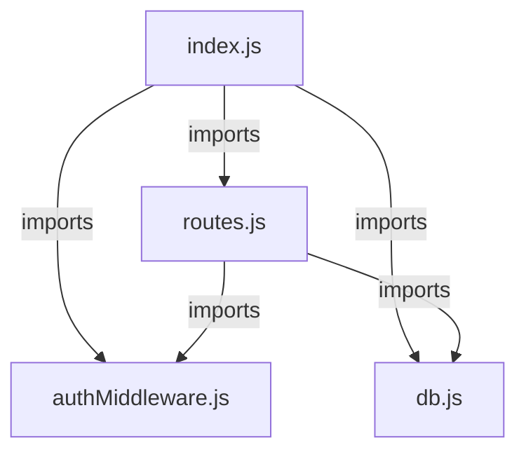
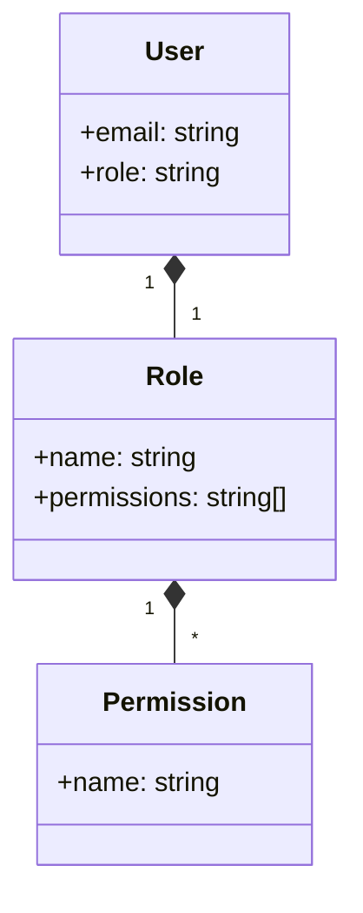
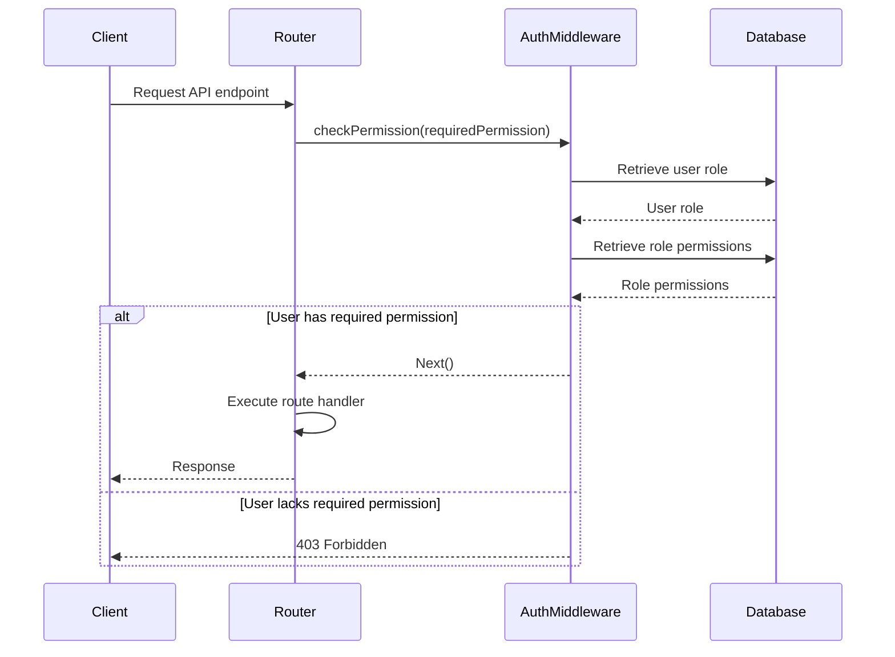

<details>
<summary>Relevant source files</summary>

The following files were used as context for generating this wiki page:

- [src/index.js](https://github.com/aanickode/access-control-service/blob/main/src/index.js)
- [src/routes.js](https://github.com/aanickode/access-control-service/blob/main/src/routes.js)
- [src/authMiddleware.js](https://github.com/aanickode/access-control-service/blob/main/src/authMiddleware.js)
- [src/db.js](https://github.com/aanickode/access-control-service/blob/main/src/db.js)
- [package.json](https://github.com/aanickode/access-control-service/blob/main/package.json)
</details>

# Architecture Overview

The Access Control Service is a Node.js application built with Express.js that provides a RESTful API for managing user roles, permissions, and authentication tokens. It serves as a centralized access control system for other services or applications within a larger project.

Sources: [src/index.js](), [src/routes.js](), [package.json]()

## Application Structure

The application follows a modular structure with separate files for different concerns:

- `index.js`: The entry point that sets up the Express application and starts the server.
- `routes.js`: Defines the API routes and their corresponding handlers.
- `authMiddleware.js`: Contains a middleware function for checking user permissions.
- `db.js`: Provides an in-memory data store for users, roles, and permissions.



Sources: [src/index.js](), [src/routes.js](), [src/authMiddleware.js](), [src/db.js]()

## API Endpoints

The Access Control Service exposes the following API endpoints:

| Endpoint        | Method | Description                                                  | Required Permissions |
|-----------------|--------|--------------------------------------------------------------|----------------------|
| `/api/users`    | GET    | Retrieve a list of users and their roles                    | `view_users`         |
| `/api/roles`    | POST   | Create a new role with specified permissions                | `create_role`        |
| `/api/permissions` | GET    | Retrieve a list of roles and their associated permissions  | `view_permissions`   |
| `/api/tokens`   | POST   | Assign a role to a user and generate an authentication token | None                 |

Sources: [src/routes.js]()

## Authentication and Authorization

The Access Control Service implements a role-based access control (RBAC) system. Each user is assigned a role, and roles are associated with specific permissions.



Sources: [src/routes.js:4,17,22](), [src/db.js:3,4]()

The `checkPermission` middleware function is used to protect routes by verifying if the user has the required permission based on their assigned role.



Sources: [src/routes.js:4,7,12,17,22](), [src/authMiddleware.js]()

## Data Storage

The Access Control Service uses an in-memory data store (`db.js`) to store user information, roles, and permissions. In a production environment, this would typically be replaced with a persistent database.

```javascript
const db = {
  users: {
    // 'user@example.com': 'admin',
    // 'another@example.com': 'viewer'
  },
  roles: {
    // 'admin': ['view_users', 'create_role', 'view_permissions'],
    // 'viewer': ['view_users', 'view_permissions']
  }
};

export default db;
```

Sources: [src/db.js]()

## Conclusion

The Access Control Service provides a centralized solution for managing user roles, permissions, and authentication within a larger application or system. It follows a modular architecture with separate concerns for API routes, authentication middleware, and data storage. The service implements a role-based access control (RBAC) system, allowing fine-grained control over user permissions and access to protected resources.

Sources: [src/index.js](), [src/routes.js](), [src/authMiddleware.js](), [src/db.js]()