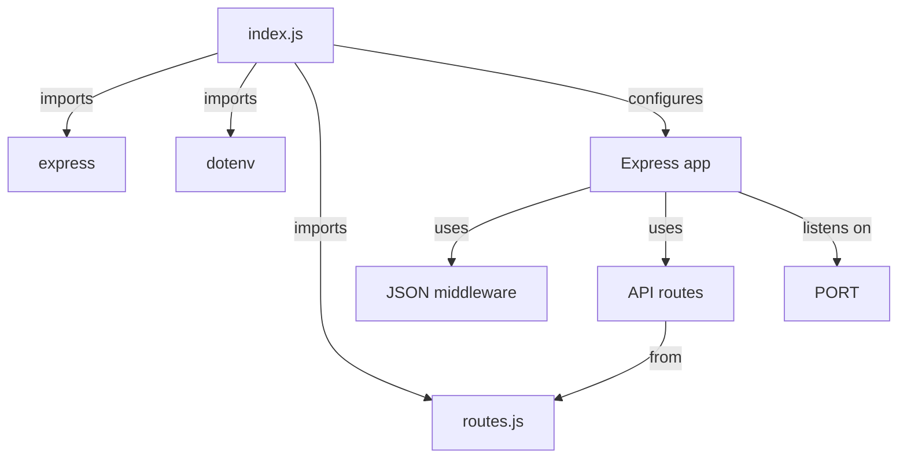
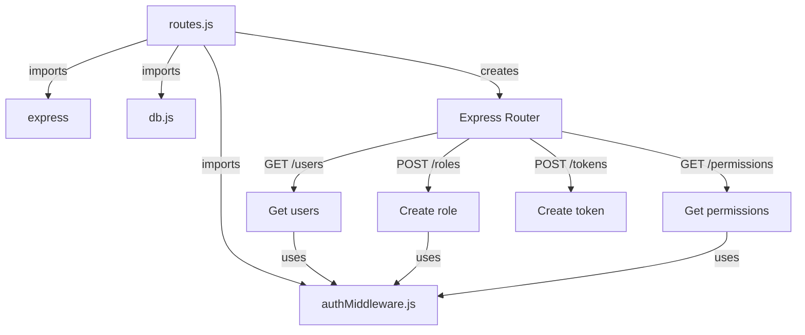
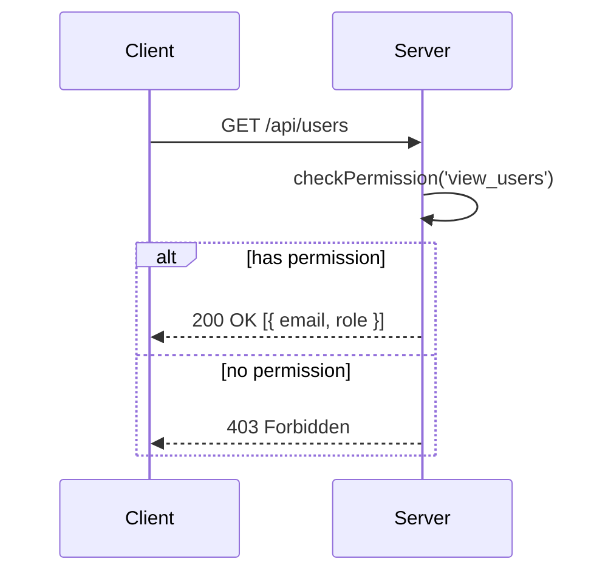
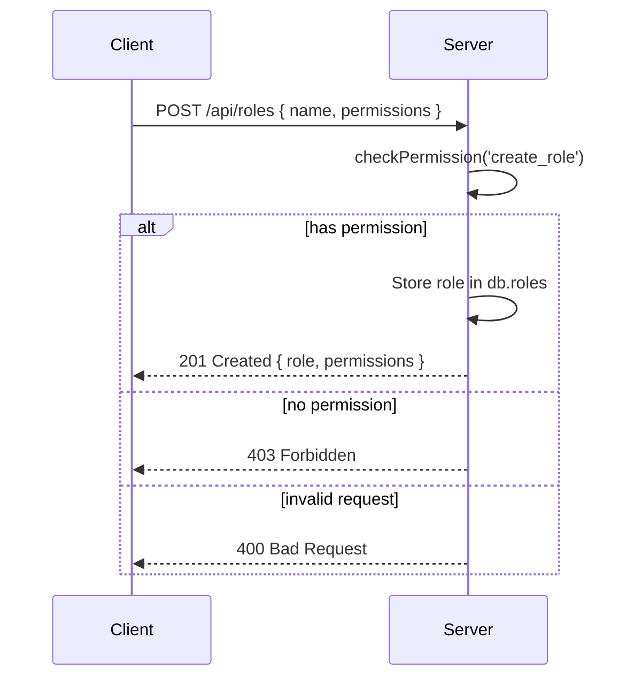
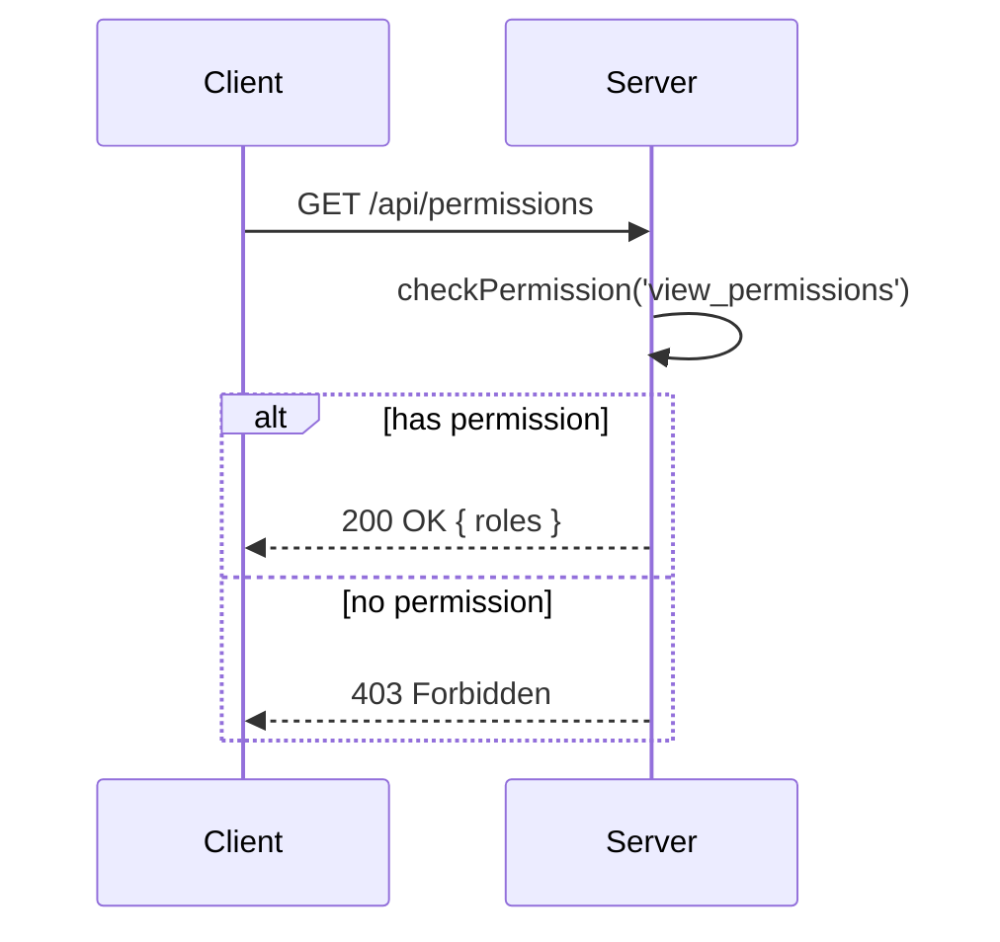
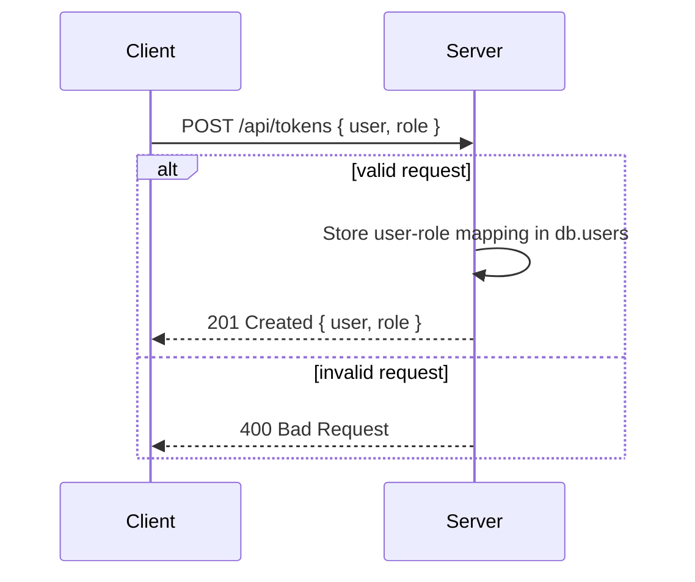
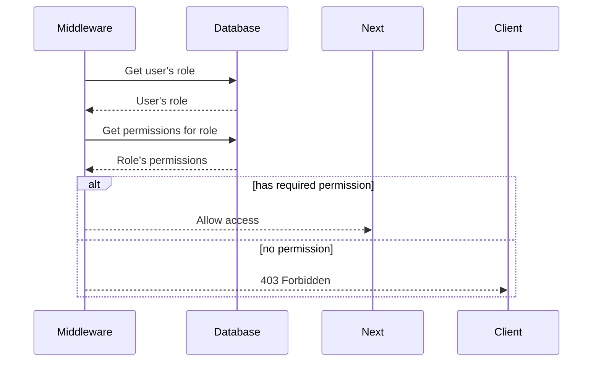

Relevant source files

The following files were used as context for generating this wiki page:

- [src/index.js](https://github.com/aanickode/access-control-service/blob/main/src/index.js)
- [src/routes.js](https://github.com/aanickode/access-control-service/blob/main/src/routes.js)
- [src/authMiddleware.js](https://github.com/aanickode/access-control-service/blob/main/src/authMiddleware.js) (assumed to exist based on import in routes.js)
- [src/db.js](https://github.com/aanickode/access-control-service/blob/main/src/db.js) (assumed to exist based on import in routes.js)

# Architecture Overview

The Access Control Service is a Node.js application built with Express.js that provides a RESTful API for managing user roles, permissions, and access tokens. It serves as a centralized access control system for other applications or services within the project.

## Application Setup

The application entry point is `src/index.js`, which sets up the Express server, configures middleware, and defines the API routes. The server listens on the specified `PORT` environment variable or defaults to port 8080.

Sources: [src/index.js](https://github.com/aanickode/access-control-service/blob/main/src/index.js)

## API Routes

The API routes are defined in `src/routes.js`, which imports the necessary dependencies and middleware functions. The routes handle various operations related to users, roles, permissions, and access tokens.

Sources: [src/routes.js](https://github.com/aanickode/access-control-service/blob/main/src/routes.js)

### GET /users

This route retrieves a list of all registered users and their associated roles. It requires the `view_users` permission, which is checked by the `checkPermission` middleware imported from `authMiddleware.js`.

Sources: [src/routes.js:5-8](https://github.com/aanickode/access-control-service/blob/main/src/routes.js#L5-L8)

### POST /roles

This route allows creating a new role with a specified name and a list of associated permissions. It requires the `create_role` permission, which is checked by the `checkPermission` middleware.

Sources: [src/routes.js:10-16](https://github.com/aanickode/access-control-service/blob/main/src/routes.js#L10-L16)

### GET /permissions

This route retrieves a list of all defined roles and their associated permissions. It requires the `view_permissions` permission, which is checked by the `checkPermission` middleware.

Sources: [src/routes.js:18-21](https://github.com/aanickode/access-control-service/blob/main/src/routes.js#L18-L21)

### POST /tokens

This route allows creating an access token for a user by associating the user with a specific role. It does not require any permission checks.

Sources: [src/routes.js:23-30](https://github.com/aanickode/access-control-service/blob/main/src/routes.js#L23-L30)

## Data Storage

The application uses an in-memory data store (`db.js`) to store user-role mappings and role-permission mappings. This is likely a temporary solution for development purposes and should be replaced with a persistent database in a production environment.

| Key | Value |
| --- | --- |
| `db.users` | Object mapping user identifiers (e.g., email) to roles |
| `db.roles` | Object mapping role names to lists of associated permissions |

Sources: [src/routes.js](https://github.com/aanickode/access-control-service/blob/main/src/routes.js) (references to `db.users` and `db.roles`)

## Authentication and Authorization

The `authMiddleware.js` module (assumed to exist based on the import in `routes.js`) likely contains the implementation of the `checkPermission` middleware function used for authorization checks. This middleware verifies if the authenticated user has the required permission(s) to access a specific route.

Sources: [src/routes.js](https://github.com/aanickode/access-control-service/blob/main/src/routes.js) (references to `checkPermission` middleware)

## Summary

The Access Control Service provides a centralized API for managing user roles, permissions, and access tokens. It allows creating and retrieving roles with associated permissions, as well as creating access tokens for users by associating them with specific roles. The service enforces authorization checks based on the user's role and required permissions for certain routes. The current implementation uses an in-memory data store, but a persistent database solution should be considered for production environments.