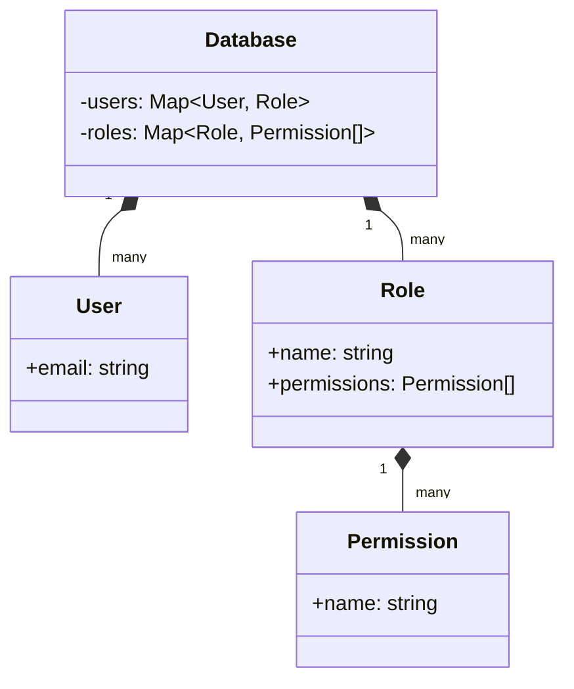
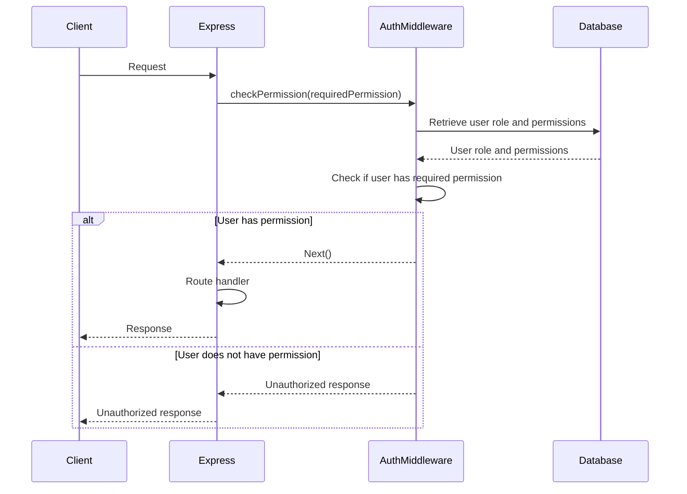

<details>
<summary>Relevant source files</summary>

The following files were used as context for generating this wiki page:

- [src/index.js](https://github.com/aanickode/access-control-service/blob/main/src/index.js)
- [src/routes.js](https://github.com/aanickode/access-control-service/blob/main/src/routes.js)
- [src/authMiddleware.js](https://github.com/aanickode/access-control-service/blob/main/src/authMiddleware.js) (assumed to exist based on the import statement in routes.js)
- [src/db.js](https://github.com/aanickode/access-control-service/blob/main/src/db.js) (assumed to exist based on the import statement in routes.js)
</details>

# Architecture Overview

The provided source files define an Access Control Service, which is a server-side application responsible for managing user roles, permissions, and authentication tokens. This service is built using Node.js and the Express.js framework.

The main purpose of the Access Control Service is to provide a centralized system for managing user access and authorization within an application or a set of applications. It allows administrators to define roles, assign permissions to those roles, and associate users with specific roles. Additionally, the service provides an API for generating authentication tokens for users based on their assigned roles.

## Application Entry Point

The `src/index.js` file serves as the entry point for the application. It sets up the Express.js server, configures middleware, and defines the API routes.

```mermaid
graph TD
    A[index.js] -->|imports| B[express]
    A -->|imports| C[dotenv]
    A -->|imports| D[routes.js]
    A -->|uses| E[express.json()]
    A -->|uses| F[app.use('/api', routes)]
    A -->|uses| G[app.use('/apis', routes)]
    A -->|starts| H[app.listen()]
```

Sources: [src/index.js]()

## API Routes

The `src/routes.js` file defines the API routes for the Access Control Service. It imports the necessary dependencies, including the `checkPermission` middleware function from `authMiddleware.js` and the `db` module for data storage.

### User Management

The `/users` route retrieves a list of all users and their associated roles. It is protected by the `checkPermission` middleware, which ensures that only users with the `view_users` permission can access this route.

```mermaid
graph TD
    A[/users GET] -->|checkPermission('view_users')| B[getUsersAndRoles]
    B -->|returns| C[{email, role}]
```

Sources: [src/routes.js:5-8]()

### Role Management

The `/roles` route allows creating new roles by specifying a name and an array of permissions. It is protected by the `checkPermission` middleware, which requires the `create_role` permission.

```mermaid
graph TD
    A[/roles POST] -->|checkPermission('create_role')| B[createRole]
    B -->|validates| C[req.body]
    C -->|valid| D[db.roles[name] = permissions]
    D -->|returns| E[{role, permissions}]
```

Sources: [src/routes.js:10-16]()

### Permission Retrieval

The `/permissions` route retrieves a list of all defined roles and their associated permissions. It is protected by the `checkPermission` middleware, which requires the `view_permissions` permission.

```mermaid
graph TD
    A[/permissions GET] -->|checkPermission('view_permissions')| B[getPermissions]
    B -->|returns| C[db.roles]
```

Sources: [src/routes.js:18-20]()

### Token Generation

The `/tokens` route allows generating an authentication token for a user by specifying the user's identifier and their associated role. This route is not protected by any middleware.

```mermaid
graph TD
    A[/tokens POST] -->|validates| B[req.body]
    B -->|valid| C[db.users[user] = role]
    C -->|returns| D[{user, role}]
```

Sources: [src/routes.js:22-28]()

## Data Storage

The Access Control Service uses an in-memory data store (`db` module) to store user roles, permissions, and user-role associations. This data store is likely a simplified implementation for demonstration purposes and would need to be replaced with a more robust and persistent storage solution in a production environment.



Sources: [src/db.js]() (assumed based on the import statement in routes.js)

## Authentication Middleware

The `authMiddleware.js` file (assumed to exist based on the import statement in `routes.js`) likely contains the implementation of the `checkPermission` middleware function. This middleware is responsible for verifying the user's permissions before allowing access to certain routes.



Sources: [src/authMiddleware.js]() (assumed based on the import statement in routes.js)

## Key Components

| Component | Description |
| --- | --- |
| Express.js Server | The main application server, responsible for handling incoming requests and routing them to the appropriate handlers. |
| API Routes | Defined in `routes.js`, these routes handle various operations related to user management, role management, permission retrieval, and token generation. |
| Authentication Middleware | The `checkPermission` middleware function, responsible for verifying user permissions before allowing access to certain routes. |
| In-Memory Data Store | A simplified data store (`db` module) for storing user roles, permissions, and user-role associations. |

Sources: [src/index.js](), [src/routes.js](), [src/authMiddleware.js]() (assumed), [src/db.js]() (assumed)

## Conclusion

The Access Control Service provides a centralized system for managing user roles, permissions, and authentication tokens. It allows administrators to define roles, assign permissions to those roles, and associate users with specific roles. The service also provides an API for generating authentication tokens for users based on their assigned roles.

While the provided source files demonstrate the core functionality of the Access Control Service, it is important to note that this implementation uses an in-memory data store, which is not suitable for production environments. In a real-world scenario, a more robust and persistent storage solution, such as a database, would be required.

Additionally, the authentication middleware (`authMiddleware.js`) plays a crucial role in enforcing access control by verifying user permissions before allowing access to certain routes. However, the implementation details of this middleware are not provided in the given source files.

Overall, the Access Control Service serves as a foundation for managing user access and authorization within an application or a set of applications, but it may require additional enhancements and integrations with other systems or services to meet the specific requirements of a production environment.