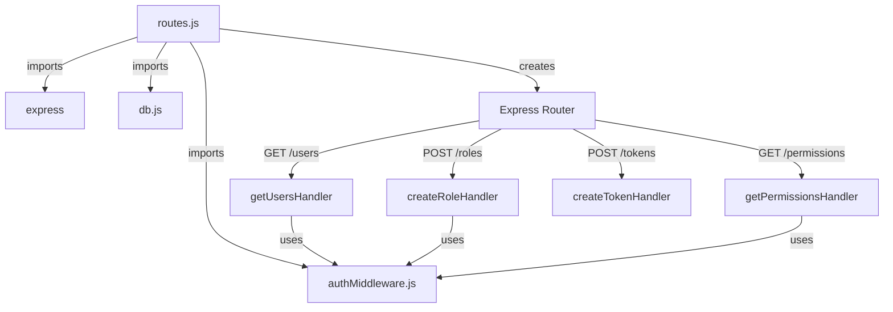
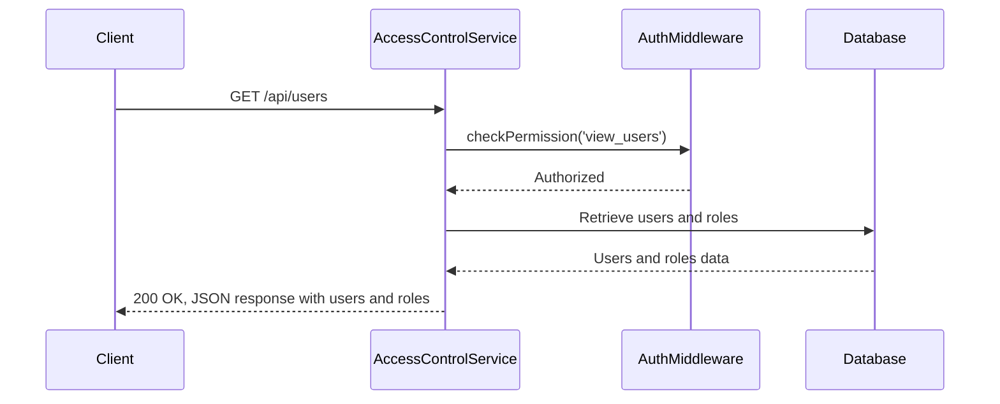
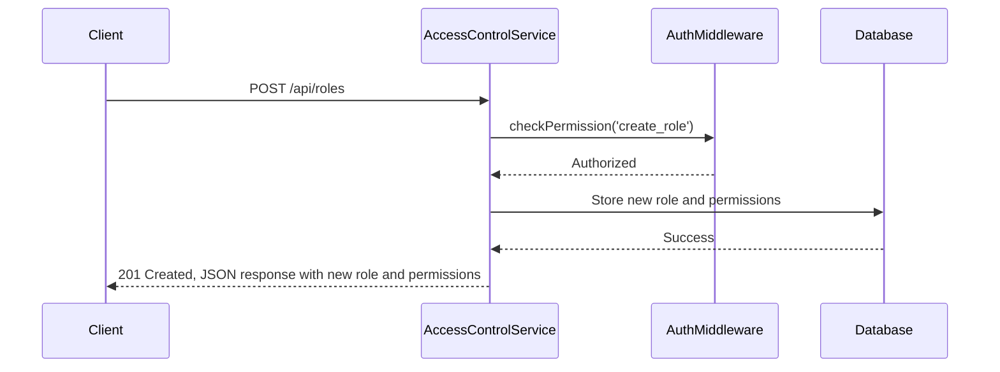
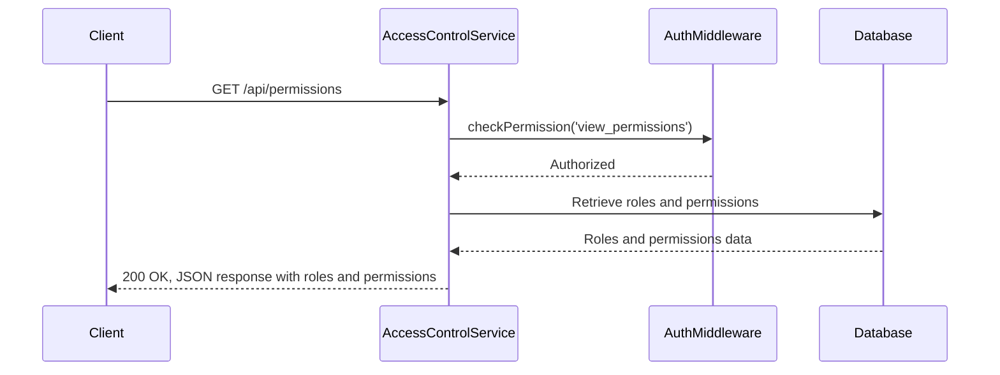
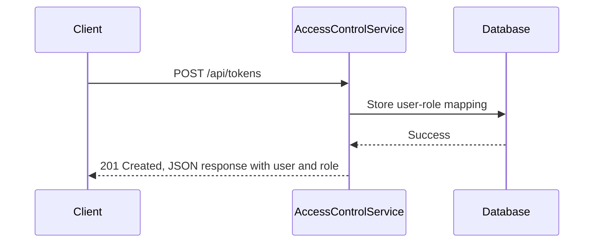

<details>
<summary>Relevant source files</summary>

The following files were used as context for generating this wiki page:

- [src/index.js](https://github.com/aanickode/access-control-service/blob/main/src/index.js)
- [src/routes.js](https://github.com/aanickode/access-control-service/blob/main/src/routes.js)
- [src/authMiddleware.js](https://github.com/aanickode/access-control-service/blob/main/src/authMiddleware.js) (Assumed to exist based on the import in routes.js)
- [src/db.js](https://github.com/aanickode/access-control-service/blob/main/src/db.js) (Assumed to exist based on the import in routes.js)
</details>

# Architecture Overview

This document provides an overview of the architecture and components of the Access Control Service, a Node.js Express application responsible for managing user roles, permissions, and access control within a larger system.

## Introduction

The Access Control Service is a RESTful API that handles user authentication, role management, and permission checking. It serves as a centralized access control mechanism for other services or applications within the system. The service maintains a database of user roles, permissions associated with each role, and user-to-role mappings.

Sources: [src/index.js](), [src/routes.js]()

## Application Structure

The application follows a typical Express.js structure, with the main entry point in `src/index.js`. This file sets up the Express application, configures middleware, and mounts the API routes defined in `src/routes.js`.

```mermaid
graph TD
    A[index.js] -->|imports| B[express]
    A -->|imports| C[dotenv]
    A -->|imports| D[routes.js]
    A -->|uses| E[express.json()]
    A -->|mounts| D
    A -->|listens on port| F[8080]
```

Sources: [src/index.js]()

## API Routes

The API routes are defined in `src/routes.js`, which imports the necessary dependencies and sets up the individual route handlers.



Sources: [src/routes.js]()

### User Management

The `/users` endpoint retrieves a list of all users and their associated roles. It requires the `view_users` permission, which is checked by the `checkPermission` middleware imported from `authMiddleware.js`.



Sources: [src/routes.js:5-8]()

### Role Management

The `/roles` endpoint allows creating a new role by providing a name and an array of associated permissions. It requires the `create_role` permission.



Sources: [src/routes.js:10-16]()

### Permission Retrieval

The `/permissions` endpoint retrieves a list of all defined roles and their associated permissions. It requires the `view_permissions` permission.



Sources: [src/routes.js:18-21]()

### Token Generation

The `/tokens` endpoint generates a new token by associating a user with a role. It does not require any specific permission.



Sources: [src/routes.js:23-29]()

## Data Storage

The application uses an in-memory data store (`db.js`) to maintain user roles, permissions, and user-to-role mappings. This data store is likely a temporary solution and should be replaced with a more robust and persistent storage mechanism, such as a database, in a production environment.

| Key | Value | Description |
|-----|-------|-------------|
| `db.users` | Object | Stores user-to-role mappings, where keys are user identifiers (e.g., email) and values are role names. |
| `db.roles` | Object | Stores role definitions, where keys are role names and values are arrays of associated permissions. |

Sources: [src/routes.js:3]() (import of `db.js`)

## Authentication and Authorization

The Access Control Service relies on the `authMiddleware.js` module to handle authentication and authorization. The `checkPermission` middleware function is used to verify if a user has the required permission to access a specific route.

```javascript
// authMiddleware.js (assumed implementation)
import db from './db.js';

export function checkPermission(requiredPermission) {
  return (req, res, next) => {
    const user = req.user; // Assuming user is set by an authentication middleware
    const role = db.users[user];
    const permissions = db.roles[role] || [];

    if (permissions.includes(requiredPermission)) {
      next();
    } else {
      res.status(403).json({ error: 'Forbidden' });
    }
  };
}
```

Sources: [src/routes.js:4]() (import of `authMiddleware.js`), [src/authMiddleware.js]() (assumed implementation)

## Conclusion

The Access Control Service provides a centralized mechanism for managing user roles, permissions, and access control within the system. It exposes a RESTful API that allows retrieving user and role information, creating new roles, and generating tokens for user-role associations. The service relies on an in-memory data store and a middleware for authentication and authorization checks.

While the current implementation serves as a basic example, it should be extended with additional features and integrated with a more robust and persistent data storage solution for production use.