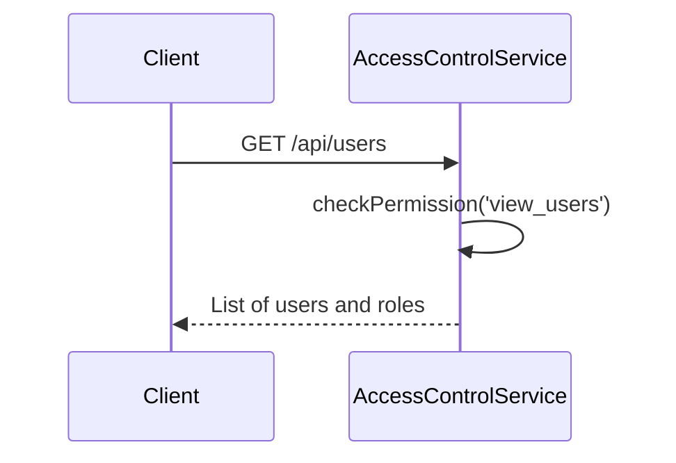
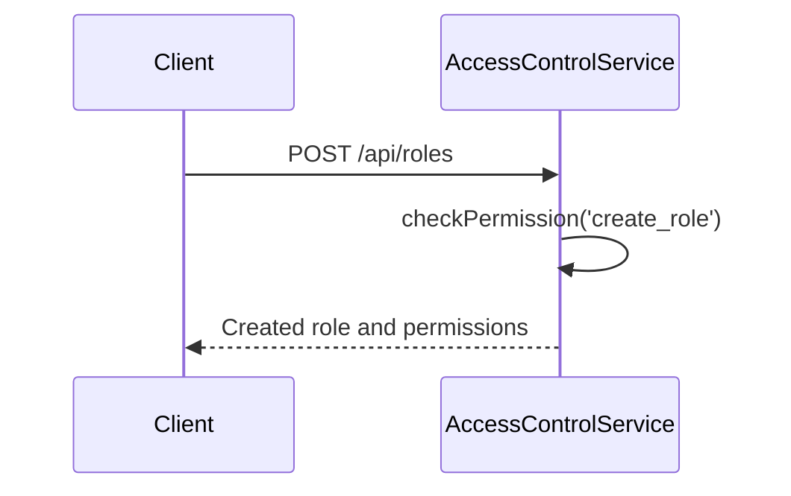
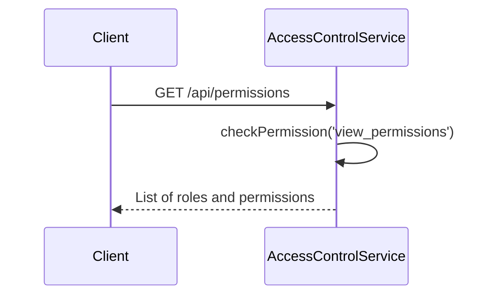
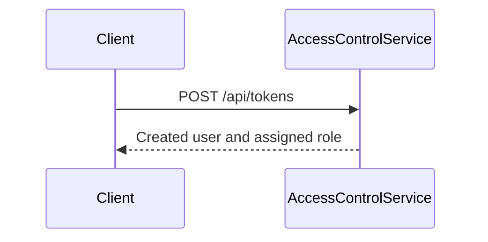

<details>
<summary>Relevant source files</summary>

The following files were used as context for generating this wiki page:

- [src/index.js](https://github.com/aanickode/access-control-service/blob/main/src/index.js)
- [src/routes.js](https://github.com/aanickode/access-control-service/blob/main/src/routes.js)
- [src/authMiddleware.js](https://github.com/aanickode/access-control-service/blob/main/src/authMiddleware.js)
- [src/db.js](https://github.com/aanickode/access-control-service/blob/main/src/db.js)
- [package.json](https://github.com/aanickode/access-control-service/blob/main/package.json)
</details>

# Architecture Overview

The Access Control Service is a Node.js application built with Express.js that provides a RESTful API for managing user roles, permissions, and authentication tokens. It serves as a centralized access control system for other services or applications within a larger project.

Sources: [src/index.js](), [src/routes.js](), [package.json]()

## Application Structure

The application follows a modular structure, with separate files for different concerns:

- `index.js`: The entry point that sets up the Express server and starts listening on a specified port.
- `routes.js`: Defines the API routes and their respective handlers.
- `authMiddleware.js`: Contains a middleware function for checking user permissions.
- `db.js`: Provides an in-memory data store for users, roles, and permissions.

Sources: [src/index.js](), [src/routes.js](), [src/authMiddleware.js](), [src/db.js]()

## API Endpoints

The Access Control Service exposes the following API endpoints:

### GET /api/users



Retrieves a list of registered users and their assigned roles. Requires the `view_users` permission.

Sources: [src/routes.js:5-8]()

### POST /api/roles



Creates a new role with a specified name and set of permissions. Requires the `create_role` permission.

Sources: [src/routes.js:10-16]()

### GET /api/permissions



Retrieves a list of defined roles and their associated permissions. Requires the `view_permissions` permission.

Sources: [src/routes.js:18-20]()

### POST /api/tokens



Assigns a role to a user, effectively creating an authentication token for that user. No permission is required for this endpoint.

Sources: [src/routes.js:22-28]()

## Data Models

### Users

The `users` object in the `db.js` file stores user email addresses as keys and their assigned roles as values.

```js
users: {
  'user1@example.com': 'admin',
  'user2@example.com': 'viewer',
  // ...
}
```

Sources: [src/db.js:3-6]()

### Roles

The `roles` object in the `db.js` file stores role names as keys and their associated permissions as values.

```js
roles: {
  'admin': ['view_users', 'create_role', 'view_permissions'],
  'viewer': ['view_users', 'view_permissions'],
  // ...
}
```

Sources: [src/db.js:8-11]()

## Authentication and Authorization

The Access Control Service uses a role-based access control (RBAC) model for authentication and authorization.

### Authentication

Users are authenticated by assigning them a role using the `POST /api/tokens` endpoint. The assigned role serves as an authentication token for the user.

Sources: [src/routes.js:22-28]()

### Authorization

The `checkPermission` middleware function is used to authorize access to certain API endpoints based on the user's assigned role and the required permissions.

```js
import db from './db.js';

export const checkPermission = (requiredPermission) => (req, res, next) => {
  const userRole = db.users[req.headers.user];
  const rolePermissions = db.roles[userRole] || [];

  if (rolePermissions.includes(requiredPermission)) {
    next();
  } else {
    res.status(403).json({ error: 'Forbidden' });
  }
};
```

The middleware checks the user's role based on the `user` header in the request. It then retrieves the permissions associated with that role from the `roles` object in the `db.js` file. If the required permission is present in the user's role permissions, the request is allowed to proceed; otherwise, a `403 Forbidden` response is sent.

Sources: [src/authMiddleware.js](), [src/routes.js:5,10,18]()

## Deployment and Configuration

The Access Control Service is a Node.js application that can be deployed to various environments, such as a local development server or a production server.

### Environment Variables

The application uses the `dotenv` library to load environment variables from a `.env` file. The following environment variable is used:

- `PORT`: The port on which the server should listen. If not provided, it defaults to `8080`.

Sources: [src/index.js:3,10](), [package.json]()

### Dependencies

The application has the following dependencies:

- `express`: The web application framework used for building the API.
- `dotenv`: A library for loading environment variables from a `.env` file.

Sources: [package.json]()

## Conclusion

The Access Control Service provides a centralized solution for managing user roles, permissions, and authentication tokens within a larger project. It follows a modular architecture and leverages the Express.js framework to expose a RESTful API. The service implements a role-based access control (RBAC) model for authorization, allowing fine-grained control over access to different API endpoints based on user roles and permissions.