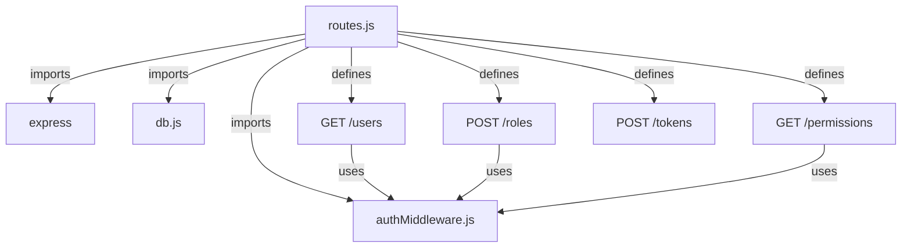
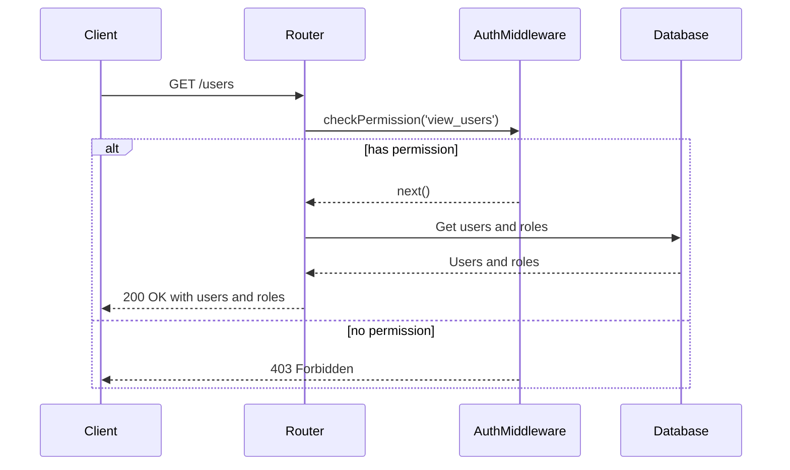
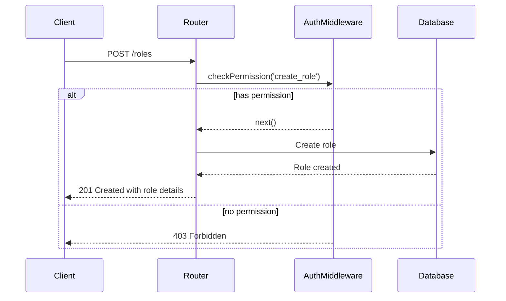
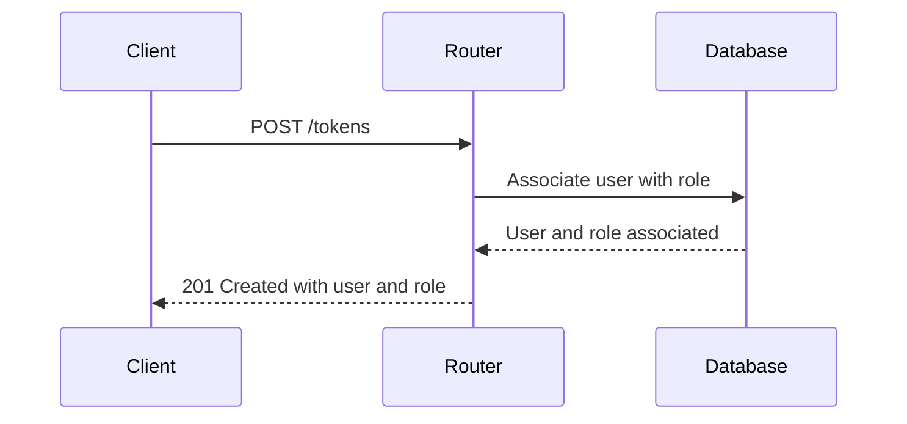

<details>
<summary>Relevant source files</summary>

The following files were used as context for generating this wiki page:

- [src/index.js](https://github.com/aanickode/access-control-service/blob/main/src/index.js)
- [src/routes.js](https://github.com/aanickode/access-control-service/blob/main/src/routes.js)
- [src/authMiddleware.js](https://github.com/aanickode/access-control-service/blob/main/src/authMiddleware.js)
- [src/db.js](https://github.com/aanickode/access-control-service/blob/main/src/db.js)
- [package.json](https://github.com/aanickode/access-control-service/blob/main/package.json)
</details>

# Architecture Overview

## Introduction

This wiki page provides an overview of the architecture and components of the Access Control Service, a Node.js application built with Express.js. The service manages user roles, permissions, and authentication tokens, allowing for role-based access control (RBAC) within a larger system or application.

The Access Control Service exposes a RESTful API for managing users, roles, permissions, and authentication tokens. It utilizes an in-memory data store for storing user information, roles, and their associated permissions.

Sources: [src/index.js](), [src/routes.js](), [package.json]()

## Application Structure

The Access Control Service follows a typical Express.js application structure, with the main entry point being `src/index.js`. This file sets up the Express application, configures middleware, and defines the API routes.

```mermaid
graph TD
    A[index.js] -->|imports| B[express]
    A -->|imports| C[dotenv]
    A -->|imports| D[routes.js]
    A -->|uses| E[express.json()]
    A -->|uses| F[routes]
    A -->|listens on| G[PORT]
```

Sources: [src/index.js]()

## API Routes

The API routes are defined in `src/routes.js`, which imports the necessary middleware and database module. The routes handle various operations related to users, roles, permissions, and authentication tokens.



Sources: [src/routes.js]()

### GET /users

This route retrieves a list of all users and their associated roles. It requires the `view_users` permission, which is checked by the `checkPermission` middleware.



Sources: [src/routes.js:5-8](), [src/authMiddleware.js]()

### POST /roles

This route creates a new role with the specified name and permissions. It requires the `create_role` permission, which is checked by the `checkPermission` middleware.



Sources: [src/routes.js:10-16](), [src/authMiddleware.js]()

### GET /permissions

This route retrieves a list of all roles and their associated permissions. It requires the `view_permissions` permission, which is checked by the `checkPermission` middleware.


Sources: [src/routes.js:18-21](), [src/authMiddleware.js]()

### POST /tokens

This route creates an authentication token by associating a user with a role. It does not require any specific permission.



Sources: [src/routes.js:23-29]()

## Data Storage

The Access Control Service uses an in-memory data store (`src/db.js`) to store user information, roles, and their associated permissions. This data store is a simple JavaScript object that serves as a mock database for demonstration purposes.

```javascript
const db = {
  users: {
    // 'user@example.com': 'admin',
    // 'user2@example.com': 'viewer'
  },
  roles: {
    // 'admin': ['view_users', 'create_role', 'view_permissions'],
    // 'viewer': ['view_users', 'view_permissions']
  }
};

export default db;
```

Sources: [src/db.js]()

## Authentication and Authorization

The Access Control Service implements role-based access control (RBAC) using the `checkPermission` middleware defined in `src/authMiddleware.js`. This middleware checks if the authenticated user has the required permission based on their assigned role.

```javascript
import db from './db.js';

export const checkPermission = (requiredPermission) => {
  return (req, res, next) => {
    const userEmail = req.headers['x-user-email'];
    if (!userEmail) {
      return res.status(401).json({ error: 'Unauthorized' });
    }

    const userRole = db.users[userEmail];
    if (!userRole) {
      return res.status(403).json({ error: 'Forbidden' });
    }

    const rolePermissions = db.roles[userRole] || [];
    if (rolePermissions.includes(requiredPermission)) {
      next();
    } else {
      res.status(403).json({ error: 'Forbidden' });
    }
  };
};
```

The `checkPermission` middleware expects the user's email to be provided in the `x-user-email` header. It then checks if the user has the required permission based on their assigned role and the permissions associated with that role.

Sources: [src/authMiddleware.js]()

## Dependencies

The Access Control Service relies on the following dependencies:

| Dependency | Version | Description |
| --- | --- | --- |
| express | ^4.18.2 | Fast, unopinionated, minimalist web framework for Node.js |
| dotenv | ^16.0.3 | Loads environment variables from a `.env` file |

Sources: [package.json]()

## Conclusion

The Access Control Service provides a RESTful API for managing users, roles, permissions, and authentication tokens. It implements role-based access control (RBAC) using an in-memory data store. The service follows a modular architecture, with separate modules for handling routes, middleware, and data storage. The architecture is designed to be extensible and can be integrated into larger systems or applications that require access control and authorization mechanisms.