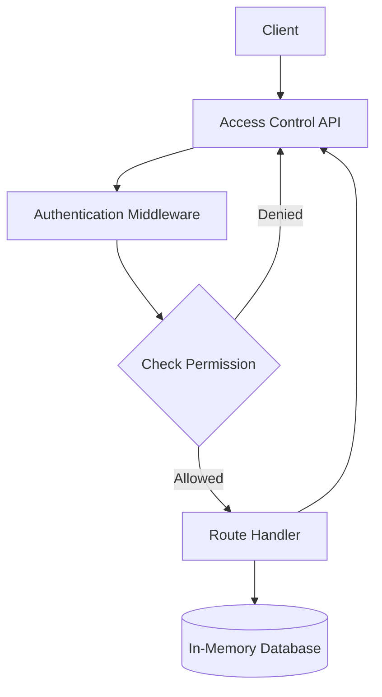
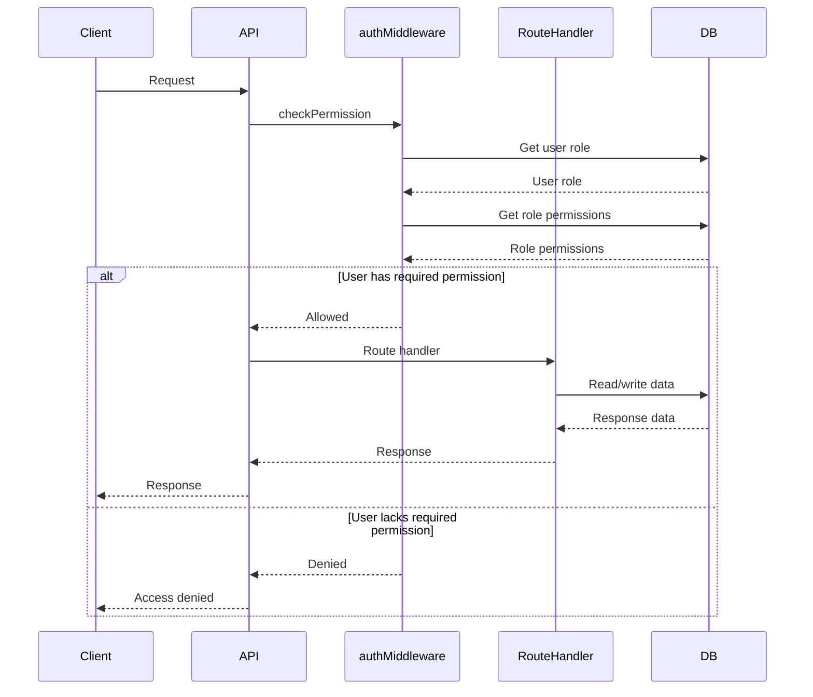

<details>
<summary>Relevant source files</summary>

The following files were used as context for generating this wiki page:

- [src/index.js](https://github.com/aanickode/access-control-service/blob/main/src/index.js)
- [src/routes.js](https://github.com/aanickode/access-control-service/blob/main/src/routes.js)
- [src/authMiddleware.js](https://github.com/aanickode/access-control-service/blob/main/src/authMiddleware.js)
- [src/db.js](https://github.com/aanickode/access-control-service/blob/main/src/db.js)
- [package.json](https://github.com/aanickode/access-control-service/blob/main/package.json)
</details>

# Architecture Overview

The Access Control Service is a Node.js application built with Express.js that provides a RESTful API for managing user roles, permissions, and access tokens. It serves as a centralized access control system for other applications or services within a larger project.

## Application Structure

The application follows a modular structure with separate files for different concerns:

- `index.js`: The entry point that sets up the Express server and mounts the API routes.
- `routes.js`: Defines the API routes and their corresponding handlers.
- `authMiddleware.js`: Contains a middleware function for checking user permissions.
- `db.js`: Provides an in-memory data store for users, roles, and permissions.

Sources: [src/index.js](), [src/routes.js](), [src/authMiddleware.js](), [src/db.js]()

## Data Flow



The data flow in the Access Control Service follows this sequence:

1. A client sends a request to the API.
2. The `authMiddleware` checks if the user has the required permission for the requested route.
3. If the user has permission, the request is forwarded to the corresponding route handler.
4. The route handler interacts with the in-memory database to read or write data related to users, roles, and permissions.
5. The route handler sends the appropriate response back to the client through the API.

Sources: [src/routes.js:4,7-19,22-28,31-37](), [src/authMiddleware.js]()

## API Endpoints

The Access Control Service exposes the following API endpoints:

| Endpoint        | Method | Description                                                  |
|-----------------|--------|--------------------------------------------------------------|
| `/users`        | GET    | Retrieve a list of users and their roles                     |
| `/roles`        | POST   | Create a new role with specified permissions                 |
| `/permissions`  | GET    | Retrieve a list of all roles and their associated permissions|
| `/tokens`       | POST   | Create a new access token for a user with a specified role   |

Sources: [src/routes.js:7-19,22-28,31-37]()

## Authentication and Authorization

The Access Control Service uses a custom middleware function `checkPermission` to enforce access control based on user roles and permissions.



1. The client sends a request to the API.
2. The `authMiddleware` checks the user's role and the required permission for the requested route.
3. If the user has the required permission, the request is forwarded to the corresponding route handler.
4. The route handler interacts with the in-memory database to read or write data.
5. The route handler sends the appropriate response back to the client through the API.
6. If the user lacks the required permission, the `authMiddleware` denies the request, and the API responds with an access denied error.

Sources: [src/authMiddleware.js](), [src/routes.js:7,10,15,19]()

## Data Storage

The Access Control Service uses an in-memory data store implemented in `db.js` to store user information, roles, and permissions. This data store is a simple JavaScript object with the following structure:

```javascript
const db = {
  users: {
    'user1@example.com': 'admin',
    'user2@example.com': 'viewer',
    // ...
  },
  roles: {
    'admin': ['view_users', 'create_role', 'view_permissions'],
    'viewer': ['view_users', 'view_permissions'],
    // ...
  }
};
```

- The `users` object maps user emails to their assigned roles.
- The `roles` object maps role names to an array of associated permissions.

Note: This in-memory data store is intended for demonstration purposes only and should be replaced with a persistent storage solution (e.g., a database) in a production environment.

Sources: [src/db.js]()

## Dependencies

The Access Control Service relies on the following external dependencies:

- `express`: A fast and minimalist web application framework for Node.js.
- `dotenv`: A module for loading environment variables from a `.env` file.

These dependencies are specified in the `package.json` file and can be installed using `npm install`.

Sources: [package.json]()

## Conclusion

The Access Control Service provides a centralized solution for managing user roles, permissions, and access tokens within a larger project. It follows a modular architecture with separate concerns handled by different components. The service enforces access control through a custom middleware function and stores user and permission data in an in-memory data store. While functional, the in-memory data store should be replaced with a persistent storage solution for production use.