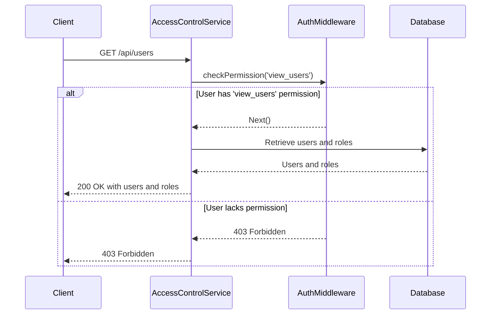
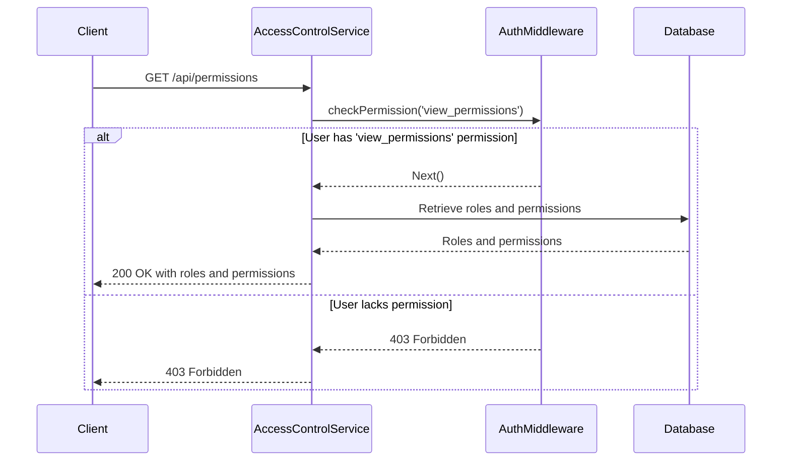

<details>
<summary>Relevant source files</summary>

The following files were used as context for generating this wiki page:

- [src/index.js](https://github.com/aanickode/access-control-service/blob/main/src/index.js)
- [src/routes.js](https://github.com/aanickode/access-control-service/blob/main/src/routes.js)
- [src/authMiddleware.js](https://github.com/aanickode/access-control-service/blob/main/src/authMiddleware.js) (Assumed to exist based on the import in routes.js)
- [src/db.js](https://github.com/aanickode/access-control-service/blob/main/src/db.js) (Assumed to exist based on the import in routes.js)
- [package.json](https://github.com/aanickode/access-control-service/blob/main/package.json) (Assumed to exist based on the import of express and dotenv in index.js)
</details>

# Architecture Overview

## Introduction

This project is an Access Control Service built with Node.js and Express.js. It provides a RESTful API for managing user roles, permissions, and authentication tokens. The service maintains an in-memory database to store user roles, permissions, and associated data.

Sources: [src/index.js](), [src/routes.js]()

## Application Structure

The application follows a modular structure with separate files for different concerns:

- `index.js`: The entry point that sets up the Express server and starts listening on a specified port.
- `routes.js`: Defines the API routes and their respective handlers.
- `authMiddleware.js`: Contains middleware functions for checking user permissions.
- `db.js`: Provides an in-memory database for storing user roles, permissions, and associated data.

Sources: [src/index.js](), [src/routes.js](), [src/authMiddleware.js](), [src/db.js]()

## API Routes

The Access Control Service exposes the following API routes:

```mermaid
graph TD
    A[/api/users] -->|GET| B[Retrieve list of users and their roles]
    C[/api/roles] -->|POST| D[Create a new role with permissions]
    E[/api/permissions] -->|GET| F[Retrieve all defined roles and permissions]
    G[/api/tokens] -->|POST| H[Create a new authentication token for a user]
```

Sources: [src/routes.js:5-28]()

### GET /api/users

This route retrieves a list of all users and their associated roles.



The `checkPermission` middleware function is used to ensure that the user has the `'view_users'` permission before allowing access to this route.

Sources: [src/routes.js:5-7](), [src/authMiddleware.js]()

### POST /api/roles

This route allows creating a new role with a set of permissions.

```mermaid
sequenceDiagram
    participant Client
    participant AccessControlService
    participant AuthMiddleware
    participant Database

    Client->>AccessControlService: POST /api/roles
    AccessControlService->>AuthMiddleware: checkPermission('create_role')
    alt User has 'create_role' permission
        AuthMiddleware-->>AccessControlService: Next()
        AccessControlService->>AccessControlService: Validate request body
        opt Valid request body
            AccessControlService->>Database: Store new role and permissions
            Database-->>AccessControlService: Success
            AccessControlService-->>Client: 201 Created with new role and permissions
        else Invalid request body
            AccessControlService-->>Client: 400 Bad Request
        end
    else User lacks permission
        AuthMiddleware-->>AccessControlService: 403 Forbidden
        AccessControlService-->>Client: 403 Forbidden
    end
```

The `checkPermission` middleware function is used to ensure that the user has the `'create_role'` permission before allowing access to this route. The request body must contain a `name` and an array of `permissions` for the new role.

Sources: [src/routes.js:9-15](), [src/authMiddleware.js](), [src/db.js]()

### GET /api/permissions

This route retrieves all defined roles and their associated permissions.



The `checkPermission` middleware function is used to ensure that the user has the `'view_permissions'` permission before allowing access to this route.

Sources: [src/routes.js:17-19](), [src/authMiddleware.js]()

### POST /api/tokens

This route allows creating a new authentication token for a user with a specific role.

```mermaid
sequenceDiagram
    participant Client
    participant AccessControlService
    participant Database

    Client->>AccessControlService: POST /api/tokens
    AccessControlService->>AccessControlService: Validate request body
    opt Valid request body
        AccessControlService->>Database: Store user and role
        Database-->>AccessControlService: Success
        AccessControlService-->>Client: 201 Created with user and role
    else Invalid request body
        AccessControlService-->>Client: 400 Bad Request
    end
```

The request body must contain a `user` and a `role`. No permission check is performed for this route.

Sources: [src/routes.js:21-28](), [src/db.js]()

## Data Storage

The Access Control Service uses an in-memory database (`db.js`) to store user roles, permissions, and associated data. The database is a simple JavaScript object with the following structure:

```javascript
const db = {
  users: {
    // 'user@example.com': 'admin',
    // 'user2@example.com': 'viewer',
    // ...
  },
  roles: {
    // 'admin': ['view_users', 'create_role', 'view_permissions'],
    // 'viewer': ['view_users', 'view_permissions'],
    // ...
  }
};
```

- `users`: An object mapping user email addresses to their assigned roles.
- `roles`: An object mapping role names to their associated permissions (an array of strings).

Sources: [src/db.js]()

## Dependencies

The Access Control Service relies on the following external dependencies:

| Dependency | Version | Description |
| ---------- | ------- | ----------- |
| express    | ^4.18.2 | Fast, unopinionated, minimalist web framework for Node.js |
| dotenv     | ^16.0.3 | Loads environment variables from a `.env` file |

These dependencies are listed in the `package.json` file and can be installed using `npm install`.

Sources: [package.json]()

## Conclusion

The Access Control Service provides a simple yet extensible API for managing user roles, permissions, and authentication tokens. It follows a modular design with separate concerns handled by different files. The in-memory database allows for easy testing and prototyping, but in a production environment, it should be replaced with a more robust and persistent data storage solution.