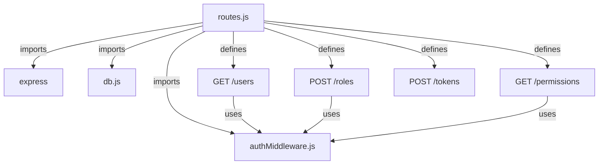
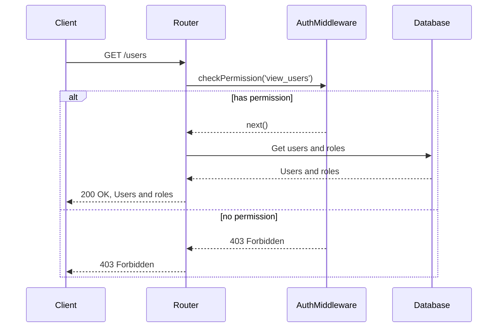
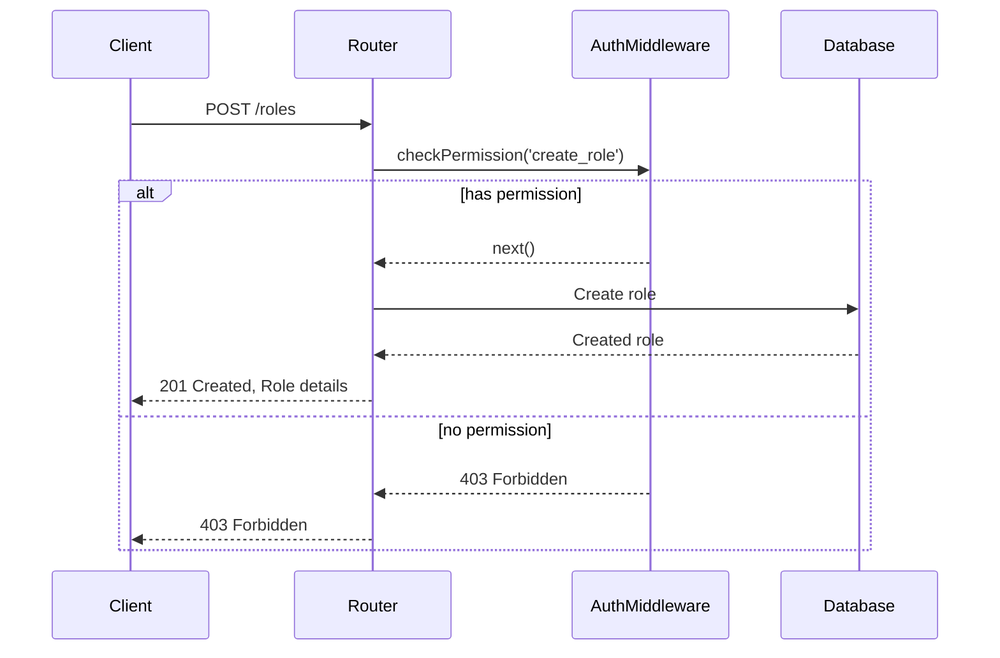
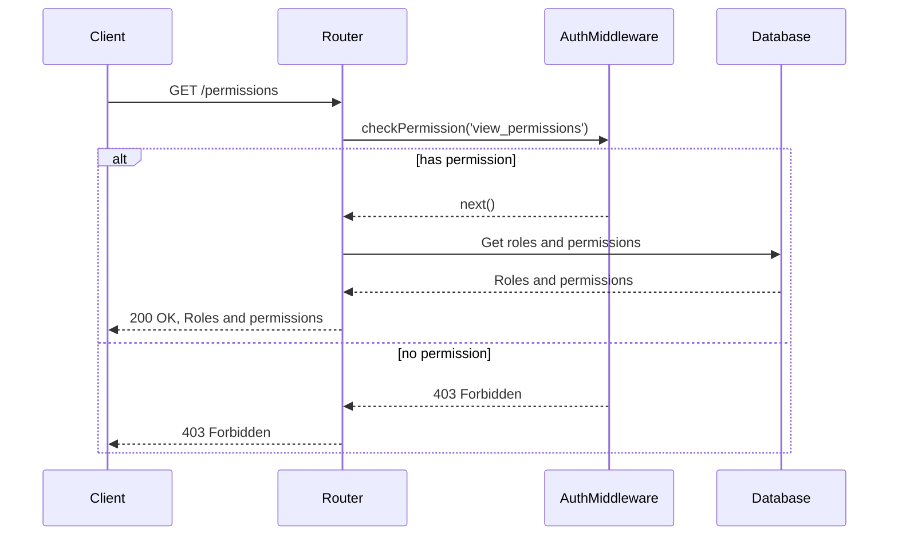
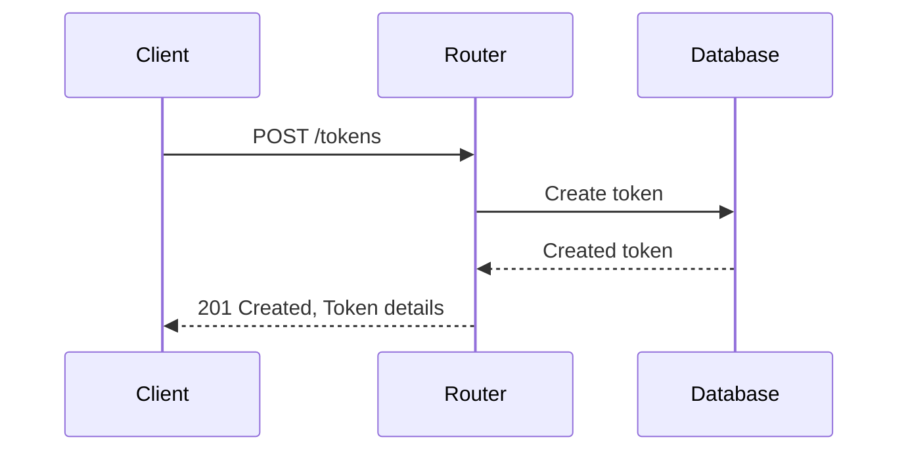
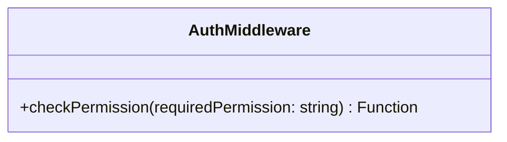
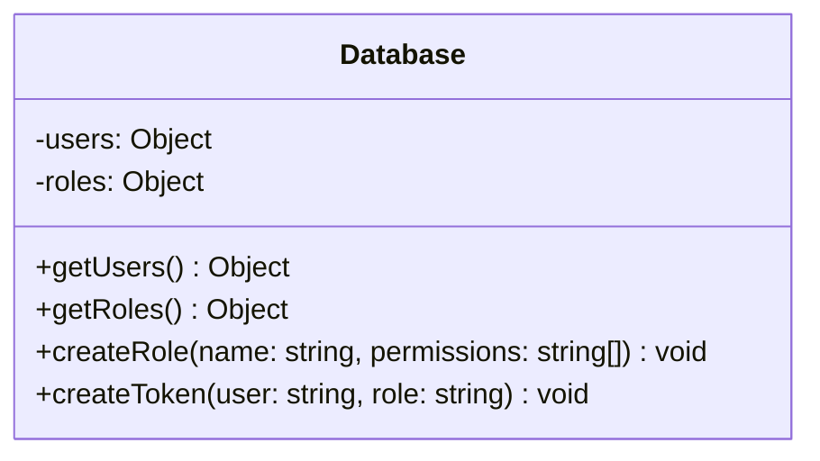

<details>
<summary>Relevant source files</summary>

The following files were used as context for generating this wiki page:

- [src/index.js](https://github.com/aanickode/access-control-service/blob/main/src/index.js)
- [src/routes.js](https://github.com/aanickode/access-control-service/blob/main/src/routes.js)
- [src/authMiddleware.js](https://github.com/aanickode/access-control-service/blob/main/src/authMiddleware.js) (assumed to exist based on the import in routes.js)
- [src/db.js](https://github.com/aanickode/access-control-service/blob/main/src/db.js) (assumed to exist based on the import in routes.js)
</details>

# Architecture Overview

## Introduction

This wiki page provides an overview of the architecture and components of the Access Control Service, a Node.js application built with Express.js. The service is responsible for managing user roles, permissions, and authentication tokens within a system. It exposes a RESTful API for interacting with user data, roles, and permissions.

Sources: [src/index.js](), [src/routes.js]()

## Application Structure

The application follows a modular structure, with the main entry point being `index.js`. This file sets up the Express.js application, configures middleware, and mounts the API routes.

```mermaid
graph TD
    A[index.js] -->|imports| B[express]
    A -->|imports| C[dotenv]
    A -->|imports| D[routes.js]
    A -->|uses| E[express.json()]
    A -->|mounts| D
    A -->|listens on port| F[8080]
```

Sources: [src/index.js]()

## API Routes

The API routes are defined in `routes.js`, which imports the necessary middleware and database modules. The routes handle various operations related to users, roles, permissions, and authentication tokens.



Sources: [src/routes.js]()

### User Management

The `/users` route retrieves a list of all users and their associated roles. It requires the `view_users` permission, which is checked by the `checkPermission` middleware.



Sources: [src/routes.js:4-7]()

### Role Management

The `/roles` route allows creating a new role by providing a name and an array of associated permissions. It requires the `create_role` permission.



Sources: [src/routes.js:8-14]()

### Permission Retrieval

The `/permissions` route retrieves all defined roles and their associated permissions. It requires the `view_permissions` permission.



Sources: [src/routes.js:15-18]()

### Token Management

The `/tokens` route allows creating an authentication token by providing a user and a role. It does not require any specific permission.



Sources: [src/routes.js:19-25]()

## Authentication Middleware

The `authMiddleware.js` module exports a `checkPermission` function, which is used as middleware to verify if the current user has the required permission to access a specific route.



Sources: [src/authMiddleware.js]() (assumed to exist based on the import in routes.js)

## Data Storage

The application uses an in-memory data store to persist user data, roles, and permissions. The `db.js` module likely exports an object or a class that manages the data storage and retrieval operations.



Sources: [src/db.js]() (assumed to exist based on the import in routes.js)

## Conclusion

The Access Control Service provides a RESTful API for managing user roles, permissions, and authentication tokens. It follows a modular architecture, separating concerns into different modules for routes, middleware, and data storage. The service leverages Express.js for handling HTTP requests and middleware for authentication and authorization. The data is stored in an in-memory data store, but this could be replaced with a persistent database in a production environment.