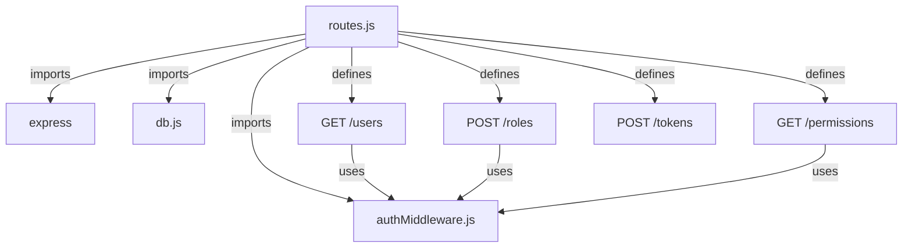
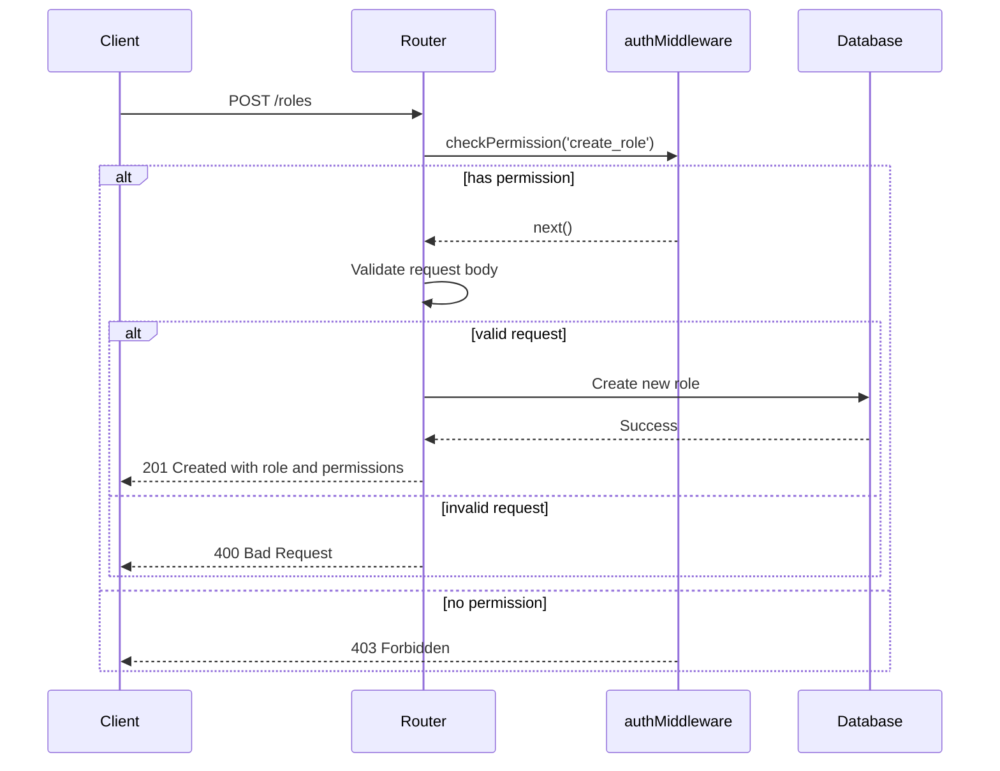
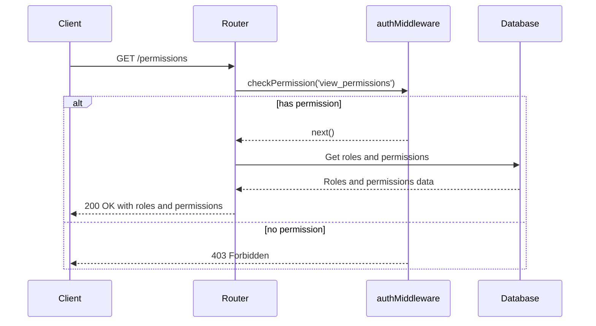
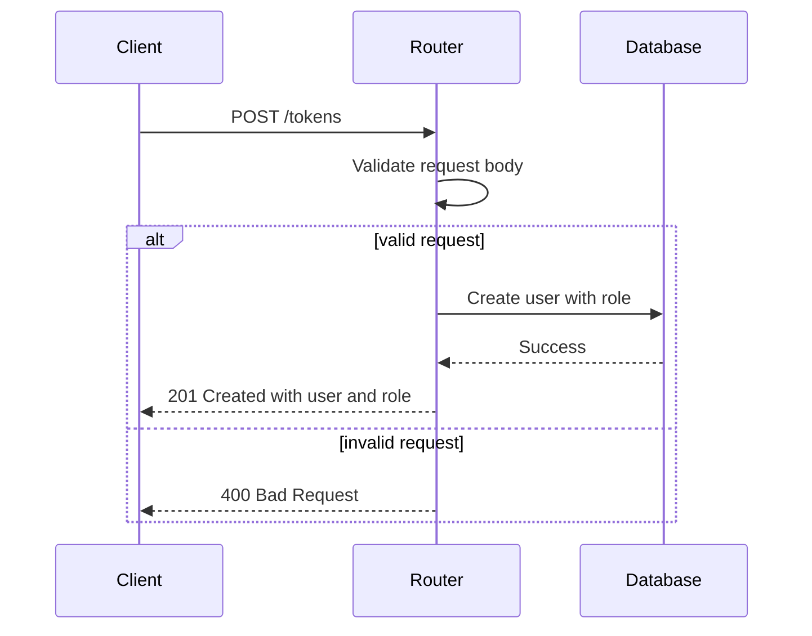

<details>
<summary>Relevant source files</summary>

The following files were used as context for generating this wiki page:

- [src/index.js](https://github.com/aanickode/access-control-service/blob/main/src/index.js)
- [src/routes.js](https://github.com/aanickode/access-control-service/blob/main/src/routes.js)
- [src/authMiddleware.js](https://github.com/aanickode/access-control-service/blob/main/src/authMiddleware.js)
- [src/db.js](https://github.com/aanickode/access-control-service/blob/main/src/db.js)
- [package.json](https://github.com/aanickode/access-control-service/blob/main/package.json)
</details>

# Architecture Overview

## Introduction

This wiki page provides an overview of the architecture and components of the Access Control Service, a Node.js application built with Express.js. The service is responsible for managing user roles, permissions, and authentication tokens within a system. It exposes a RESTful API for interacting with user data, roles, and permissions.

Sources: [src/index.js](), [src/routes.js](), [package.json]()

## Application Structure

The Access Control Service follows a typical Express.js application structure, with the main entry point defined in `src/index.js`. This file sets up the Express application, configures middleware, and mounts the API routes.

```mermaid
graph TD
    A[index.js] -->|imports| B[express]
    A -->|imports| C[dotenv]
    A -->|imports| D[routes.js]
    A -->|uses| E[express.json()]
    A -->|mounts| F[/api and /apis routes]
    A -->|listens on| G[PORT]
```

Sources: [src/index.js]()

## API Routes

The API routes are defined in `src/routes.js`, which imports the necessary middleware and database modules. The routes handle various operations related to users, roles, permissions, and authentication tokens.



Sources: [src/routes.js]()

### Users Route

The `/users` route retrieves a list of all users and their associated roles. It requires the `view_users` permission, which is checked by the `checkPermission` middleware.


Sources: [src/routes.js:5-8](), [src/authMiddleware.js]()

### Roles Route

The `/roles` route allows creating a new role with a set of permissions. It requires the `create_role` permission, which is checked by the `checkPermission` middleware.



Sources: [src/routes.js:10-18](), [src/authMiddleware.js]()

### Permissions Route

The `/permissions` route retrieves a list of all defined roles and their associated permissions. It requires the `view_permissions` permission, which is checked by the `checkPermission` middleware.



Sources: [src/routes.js:20-23](), [src/authMiddleware.js]()

### Tokens Route

The `/tokens` route allows creating a new authentication token for a user with a specified role. It does not require any specific permission.



Sources: [src/routes.js:25-32]()

## Data Storage

The Access Control Service uses an in-memory data store (`src/db.js`) to store user data, roles, and permissions. This is likely a simplified implementation for demonstration purposes, and a production system would typically use a more robust and persistent data storage solution.

```javascript
const db = {
  users: {},
  roles: {}
};

export default db;
```

Sources: [src/db.js]()

## Authentication Middleware

The `checkPermission` middleware, defined in `src/authMiddleware.js`, is responsible for checking if a user has the required permission to access a specific route. It is used to protect routes that require certain permissions.

```javascript
import db from './db.js';

export const checkPermission = (requiredPermission) => {
  return (req, res, next) => {
    // Assuming user and role are available in the request object
    const { user, role } = req;

    // Check if the user's role has the required permission
    if (db.roles[role] && db.roles[role].includes(requiredPermission)) {
      next();
    } else {
      res.status(403).json({ error: 'Forbidden' });
    }
  };
};
```

Sources: [src/authMiddleware.js]()

## Dependencies

The Access Control Service relies on the following dependencies:

| Dependency | Version | Description |
| ---------- | ------- | ----------- |
| express    | ^4.18.2 | Web application framework for Node.js |
| dotenv     | ^16.0.3 | Loads environment variables from a `.env` file |

Sources: [package.json]()

## Conclusion

The Access Control Service provides a RESTful API for managing users, roles, permissions, and authentication tokens. It follows a typical Express.js application structure and uses an in-memory data store for simplicity. The service implements role-based access control (RBAC) by checking permissions before allowing access to certain routes. While this implementation is basic, it demonstrates the core concepts of an access control system and can be extended or integrated with more robust authentication and authorization mechanisms as needed.