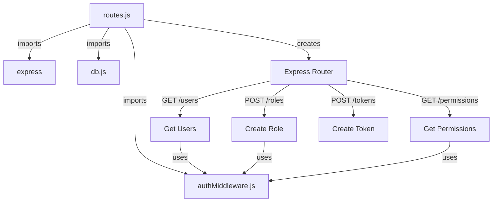
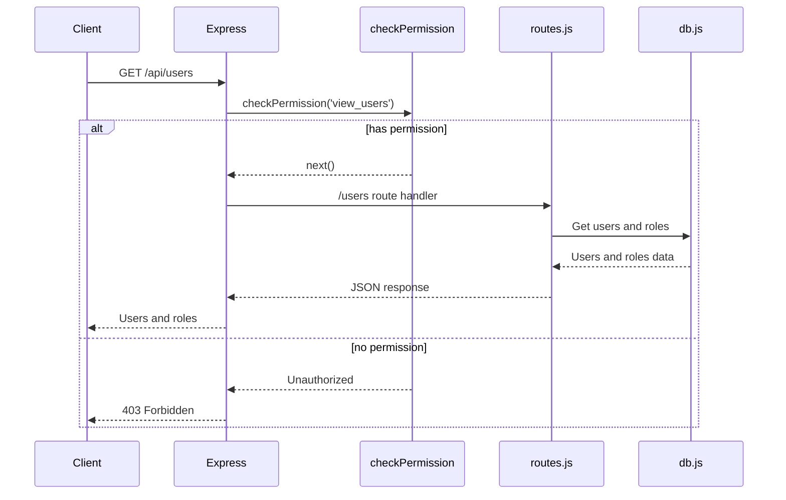
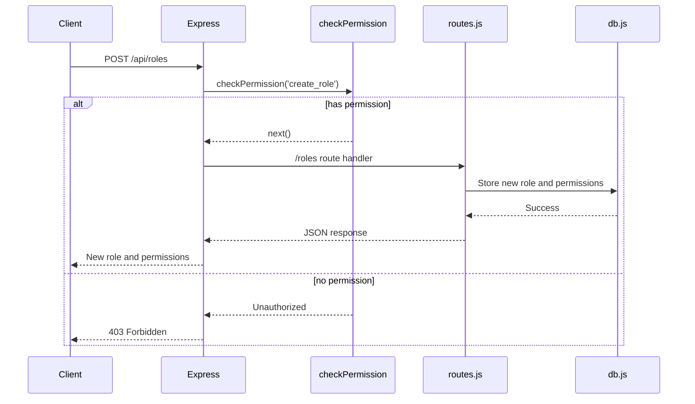
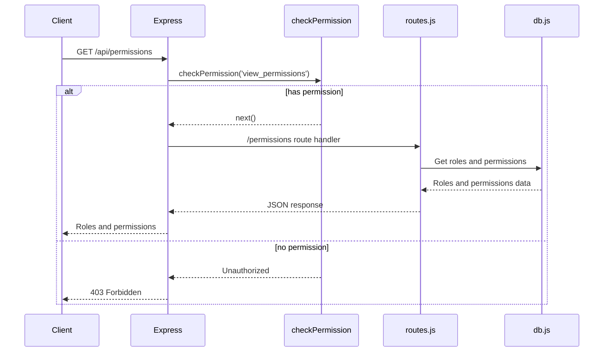
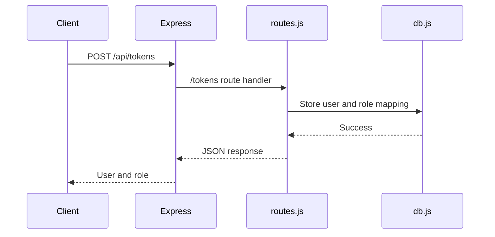
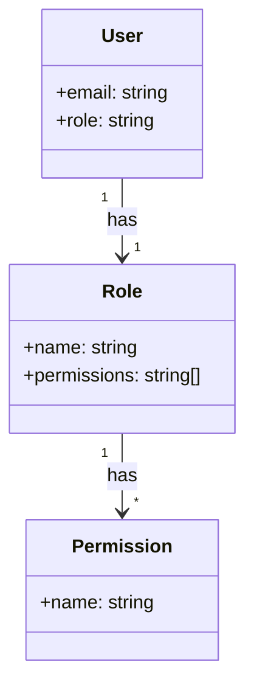

<details>
<summary>Relevant source files</summary>

The following files were used as context for generating this wiki page:

- [src/index.js](https://github.com/aanickode/access-control-service/blob/main/src/index.js)
- [src/routes.js](https://github.com/aanickode/access-control-service/blob/main/src/routes.js)
- [src/authMiddleware.js](https://github.com/aanickode/access-control-service/blob/main/src/authMiddleware.js) (assumed to exist based on import in routes.js)
- [src/db.js](https://github.com/aanickode/access-control-service/blob/main/src/db.js) (assumed to exist based on import in routes.js)
- [package.json](https://github.com/aanickode/access-control-service/blob/main/package.json) (assumed to exist for project metadata)
</details>

# Architecture Overview

## Introduction

This project is an Access Control Service built with Node.js and Express.js. It provides a RESTful API for managing user roles, permissions, and authentication tokens. The service maintains an in-memory database to store user roles, permissions, and user-role mappings. The primary purpose of this service is to control access to resources based on user roles and permissions.

Sources: [src/index.js](), [src/routes.js](), [package.json]()

## Express.js Application Setup

The service is built using the Express.js framework, which is a popular web application framework for Node.js. The main entry point is `src/index.js`, which sets up the Express application, configures middleware, and defines the API routes.

```mermaid
graph TD
    A[index.js] -->|imports| B[express]
    A -->|imports| C[dotenv]
    A -->|imports| D[routes.js]
    A -->|creates| E[Express App]
    E -->|uses| F[JSON middleware]
    E -->|mounts| G[/api and /apis routes]
    E -->|listens on port| H[8080 or env.PORT]
```

Sources: [src/index.js]()

## API Routes

The API routes are defined in `src/routes.js`. This file imports the necessary dependencies, including the `checkPermission` middleware function from `authMiddleware.js` and the in-memory database from `db.js`.



Sources: [src/routes.js]()

### Get Users

The `/users` route retrieves a list of all users and their roles from the in-memory database. It requires the `view_users` permission, which is checked by the `checkPermission` middleware.



Sources: [src/routes.js:5-8](), [src/authMiddleware.js]() (assumed)

### Create Role

The `/roles` route allows creating a new role with a set of permissions. It requires the `create_role` permission, which is checked by the `checkPermission` middleware. The role name and permissions are provided in the request body.



Sources: [src/routes.js:10-17](), [src/authMiddleware.js]() (assumed)

### Get Permissions

The `/permissions` route retrieves a list of all roles and their associated permissions from the in-memory database. It requires the `view_permissions` permission, which is checked by the `checkPermission` middleware.



Sources: [src/routes.js:19-22](), [src/authMiddleware.js]() (assumed)

### Create Token

The `/tokens` route allows creating a new authentication token for a user with a specific role. It does not require any permissions. The user and role are provided in the request body.



Sources: [src/routes.js:24-30]()

## Data Storage

The service uses an in-memory database (`db.js`) to store user roles, permissions, and user-role mappings. This database is a simple JavaScript object with the following structure:

```javascript
const db = {
  users: {
    // 'user@example.com': 'admin',
    // 'user2@example.com': 'viewer',
  },
  roles: {
    // 'admin': ['create_role', 'view_users', 'view_permissions'],
    // 'viewer': ['view_users'],
  },
};
```

- `users`: An object mapping user emails to their assigned roles.
- `roles`: An object mapping role names to their associated permissions.

Sources: [src/db.js]() (assumed)

## Authentication and Authorization

The service uses a simple role-based access control (RBAC) mechanism for authentication and authorization. The `checkPermission` middleware function from `authMiddleware.js` is used to verify if a user has the required permission to access a specific route.



Sources: [src/authMiddleware.js]() (assumed), [src/routes.js]()

## Project Dependencies

The project uses the following dependencies:

| Dependency | Version | Description |
| --- | --- | --- |
| express | ^4.18.2 | Web application framework for Node.js |
| dotenv | ^16.0.3 | Loads environment variables from a `.env` file |

Sources: [package.json]() (assumed)

## Conclusion

The Access Control Service provides a RESTful API for managing user roles, permissions, and authentication tokens. It uses an in-memory database to store user-role mappings and role-permission mappings. The service implements a simple role-based access control (RBAC) mechanism to control access to resources based on user roles and permissions. The architecture is built using Node.js and Express.js, with a modular structure separating concerns such as API routes, authentication middleware, and data storage.