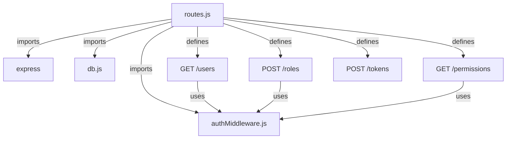
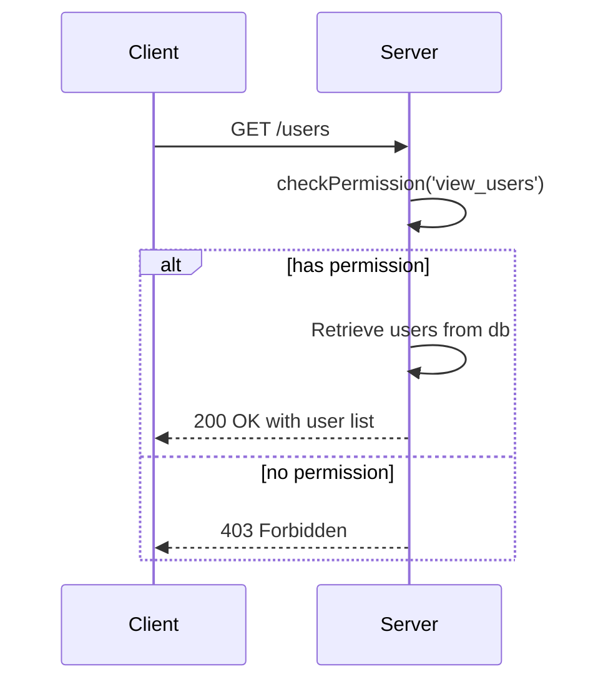
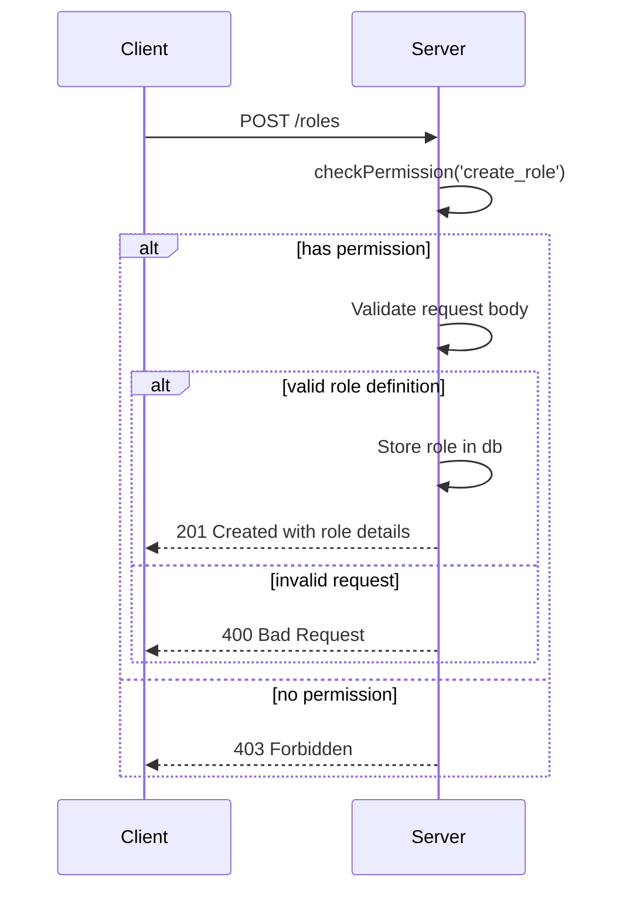
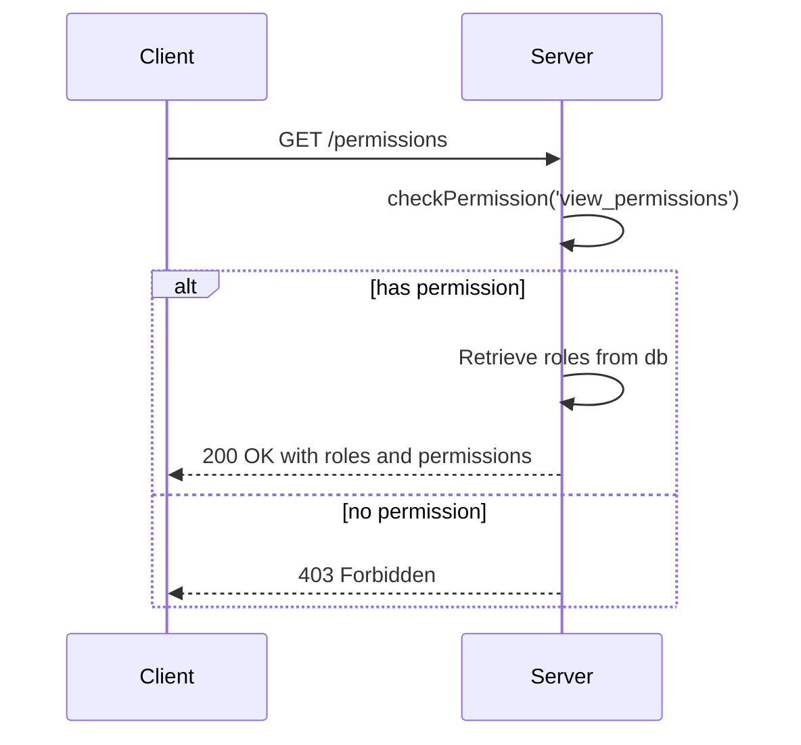
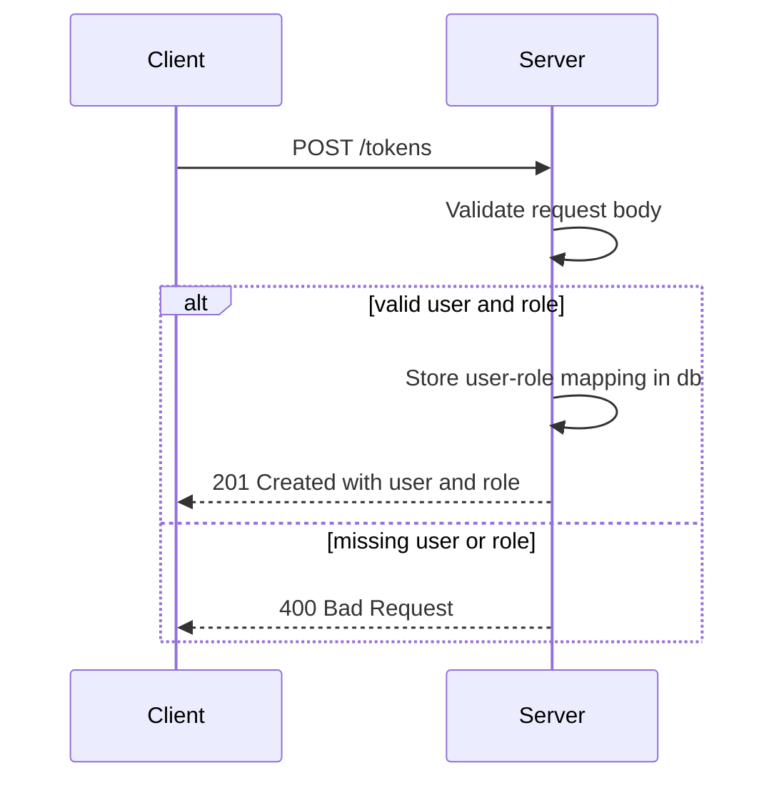
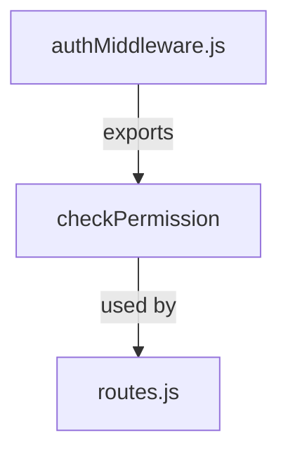
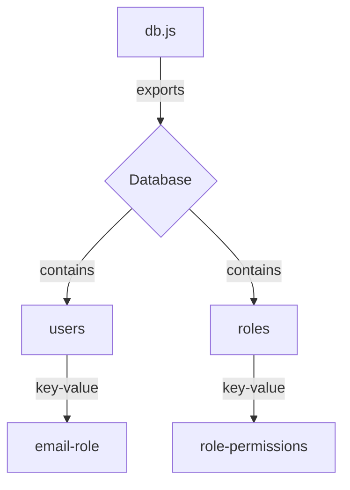

<details>
<summary>Relevant source files</summary>

The following files were used as context for generating this wiki page:

- [src/index.js](https://github.com/aanickode/access-control-service/blob/main/src/index.js)
- [src/routes.js](https://github.com/aanickode/access-control-service/blob/main/src/routes.js)
- [src/authMiddleware.js](https://github.com/aanickode/access-control-service/blob/main/src/authMiddleware.js) (assumed to exist based on import in routes.js)
- [src/db.js](https://github.com/aanickode/access-control-service/blob/main/src/db.js) (assumed to exist based on import in routes.js)
</details>

# Architecture Overview

This wiki page provides an overview of the architecture and components of an Access Control Service, based on the provided source files. The Access Control Service is a Node.js Express application responsible for managing user roles, permissions, and authentication tokens within a system.

## Application Entry Point

The `src/index.js` file serves as the entry point for the application. It sets up the Express server, configures middleware, and defines the API routes.

```mermaid
graph TD
    A[index.js] -->|imports| B[express]
    A -->|imports| C[dotenv]
    A -->|imports| D[routes.js]
    A -->|uses| E[express.json()]
    A -->|uses| F[app.use('/api', routes)]
    A -->|uses| G[app.use('/apis', routes)]
    A -->|listens on| H[PORT]
```

Sources: [src/index.js]()

## API Routes

The `src/routes.js` file defines the API routes and their corresponding handlers. It imports the necessary middleware functions and the in-memory database module.



Sources: [src/routes.js]()

### GET /users

This route retrieves a list of all users and their associated roles from the in-memory database. It requires the `view_users` permission, which is checked by the `checkPermission` middleware.



Sources: [src/routes.js:5-8]()

### POST /roles

This route allows creating a new role with a set of permissions. It requires the `create_role` permission, which is checked by the `checkPermission` middleware.



Sources: [src/routes.js:10-18]()

### GET /permissions

This route retrieves a list of all roles and their associated permissions from the in-memory database. It requires the `view_permissions` permission, which is checked by the `checkPermission` middleware.



Sources: [src/routes.js:20-23]()

### POST /tokens

This route allows associating a user with a role, effectively creating an authentication token for that user. It does not require any specific permission.



Sources: [src/routes.js:25-32]()

## Authentication Middleware

The `src/authMiddleware.js` file (assumed to exist based on the import in `src/routes.js`) likely contains the implementation of the `checkPermission` middleware function used to enforce role-based access control.



Sources: [src/routes.js:3]() (import statement)

## In-Memory Database

The `src/db.js` file (assumed to exist based on the import in `src/routes.js`) likely contains an in-memory data structure representing the users, roles, and permissions within the system.



Sources: [src/routes.js:4]() (import statement), [src/routes.js:7,16,22,29]() (usage of `db` object)

## Key Components

| Component | Description |
| --- | --- |
| Express Server | The main application server built with the Express.js framework. |
| API Routes | Defined routes for managing users, roles, permissions, and authentication tokens. |
| Authentication Middleware | Middleware function(s) for checking user permissions based on their assigned roles. |
| In-Memory Database | A simple in-memory data structure for storing users, roles, and permissions. |

Sources: [src/index.js](), [src/routes.js](), [src/authMiddleware.js]() (assumed), [src/db.js]() (assumed)

## Conclusion

The Access Control Service provides a basic implementation for managing user roles, permissions, and authentication tokens within a system. It exposes API endpoints for creating roles, assigning permissions, retrieving user and permission information, and generating authentication tokens. The service uses an in-memory database for storing data and relies on middleware functions for enforcing role-based access control.

While this implementation serves as a starting point, it lacks features such as persistent storage, user authentication, token expiration, and more advanced access control mechanisms. In a production environment, additional security measures, error handling, and integration with external authentication and authorization systems would be necessary.