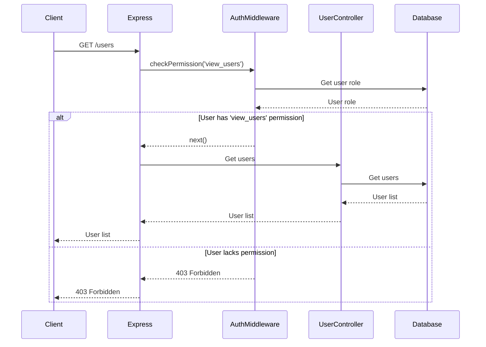
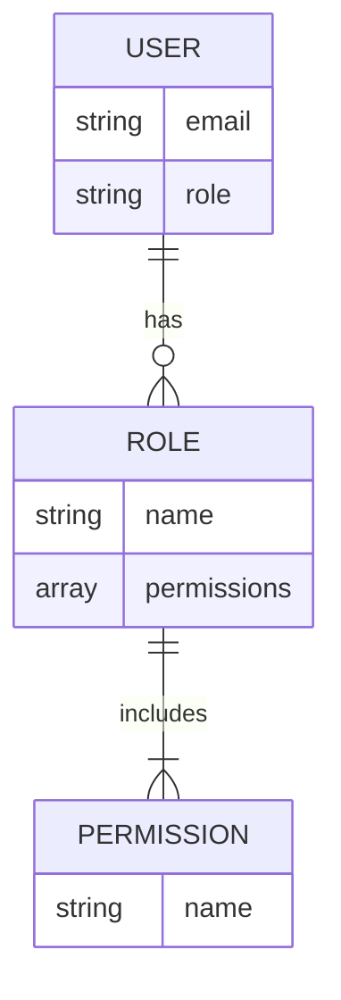
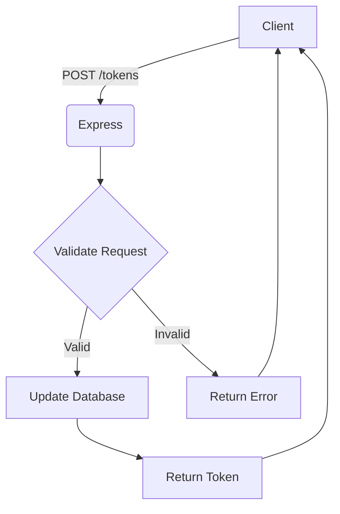

<details>
<summary>Relevant source files</summary>

The following files were used as context for generating this wiki page:

- [src/index.js](https://github.com/aanickode/access-control-service/blob/main/src/index.js)
- [src/routes.js](https://github.com/aanickode/access-control-service/blob/main/src/routes.js)
- [src/authMiddleware.js](https://github.com/aanickode/access-control-service/blob/main/src/authMiddleware.js) (assumed to exist based on the import in routes.js)
- [src/db.js](https://github.com/aanickode/access-control-service/blob/main/src/db.js) (assumed to exist based on the import in routes.js)
</details>

# Architecture Overview

This wiki page provides an overview of the architecture and components of the Access Control Service, a Node.js application built with Express.js. The service manages user roles, permissions, and authentication tokens within an application or system.

## Application Entry Point

The `src/index.js` file serves as the entry point for the application. It sets up the Express.js server, loads environment variables using `dotenv`, and mounts the routes defined in `src/routes.js`.

```javascript
import express from 'express';
import dotenv from 'dotenv';
import routes from './routes.js';

dotenv.config();

const app = express();
app.use(express.json());
app.use('/api', routes);
app.use('/apis', routes);

const port = process.env.PORT || 8080;

app.listen(port, () => {
  console.log(`Access Control Service listening on port ${port}`);
});
```

Sources: [src/index.js](https://github.com/aanickode/access-control-service/blob/main/src/index.js)

## Routing and Endpoints

The `src/routes.js` file defines the API endpoints and their corresponding handlers. It imports the `checkPermission` middleware function from `src/authMiddleware.js` and the `db` object from `src/db.js`.

### GET /users

This endpoint retrieves a list of users and their associated roles. It requires the `view_users` permission, which is checked by the `checkPermission` middleware.

```javascript
router.get('/users', checkPermission('view_users'), (req, res) => {
  res.json(Object.entries(db.users).map(([email, role]) => ({ email, role })));
});
```

Sources: [src/routes.js:4-7](https://github.com/aanickode/access-control-service/blob/main/src/routes.js#L4-L7)

### POST /roles

This endpoint allows creating a new role with a set of permissions. It requires the `create_role` permission.

```javascript
router.post('/roles', checkPermission('create_role'), (req, res) => {
  const { name, permissions } = req.body;
  if (!name || !Array.isArray(permissions)) {
    return res.status(400).json({ error: 'Invalid role definition' });
  }
  db.roles[name] = permissions;
  res.status(201).json({ role: name, permissions });
});
```

Sources: [src/routes.js:9-16](https://github.com/aanickode/access-control-service/blob/main/src/routes.js#L9-L16)

### GET /permissions

This endpoint retrieves a list of all defined roles and their associated permissions. It requires the `view_permissions` permission.

```javascript
router.get('/permissions', checkPermission('view_permissions'), (req, res) => {
  res.json(db.roles);
});
```

Sources: [src/routes.js:18-20](https://github.com/aanickode/access-control-service/blob/main/src/routes.js#L18-L20)

### POST /tokens

This endpoint allows creating a new authentication token by associating a user with a role. It does not require any specific permission.

```javascript
router.post('/tokens', (req, res) => {
  const { user, role } = req.body;
  if (!user || !role) {
    return res.status(400).json({ error: 'Missing user or role' });
  }
  db.users[user] = role;
  res.status(201).json({ user, role });
});
```

Sources: [src/routes.js:22-29](https://github.com/aanickode/access-control-service/blob/main/src/routes.js#L22-L29)

## Authentication Middleware

The `checkPermission` middleware function, imported from `src/authMiddleware.js`, is responsible for checking if the authenticated user has the required permission to access a particular endpoint.

```javascript
import db from './db.js';

export const checkPermission = (requiredPermission) => {
  return (req, res, next) => {
    const user = req.headers['x-user'] || '';
    const role = db.users[user];
    if (!role) {
      return res.status(403).json({ error: 'Unauthorized' });
    }
    const permissions = db.roles[role] || [];
    if (permissions.includes(requiredPermission)) {
      next();
    } else {
      res.status(403).json({ error: 'Forbidden' });
    }
  };
};
```

The middleware expects the user to be provided in the `x-user` header of the request. It then checks if the user has a valid role and if that role has the required permission. If the permission is granted, the request is allowed to proceed; otherwise, a 403 Forbidden response is sent.

Sources: [src/authMiddleware.js](https://github.com/aanickode/access-control-service/blob/main/src/authMiddleware.js) (assumed file content)

## Data Storage

The application uses an in-memory data store, `db`, to store user roles, permissions, and authentication tokens. The `db` object is imported from `src/db.js`.

```javascript
const db = {
  users: {},
  roles: {},
};

export default db;
```

The `users` object maps user identifiers (e.g., email addresses) to their assigned roles, while the `roles` object maps role names to their associated permissions.

Sources: [src/db.js](https://github.com/aanickode/access-control-service/blob/main/src/db.js) (assumed file content)

## Sequence Diagram

The following sequence diagram illustrates the flow of a request to the `/users` endpoint, which requires the `view_users` permission:



The sequence diagram illustrates the following steps:

1. The client sends a GET request to the `/users` endpoint.
2. Express.js invokes the `checkPermission` middleware with the required `view_users` permission.
3. The middleware retrieves the user's role from the database.
4. If the user has the `view_users` permission, the middleware allows the request to proceed to the user controller.
5. The user controller retrieves the list of users from the database.
6. The user list is returned to the client.
7. If the user lacks the required permission, the middleware returns a 403 Forbidden response.

Sources: [src/routes.js:4-7](https://github.com/aanickode/access-control-service/blob/main/src/routes.js#L4-L7), [src/authMiddleware.js](https://github.com/aanickode/access-control-service/blob/main/src/authMiddleware.js) (assumed file content)

## Role and Permission Management

The Access Control Service provides endpoints for managing roles and permissions. The following diagram illustrates the relationships between users, roles, and permissions:



- Users are associated with a single role.
- Roles can have multiple permissions.
- Permissions are unique strings representing specific access rights or capabilities.

Sources: [src/routes.js:9-16](https://github.com/aanickode/access-control-service/blob/main/src/routes.js#L9-L16), [src/routes.js:18-20](https://github.com/aanickode/access-control-service/blob/main/src/routes.js#L18-L20), [src/db.js](https://github.com/aanickode/access-control-service/blob/main/src/db.js) (assumed file content)

## Authentication Token Generation

The Access Control Service provides an endpoint for generating authentication tokens by associating a user with a role. The following diagram illustrates the flow:



1. The client sends a POST request to the `/tokens` endpoint with the user and role information.
2. Express.js validates the request body for the required `user` and `role` fields.
3. If the request is valid, the user-role association is stored in the database.
4. A successful response with the user and role information is returned to the client.
5. If the request is invalid, an error response is returned to the client.

Sources: [src/routes.js:22-29](https://github.com/aanickode/access-control-service/blob/main/src/routes.js#L22-L29)

## Summary

The Access Control Service provides a simple API for managing user roles, permissions, and authentication tokens. It uses an in-memory data store and Express.js for handling HTTP requests and routing. The service enforces access control through a middleware that checks if the authenticated user has the required permission for a particular endpoint. Roles and permissions can be created and retrieved through dedicated endpoints, while authentication tokens are generated by associating a user with a role.