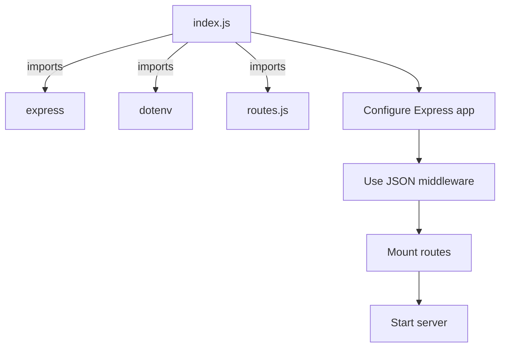
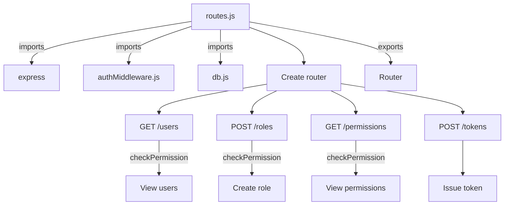
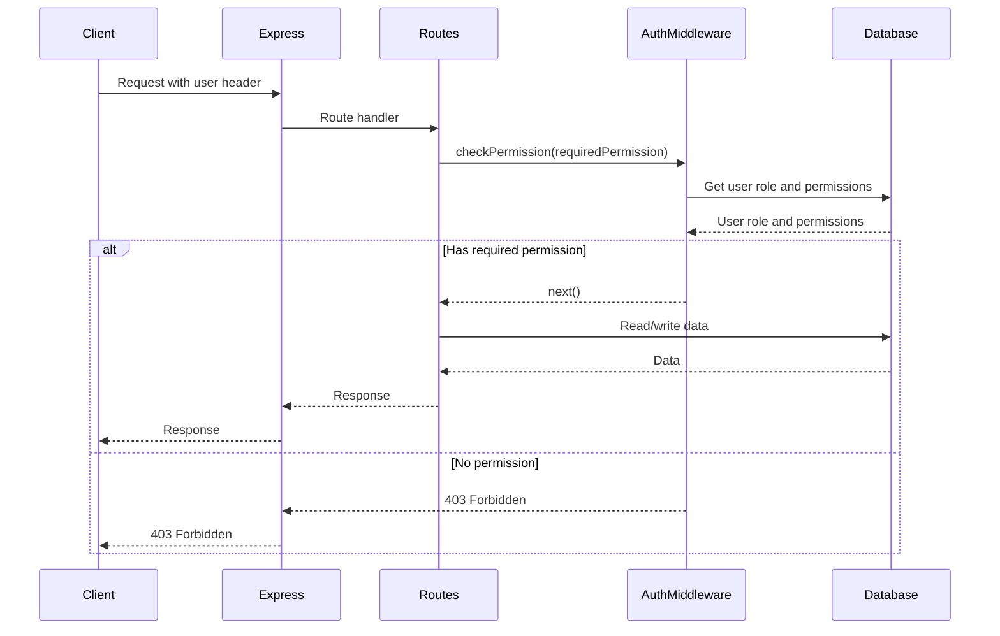

<details>
<summary>Relevant source files</summary>

The following files were used as context for generating this wiki page:

- [src/index.js](https://github.com/aanickode/access-control-service/blob/main/src/index.js)
- [src/routes.js](https://github.com/aanickode/access-control-service/blob/main/src/routes.js)
- [src/authMiddleware.js](https://github.com/aanickode/access-control-service/blob/main/src/authMiddleware.js)
- [src/db.js](https://github.com/aanickode/access-control-service/blob/main/src/db.js)
- [package.json](https://github.com/aanickode/access-control-service/blob/main/package.json)
</details>

# Architecture Overview

The Access Control Service is a Node.js application built with Express.js that provides role-based access control (RBAC) functionality. It allows managing users, roles, and permissions within an application or system. The service exposes a RESTful API for interacting with the access control data.

Sources: [src/index.js](), [src/routes.js](), [package.json]()

## Application Structure

The application follows a modular structure with separate files for different concerns:

### Entry Point (`src/index.js`)



The `index.js` file is the entry point of the application. It imports the required dependencies (`express`, `dotenv`, and `routes`), configures the Express app, mounts the routes, and starts the server on the specified port.

Sources: [src/index.js]()

### Routes (`src/routes.js`)



The `routes.js` file defines the API routes and their respective handlers. It imports the `authMiddleware` for permission checking, and the `db` module for interacting with the data store. The routes include:

- `GET /users`: Retrieve a list of users and their roles (requires `view_users` permission).
- `POST /roles`: Create a new role with specified permissions (requires `create_role` permission).
- `GET /permissions`: Retrieve a list of roles and their associated permissions (requires `view_permissions` permission).
- `POST /tokens`: Issue a token for a user with a specific role.

Sources: [src/routes.js](), [src/authMiddleware.js:1-9](), [src/db.js]()

### Authentication Middleware (`src/authMiddleware.js`)

```javascript
import db from './db.js';

export const checkPermission = (requiredPermission) => {
  return (req, res, next) => {
    const userRole = db.users[req.headers.user];
    const permissions = db.roles[userRole] || [];
    if (permissions.includes(requiredPermission)) {
      next();
    } else {
      res.status(403).json({ error: 'Forbidden' });
    }
  };
};
```

The `authMiddleware.js` file exports a `checkPermission` function that checks if the user has the required permission based on their role. It retrieves the user's role from the `db.users` object and checks if the associated permissions (from `db.roles`) include the required permission. If the user has the permission, the request is allowed to proceed; otherwise, a `403 Forbidden` response is sent.

Sources: [src/authMiddleware.js]()

### Data Store (`src/db.js`)

```javascript
const db = {
  users: {},
  roles: {},
};

export default db;
```

The `db.js` file exports a simple in-memory data store object with two properties: `users` and `roles`. The `users` object maps user identifiers (e.g., email addresses) to their assigned roles, while the `roles` object maps role names to their associated permissions.

Sources: [src/db.js]()

## Data Flow

The following sequence diagram illustrates the data flow when a user makes a request to the Access Control Service:



1. The client sends a request to the Express server, including a user header.
2. Express routes the request to the appropriate route handler.
3. The route handler calls the `checkPermission` middleware with the required permission.
4. The `checkPermission` middleware retrieves the user's role and associated permissions from the database.
5. If the user has the required permission, the middleware calls `next()`, allowing the request to proceed.
6. The route handler interacts with the database to read or write data as needed.
7. The database responds with the requested data or a success/failure status.
8. The route handler sends the appropriate response back to the client through Express.
9. If the user does not have the required permission, the `checkPermission` middleware sends a `403 Forbidden` response to the client.

Sources: [src/routes.js](), [src/authMiddleware.js]()

## Role-Based Access Control (RBAC)

The Access Control Service implements a role-based access control (RBAC) model, where permissions are assigned to roles, and users are assigned one or more roles. This approach simplifies the management of permissions by grouping them into logical roles.

### Roles

Roles are defined in the `db.roles` object, where the keys represent role names, and the values are arrays of associated permissions.

Example:

```javascript
{
  'admin': ['view_users', 'create_role', 'view_permissions'],
  'manager': ['view_users'],
  'guest': []
}
```

Sources: [src/db.js]()

### Permissions

Permissions are strings that represent specific actions or operations that can be performed within the application or system. They are associated with roles in the `db.roles` object.

Example permissions:

- `view_users`: Allows viewing the list of users and their roles.
- `create_role`: Allows creating new roles with specified permissions.
- `view_permissions`: Allows viewing the list of roles and their associated permissions.

Sources: [src/routes.js]()

## API Endpoints

The Access Control Service exposes the following API endpoints:

| Endpoint | Method | Description | Required Permission |
| --- | --- | --- | --- |
| `/api/users` | GET | Retrieve a list of users and their roles | `view_users` |
| `/api/roles` | POST | Create a new role with specified permissions | `create_role` |
| `/api/permissions` | GET | Retrieve a list of roles and their associated permissions | `view_permissions` |
| `/api/tokens` | POST | Issue a token for a user with a specific role | None |

Sources: [src/routes.js]()

## Conclusion

The Access Control Service provides a simple yet effective way to manage users, roles, and permissions within an application or system. By implementing a role-based access control (RBAC) model, it allows for granular control over access to resources and operations. The service exposes a RESTful API for interacting with the access control data, making it easy to integrate with other applications or systems.