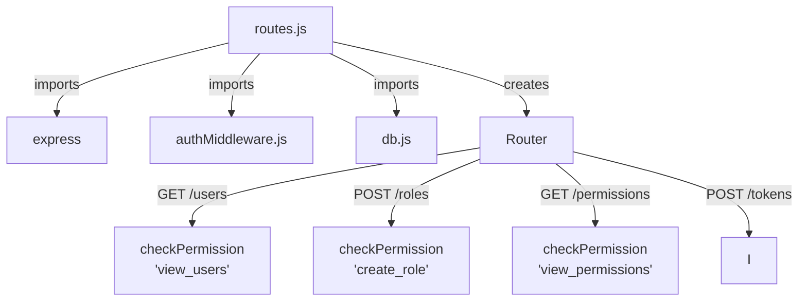
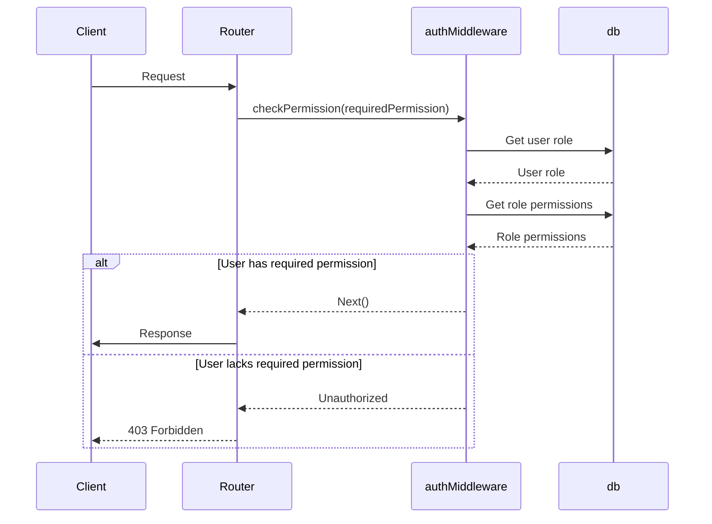

<details>
<summary>Relevant source files</summary>

The following files were used as context for generating this wiki page:

- [src/index.js](https://github.com/aanickode/access-control-service/blob/main/src/index.js)
- [src/routes.js](https://github.com/aanickode/access-control-service/blob/main/src/routes.js)
- [src/authMiddleware.js](https://github.com/aanickode/access-control-service/blob/main/src/authMiddleware.js)
- [src/db.js](https://github.com/aanickode/access-control-service/blob/main/src/db.js)
- [package.json](https://github.com/aanickode/access-control-service/blob/main/package.json)
</details>

# Architecture Overview

The Access Control Service is an Express.js application that provides a RESTful API for managing user roles, permissions, and access tokens. It serves as a centralized access control system for other services or applications within a larger project.

## Application Structure

The application follows a modular structure, with the main entry point being `src/index.js`. This file sets up the Express server, configures middleware, and mounts the API routes.

```mermaid
graph TD
    A[index.js] -->|imports| B[express]
    A -->|imports| C[dotenv]
    A -->|imports| D[routes.js]
    A -->|uses| E[express.json()]
    A -->|mounts| D
    A -->|listens| F[Port]
```

Sources: [src/index.js](https://github.com/aanickode/access-control-service/blob/main/src/index.js)

## API Routes

The API routes are defined in `src/routes.js`, which imports the necessary dependencies and middleware functions.



Sources: [src/routes.js](https://github.com/aanickode/access-control-service/blob/main/src/routes.js)

### User Management

The `/users` endpoint retrieves a list of all registered users and their associated roles.

| Method | Endpoint | Permission | Description |
| ------ | -------- | ---------- | ----------- |
| GET    | `/users` | `view_users` | Retrieve a list of users and their roles |

Sources: [src/routes.js:5-7](https://github.com/aanickode/access-control-service/blob/main/src/routes.js#L5-L7)

### Role Management

The `/roles` endpoint allows creating new roles with a set of permissions.

| Method | Endpoint | Permission | Description |
| ------ | -------- | ---------- | ----------- |
| POST   | `/roles` | `create_role` | Create a new role with specified permissions |

Sources: [src/routes.js:9-14](https://github.com/aanickode/access-control-service/blob/main/src/routes.js#L9-L14)

### Permission Management

The `/permissions` endpoint retrieves a list of all defined roles and their associated permissions.

| Method | Endpoint | Permission | Description |
| ------ | -------- | ---------- | ----------- |
| GET    | `/permissions` | `view_permissions` | Retrieve a list of roles and their permissions |

Sources: [src/routes.js:16-18](https://github.com/aanickode/access-control-service/blob/main/src/routes.js#L16-L18)

### Token Management

The `/tokens` endpoint allows creating new access tokens by associating a user with a role.

| Method | Endpoint | Permission | Description |
| ------ | -------- | ---------- | ----------- |
| POST   | `/tokens` | - | Create a new access token by associating a user with a role |

Sources: [src/routes.js:20-25](https://github.com/aanickode/access-control-service/blob/main/src/routes.js#L20-L25)

## Authentication and Authorization

The application uses a custom middleware function `checkPermission` to enforce role-based access control (RBAC) on certain routes.



Sources: [src/routes.js](https://github.com/aanickode/access-control-service/blob/main/src/routes.js), [src/authMiddleware.js](https://github.com/aanickode/access-control-service/blob/main/src/authMiddleware.js), [src/db.js](https://github.com/aanickode/access-control-service/blob/main/src/db.js)

## Data Storage

The application uses an in-memory data store (`src/db.js`) to store user roles, permissions, and access tokens. In a production environment, this would likely be replaced with a persistent database.

```javascript
const db = {
  users: {
    // 'user@example.com': 'admin',
    // 'user2@example.com': 'viewer'
  },
  roles: {
    // 'admin': ['view_users', 'create_role', 'view_permissions'],
    // 'viewer': ['view_users', 'view_permissions']
  }
};

export default db;
```

Sources: [src/db.js](https://github.com/aanickode/access-control-service/blob/main/src/db.js)

## Dependencies

The application relies on the following main dependencies:

| Dependency | Version | Description |
| ---------- | ------- | ----------- |
| express    | ^4.18.2 | Web application framework for Node.js |
| dotenv     | ^16.0.3 | Loads environment variables from a `.env` file |

Sources: [package.json](https://github.com/aanickode/access-control-service/blob/main/package.json)

In summary, the Access Control Service provides a RESTful API for managing user roles, permissions, and access tokens. It enforces role-based access control (RBAC) on certain routes and uses an in-memory data store for storing user and role information. The application follows a modular structure and leverages the Express.js framework for handling HTTP requests and responses.