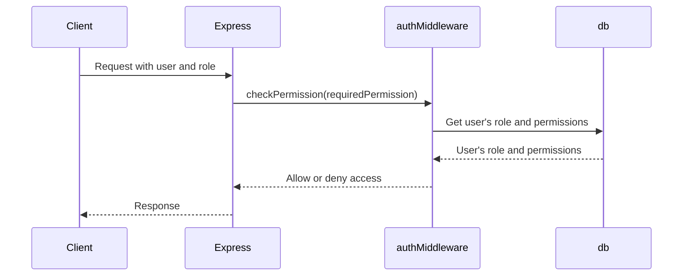

<details>
<summary>Relevant source files</summary>

The following files were used as context for generating this wiki page:

- [src/index.js](https://github.com/aanickode/access-control-service/blob/main/src/index.js)
- [src/routes.js](https://github.com/aanickode/access-control-service/blob/main/src/routes.js)
- [src/authMiddleware.js](https://github.com/aanickode/access-control-service/blob/main/src/authMiddleware.js)
- [src/db.js](https://github.com/aanickode/access-control-service/blob/main/src/db.js)
- [package.json](https://github.com/aanickode/access-control-service/blob/main/package.json)
</details>

# Architecture Overview

This wiki page provides an overview of the architecture and key components of the Access Control Service, a Node.js application built with Express.js. The service manages user roles, permissions, and authentication tokens within an organization.

## Application Structure

The Access Control Service follows a modular structure, with the main application entry point in `src/index.js`. This file sets up the Express.js server, loads environment variables using `dotenv`, and mounts the API routes defined in `src/routes.js`.

```mermaid
graph TD
    A[index.js] -->|imports| B[express]
    A -->|imports| C[dotenv]
    A -->|imports| D[routes.js]
    A -->|uses| E[express.json()]
    A -->|mounts| D
    A -->|listens on port| F[process.env.PORT or 8080]
```

Sources: [src/index.js](https://github.com/aanickode/access-control-service/blob/main/src/index.js)

## API Routes

The `src/routes.js` file defines the API endpoints and their corresponding handlers. It imports the `checkPermission` middleware from `src/authMiddleware.js` and the in-memory database `db` from `src/db.js`.

### User Management

| Route | Method | Permission | Description |
| --- | --- | --- | --- |
| `/users` | GET | `view_users` | Retrieve a list of users and their roles |
| `/tokens` | POST | - | Create a new user and assign a role |

```mermaid
graph TD
    A[routes.js] -->|imports| B[express]
    A -->|imports| C[authMiddleware.js]
    A -->|imports| D[db.js]
    A -->|defines| E[/users GET]
    A -->|defines| F[/tokens POST]
    E -->|requires| G[view_users]
    E -->|uses| H[db.users]
    F -->|uses| H
```

Sources: [src/routes.js:1-7](https://github.com/aanickode/access-control-service/blob/main/src/routes.js#L1-L7), [src/routes.js:17-24](https://github.com/aanickode/access-control-service/blob/main/src/routes.js#L17-L24)

### Role and Permission Management

| Route | Method | Permission | Description |
| --- | --- | --- | --- |
| `/roles` | POST | `create_role` | Create a new role with specified permissions |
| `/permissions` | GET | `view_permissions` | Retrieve a list of roles and their associated permissions |

```mermaid
graph TD
    A[routes.js] -->|defines| B[/roles POST]
    A -->|defines| C[/permissions GET]
    B -->|requires| D[create_role]
    B -->|uses| E[db.roles]
    C -->|requires| F[view_permissions]
    C -->|uses| E
```

Sources: [src/routes.js:9-16](https://github.com/aanickode/access-control-service/blob/main/src/routes.js#L9-L16), [src/routes.js:25-28](https://github.com/aanickode/access-control-service/blob/main/src/routes.js#L25-L28)

## Authentication Middleware

The `checkPermission` middleware, defined in `src/authMiddleware.js`, is responsible for verifying if a user has the required permission to access a specific route. It checks the user's role and associated permissions against the requested permission.



Sources: [src/authMiddleware.js](https://github.com/aanickode/access-control-service/blob/main/src/authMiddleware.js)

## In-Memory Database

The `src/db.js` file defines an in-memory database object that stores user roles, permissions, and user-role mappings. This is a simplified implementation for demonstration purposes and should be replaced with a persistent database solution in a production environment.

```javascript
const db = {
  users: {
    // 'user@example.com': 'admin',
    // 'another@example.com': 'viewer'
  },
  roles: {
    // 'admin': ['view_users', 'create_role', 'view_permissions'],
    // 'viewer': ['view_users', 'view_permissions']
  }
};

export default db;
```

Sources: [src/db.js](https://github.com/aanickode/access-control-service/blob/main/src/db.js)

## Dependencies

The Access Control Service relies on the following dependencies, as specified in the `package.json` file:

- `express`: A fast and minimalist web application framework for Node.js.
- `dotenv`: A module for loading environment variables from a `.env` file.

```json
{
  "dependencies": {
    "dotenv": "^16.0.3",
    "express": "^4.18.2"
  }
}
```

Sources: [package.json](https://github.com/aanickode/access-control-service/blob/main/package.json)

## Conclusion

The Access Control Service provides a simple yet extensible architecture for managing user roles, permissions, and authentication tokens within an organization. It follows a modular design, separating concerns into different files and components. The use of Express.js and middleware functions allows for easy customization and extension of the service's functionality.

While the current implementation uses an in-memory database for simplicity, a production-ready version would require integrating with a persistent data store and implementing additional security measures, such as token-based authentication and encryption of sensitive data.