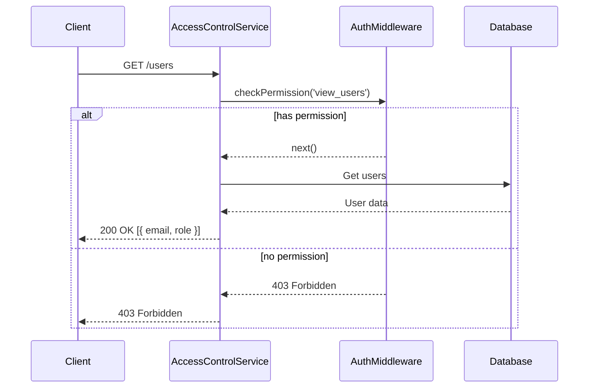
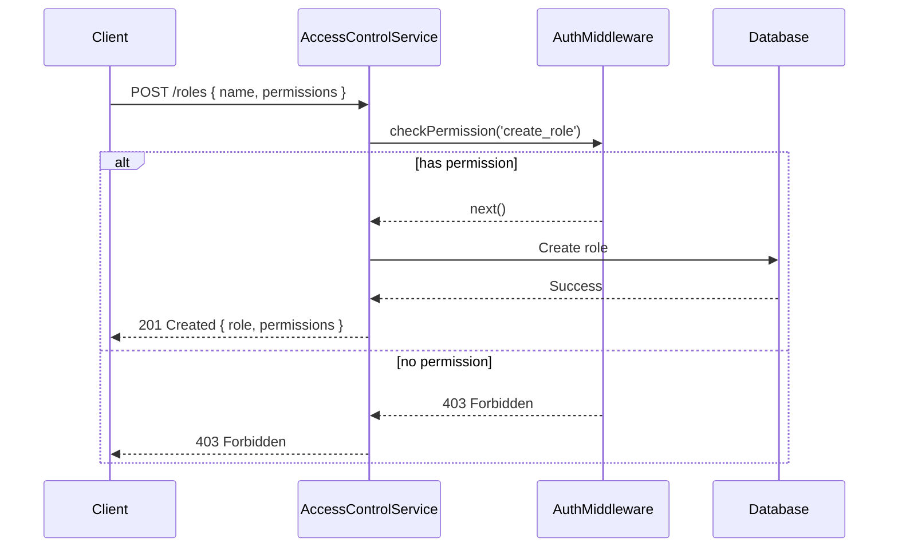
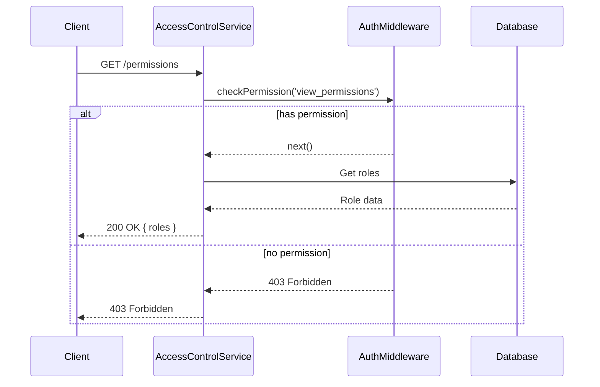
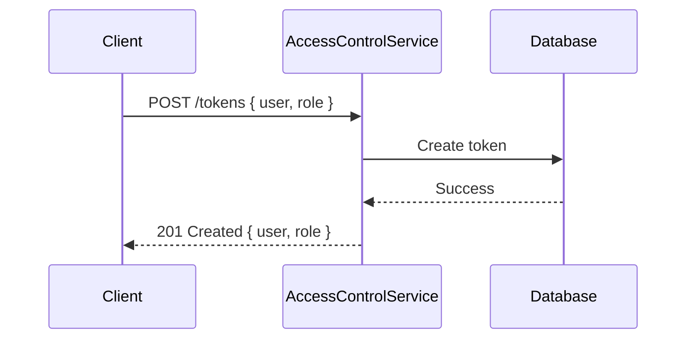
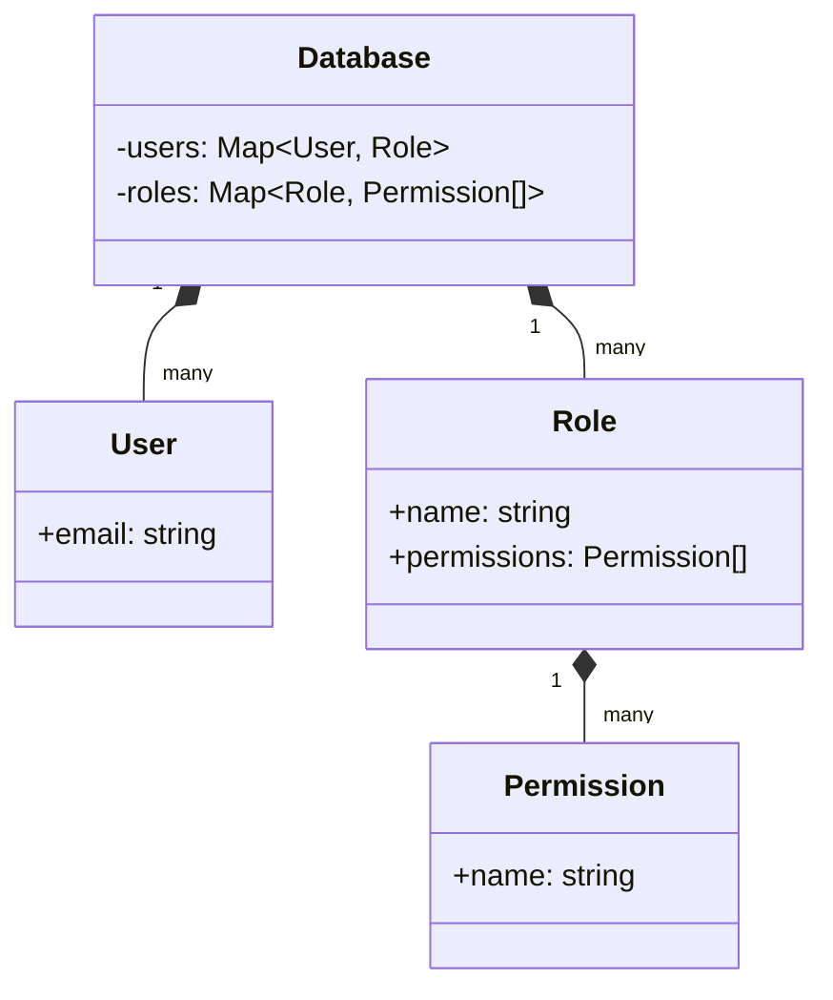
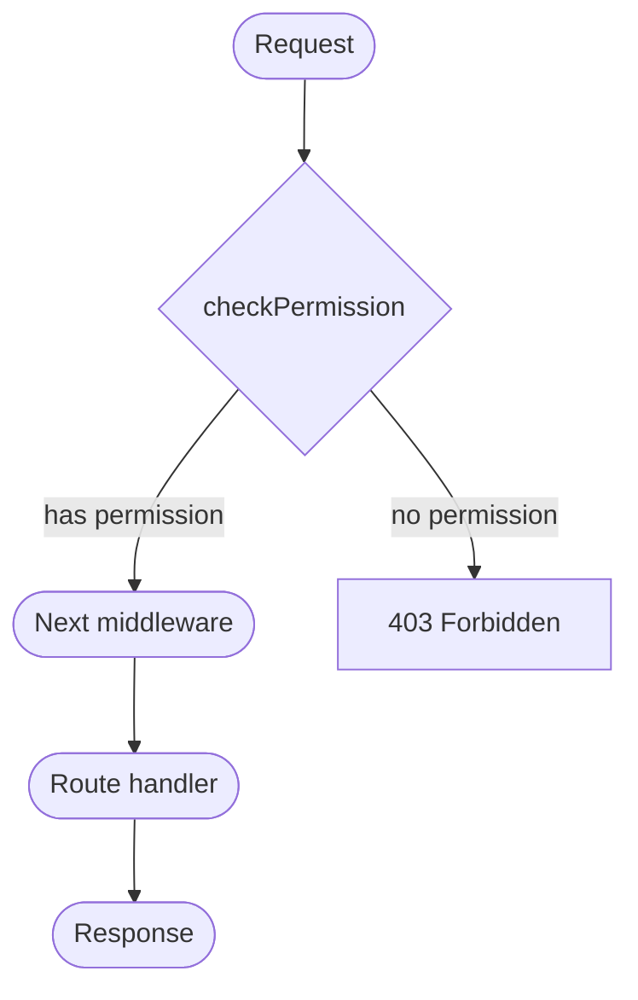

Relevant source files

The following files were used as context for generating this wiki page:

- [src/index.js](https://github.com/aanickode/access-control-service/blob/main/src/index.js)
- [src/routes.js](https://github.com/aanickode/access-control-service/blob/main/src/routes.js)
- [src/authMiddleware.js](https://github.com/aanickode/access-control-service/blob/main/src/authMiddleware.js)
- [src/db.js](https://github.com/aanickode/access-control-service/blob/main/src/db.js)
- [package.json](https://github.com/aanickode/access-control-service/blob/main/package.json)

# Architecture Overview

The Access Control Service is a Node.js application built with Express.js that provides a RESTful API for managing user roles, permissions, and access tokens. It serves as a centralized access control system for other services or applications within a larger project.

## Application Structure

The application follows a modular structure with separate files for different concerns:

- `index.js`: The entry point that sets up the Express server and mounts the API routes.
- `routes.js`: Defines the API endpoints and their respective handlers.
- `authMiddleware.js`: Contains a middleware function for checking user permissions.
- `db.js`: Provides an in-memory data store for storing user roles, permissions, and access tokens.

Sources: [src/index.js](), [src/routes.js](), [src/authMiddleware.js](), [src/db.js]()

## API Endpoints

The Access Control Service exposes the following API endpoints:

### GET /users

Retrieves a list of all registered users and their roles. Requires the `view_users` permission.

Sources: [src/routes.js:5-8]()

### POST /roles

Creates a new role with a set of permissions. Requires the `create_role` permission.

Sources: [src/routes.js:10-17]()

### GET /permissions

Retrieves a list of all defined roles and their associated permissions. Requires the `view_permissions` permission.

Sources: [src/routes.js:19-22]()

### POST /tokens

Creates an access token by associating a user with a role. No permissions are required for this endpoint.

Sources: [src/routes.js:24-30]()

## Data Storage

The application uses an in-memory data store (`db.js`) to store user roles, permissions, and access tokens. In a production environment, this should be replaced with a persistent data store like a database.

Sources: [src/db.js]()

## Authentication and Authorization

The Access Control Service uses a custom middleware function (`authMiddleware.js`) to check if a user has the required permission to access a specific API endpoint. The middleware function retrieves the user's role from the in-memory data store and checks if the role has the requested permission.

Sources: [src/authMiddleware.js](), [src/routes.js:5,10,19]()

## Dependencies

The Access Control Service relies on the following dependencies:

| Dependency | Version | Description |
| --- | --- | --- |
| express | ^4.18.2 | Web application framework for Node.js |
| dotenv | ^16.0.3 | Loads environment variables from a `.env` file |

Sources: [package.json]()

## Conclusion

The Access Control Service provides a centralized solution for managing user roles, permissions, and access tokens within a larger project. It exposes a RESTful API for creating and retrieving roles, permissions, and tokens, with access control enforced through a custom middleware function. While the current implementation uses an in-memory data store, a production deployment would require a persistent data store for storing and retrieving user and role information.