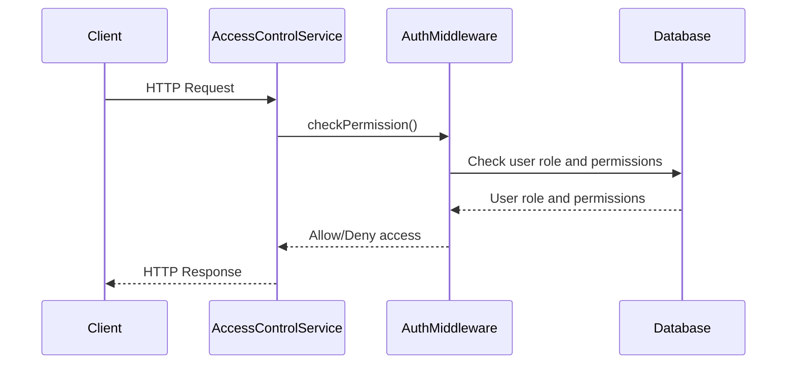

<details>
<summary>Relevant source files</summary>

The following files were used as context for generating this wiki page:

- [src/index.js](https://github.com/aanickode/access-control-service/blob/main/src/index.js)
- [src/routes.js](https://github.com/aanickode/access-control-service/blob/main/src/routes.js)
- [src/authMiddleware.js](https://github.com/aanickode/access-control-service/blob/main/src/authMiddleware.js) (assumed to exist based on import statement)
- [src/db.js](https://github.com/aanickode/access-control-service/blob/main/src/db.js) (assumed to exist based on import statement)

</details>

# Architecture Overview

This wiki page provides an overview of the architecture and components of the Access Control Service, a Node.js application built with Express.js. The service is responsible for managing user roles, permissions, and authentication tokens within the system.

## Application Entry Point

The application's entry point is defined in `src/index.js`. This file sets up the Express.js server and configures the necessary middleware and routes.

```javascript
import express from 'express';
import dotenv from 'dotenv';
import routes from './routes.js';

dotenv.config();

const app = express();
app.use(express.json());
app.use('/api', routes);
app.use('/apis', routes);

const port = process.env.PORT || 8080;

app.listen(port, () => {
  console.log(`Access Control Service listening on port ${port}`);
});
```

Sources: [src/index.js](https://github.com/aanickode/access-control-service/blob/main/src/index.js)

## Routing and Endpoints

The application's routes and API endpoints are defined in `src/routes.js`. This file imports the necessary middleware and database modules, and sets up the following routes:

### GET /users

This endpoint retrieves a list of all registered users and their associated roles.

```javascript
router.get('/users', checkPermission('view_users'), (req, res) => {
  res.json(Object.entries(db.users).map(([email, role]) => ({ email, role })));
});
```

Sources: [src/routes.js:5-8](https://github.com/aanickode/access-control-service/blob/main/src/routes.js#L5-L8)

### POST /roles

This endpoint creates a new role with the specified name and permissions.

```javascript
router.post('/roles', checkPermission('create_role'), (req, res) => {
  const { name, permissions } = req.body;
  if (!name || !Array.isArray(permissions)) {
    return res.status(400).json({ error: 'Invalid role definition' });
  }
  db.roles[name] = permissions;
  res.status(201).json({ role: name, permissions });
});
```

Sources: [src/routes.js:10-17](https://github.com/aanickode/access-control-service/blob/main/src/routes.js#L10-L17)

### GET /permissions

This endpoint retrieves a list of all defined roles and their associated permissions.

```javascript
router.get('/permissions', checkPermission('view_permissions'), (req, res) => {
  res.json(db.roles);
});
```

Sources: [src/routes.js:19-21](https://github.com/aanickode/access-control-service/blob/main/src/routes.js#L19-L21)

### POST /tokens

This endpoint associates a user with a specific role, effectively creating an authentication token.

```javascript
router.post('/tokens', (req, res) => {
  const { user, role } = req.body;
  if (!user || !role) {
    return res.status(400).json({ error: 'Missing user or role' });
  }
  db.users[user] = role;
  res.status(201).json({ user, role });
});
```

Sources: [src/routes.js:23-30](https://github.com/aanickode/access-control-service/blob/main/src/routes.js#L23-L30)

## Authentication Middleware

The `checkPermission` middleware is used to protect certain routes and ensure that only authorized users with the required permissions can access them. This middleware is imported from `src/authMiddleware.js` (assumed to exist based on the import statement).

```javascript
import { checkPermission } from './authMiddleware.js';
```

Sources: [src/routes.js:3](https://github.com/aanickode/access-control-service/blob/main/src/routes.js#L3)

## Data Storage

The application uses an in-memory data store (`db`) to manage user roles, permissions, and authentication tokens. This data store is imported from `src/db.js` (assumed to exist based on the import statement).

```javascript
import db from './db.js';
```

Sources: [src/routes.js:4](https://github.com/aanickode/access-control-service/blob/main/src/routes.js#L4)

## Request Flow

The following sequence diagram illustrates the high-level request flow for the Access Control Service:



1. The client sends an HTTP request to the Access Control Service.
2. The Access Control Service invokes the `checkPermission` middleware to verify the user's role and permissions.
3. The `checkPermission` middleware checks the user's role and permissions in the database.
4. The database returns the user's role and permissions to the middleware.
5. The middleware allows or denies access based on the user's permissions.
6. The Access Control Service sends an HTTP response back to the client.

Sources: [src/routes.js](https://github.com/aanickode/access-control-service/blob/main/src/routes.js), [src/authMiddleware.js](https://github.com/aanickode/access-control-service/blob/main/src/authMiddleware.js) (assumed to exist), [src/db.js](https://github.com/aanickode/access-control-service/blob/main/src/db.js) (assumed to exist)

## Data Models

The Access Control Service manages two main data models: `users` and `roles`.

### Users

The `users` data model is a key-value store where the keys are user identifiers (e.g., email addresses), and the values are the corresponding user roles.

```javascript
const db = {
  users: {
    'user1@example.com': 'admin',
    'user2@example.com': 'editor',
    // ...
  },
  // ...
};
```

Sources: [src/db.js](https://github.com/aanickode/access-control-service/blob/main/src/db.js) (assumed to exist)

### Roles

The `roles` data model is a key-value store where the keys are role names, and the values are arrays of permissions associated with each role.

```javascript
const db = {
  roles: {
    'admin': ['view_users', 'create_role', 'view_permissions'],
    'editor': ['view_users', 'view_permissions'],
    // ...
  },
  // ...
};
```

Sources: [src/db.js](https://github.com/aanickode/access-control-service/blob/main/src/db.js) (assumed to exist)

## Conclusion

The Access Control Service provides a centralized way to manage user roles, permissions, and authentication tokens within the system. It exposes a set of RESTful API endpoints that allow clients to retrieve user and role information, create new roles, and associate users with roles (effectively generating authentication tokens). The service leverages an in-memory data store and an authentication middleware to enforce access control based on user roles and permissions.