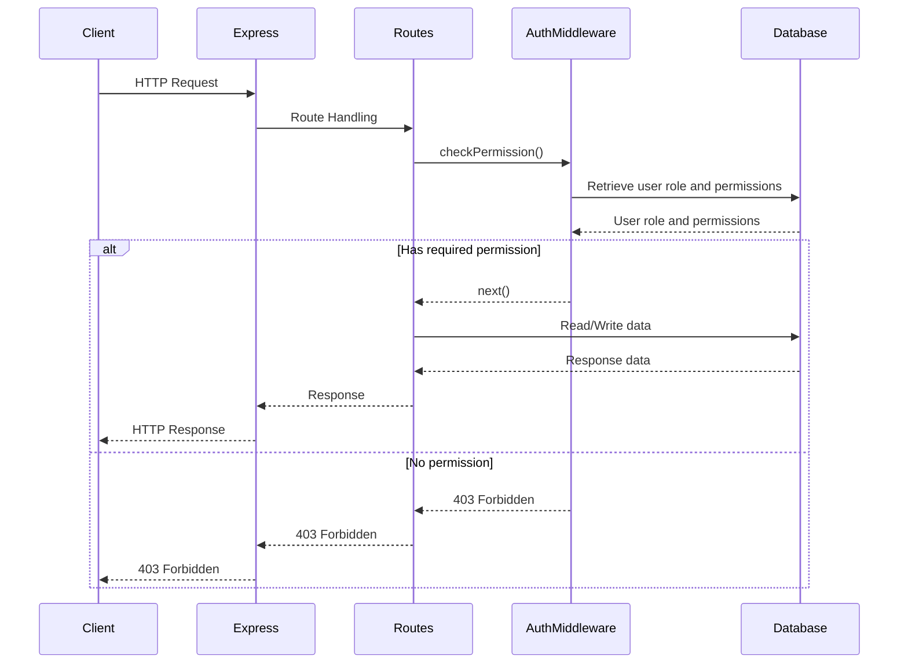

<details>
<summary>Relevant source files</summary>

The following files were used as context for generating this wiki page:

- [src/index.js](https://github.com/aanickode/access-control-service/blob/main/src/index.js)
- [src/routes.js](https://github.com/aanickode/access-control-service/blob/main/src/routes.js)
- [src/authMiddleware.js](https://github.com/aanickode/access-control-service/blob/main/src/authMiddleware.js)
- [src/db.js](https://github.com/aanickode/access-control-service/blob/main/src/db.js)
- [package.json](https://github.com/aanickode/access-control-service/blob/main/package.json)
</details>

# Architecture Overview

## Introduction

This wiki page provides an overview of the architecture and components of the Access Control Service, a Node.js application built with Express.js. The service is responsible for managing user roles, permissions, and authentication tokens within a system. It exposes a RESTful API for creating roles, assigning roles to users, viewing user roles and permissions, and generating authentication tokens.

Sources: [src/index.js](), [src/routes.js](), [package.json]()

## Application Structure

The Access Control Service follows a modular structure, with the main components organized into separate files:

### Entry Point (`src/index.js`)

The `index.js` file serves as the entry point of the application. It sets up the Express.js server, loads environment variables using `dotenv`, and mounts the API routes.

```javascript
import express from 'express';
import dotenv from 'dotenv';
import routes from './routes.js';

dotenv.config();

const app = express();
app.use(express.json());
app.use('/api', routes);
app.use('/apis', routes);

const port = process.env.PORT || 8080;

app.listen(port, () => {
  console.log(`Access Control Service listening on port ${port}`);
});
```

Sources: [src/index.js]()

### API Routes (`src/routes.js`)

The `routes.js` file defines the API routes and their corresponding handlers. It imports the `checkPermission` middleware from `authMiddleware.js` and the in-memory database from `db.js`.

```javascript
import express from 'express';
import { checkPermission } from './authMiddleware.js';
import db from './db.js';

const router = express.Router();

// Route definitions...

export default router;
```

Sources: [src/routes.js:1-6]()

## API Endpoints

The Access Control Service exposes the following API endpoints:

### `GET /users`

Retrieves a list of all users and their assigned roles.

```javascript
router.get('/users', checkPermission('view_users'), (req, res) => {
  res.json(Object.entries(db.users).map(([email, role]) => ({ email, role })));
});
```

- Requires the `view_users` permission.
- Returns an array of user objects with `email` and `role` properties.

Sources: [src/routes.js:8-11]()

### `POST /roles`

Creates a new role with a set of permissions.

```javascript
router.post('/roles', checkPermission('create_role'), (req, res) => {
  const { name, permissions } = req.body;
  if (!name || !Array.isArray(permissions)) {
    return res.status(400).json({ error: 'Invalid role definition' });
  }
  db.roles[name] = permissions;
  res.status(201).json({ role: name, permissions });
});
```

- Requires the `create_role` permission.
- Expects a JSON payload with `name` and `permissions` properties.
- Stores the new role and its permissions in the in-memory database.
- Returns the created role and its permissions.

Sources: [src/routes.js:13-21]()

### `GET /permissions`

Retrieves a list of all roles and their associated permissions.

```javascript
router.get('/permissions', checkPermission('view_permissions'), (req, res) => {
  res.json(db.roles);
});
```

- Requires the `view_permissions` permission.
- Returns an object containing all roles and their permissions.

Sources: [src/routes.js:23-25]()

### `POST /tokens`

Assigns a role to a user and generates an authentication token.

```javascript
router.post('/tokens', (req, res) => {
  const { user, role } = req.body;
  if (!user || !role) {
    return res.status(400).json({ error: 'Missing user or role' });
  }
  db.users[user] = role;
  res.status(201).json({ user, role });
});
```

- Expects a JSON payload with `user` and `role` properties.
- Stores the user and their assigned role in the in-memory database.
- Returns the user and their assigned role.

Sources: [src/routes.js:27-35]()

## Authentication and Authorization

The Access Control Service uses a middleware function `checkPermission` to enforce role-based access control (RBAC) on certain API endpoints.

```javascript
import db from './db.js';

export const checkPermission = (requiredPermission) => {
  return (req, res, next) => {
    const userRole = db.users[req.headers.user];
    const permissions = db.roles[userRole] || [];

    if (permissions.includes(requiredPermission)) {
      next();
    } else {
      res.status(403).json({ error: 'Forbidden' });
    }
  };
};
```

- The `checkPermission` function takes a `requiredPermission` as an argument.
- It retrieves the user's role and associated permissions from the in-memory database.
- If the user's permissions include the `requiredPermission`, the request is allowed to proceed.
- Otherwise, a `403 Forbidden` response is sent.

Sources: [src/authMiddleware.js]()

## Data Storage

The Access Control Service uses an in-memory data store (`db.js`) to store user roles, permissions, and authentication tokens. In a production environment, this would typically be replaced with a persistent database.

```javascript
const db = {
  users: {},
  roles: {},
};

export default db;
```

Sources: [src/db.js]()

## Sequence Diagram

The following sequence diagram illustrates the flow of a typical request to the Access Control Service:



This diagram illustrates the following steps:

1. The client sends an HTTP request to the Express server.
2. Express routes the request to the appropriate handler in `routes.js`.
3. The route handler calls the `checkPermission` middleware to verify the user's permissions.
4. The `checkPermission` middleware retrieves the user's role and permissions from the in-memory database.
5. If the user has the required permission, the middleware calls `next()` to proceed with the request.
6. The route handler interacts with the in-memory database to read or write data as needed.
7. The route handler sends the response back to Express.
8. Express sends the HTTP response back to the client.
9. If the user does not have the required permission, the `checkPermission` middleware sends a `403 Forbidden` response.

Sources: [src/index.js](), [src/routes.js](), [src/authMiddleware.js](), [src/db.js]()

## Conclusion

The Access Control Service provides a simple yet effective way to manage user roles, permissions, and authentication tokens within a system. It follows a modular architecture, separating concerns into different files and components. The service exposes a RESTful API for creating roles, assigning roles to users, viewing user roles and permissions, and generating authentication tokens. The `checkPermission` middleware enforces role-based access control on certain API endpoints, ensuring that only authorized users can perform specific actions. While the current implementation uses an in-memory data store, in a production environment, this would typically be replaced with a persistent database.

Sources: [src/index.js](), [src/routes.js](), [src/authMiddleware.js](), [src/db.js]()