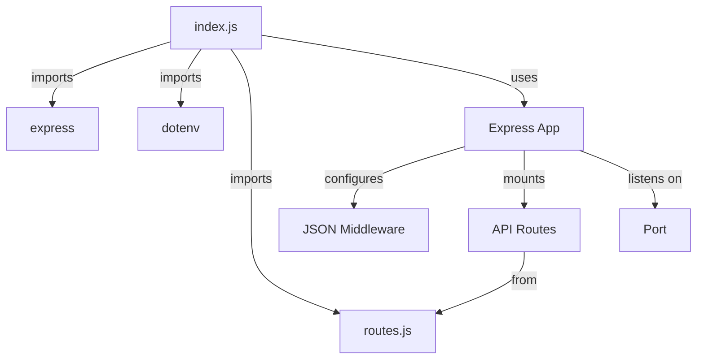
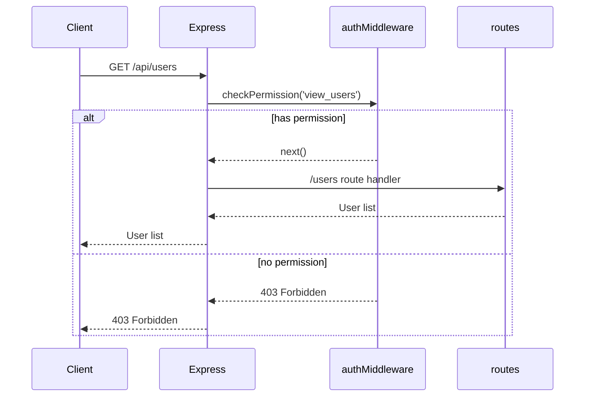
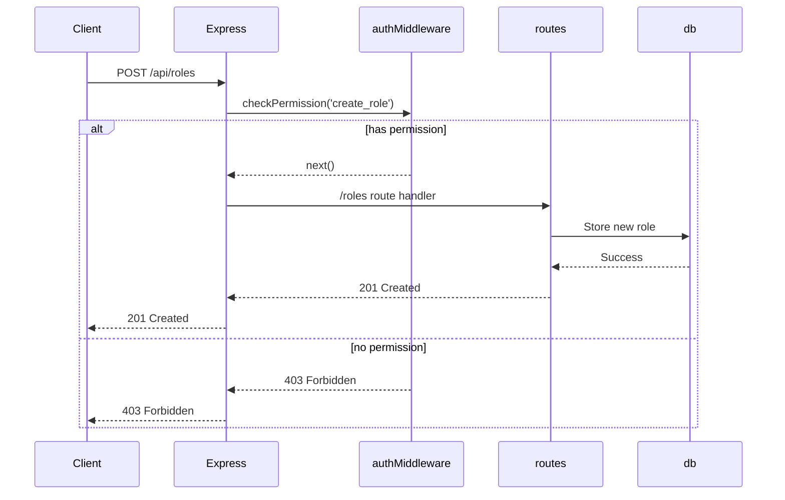
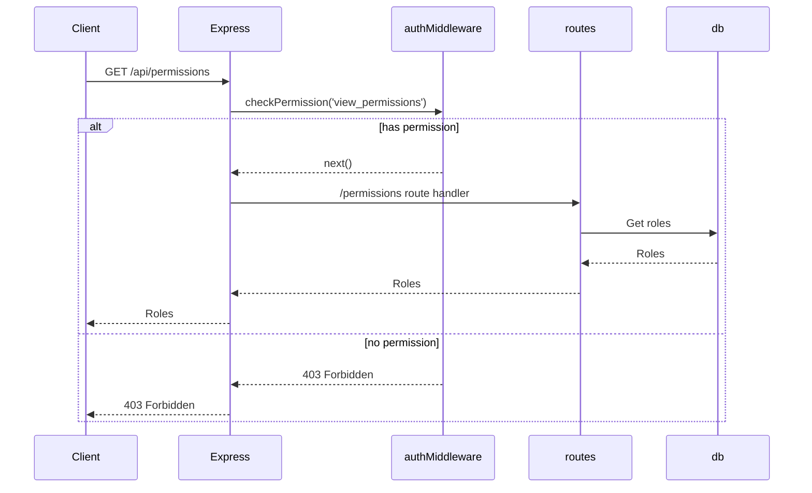
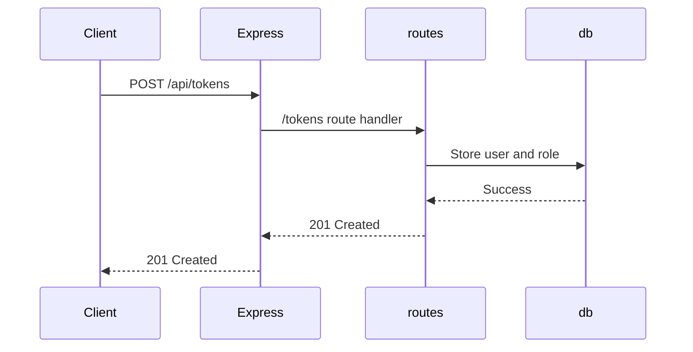
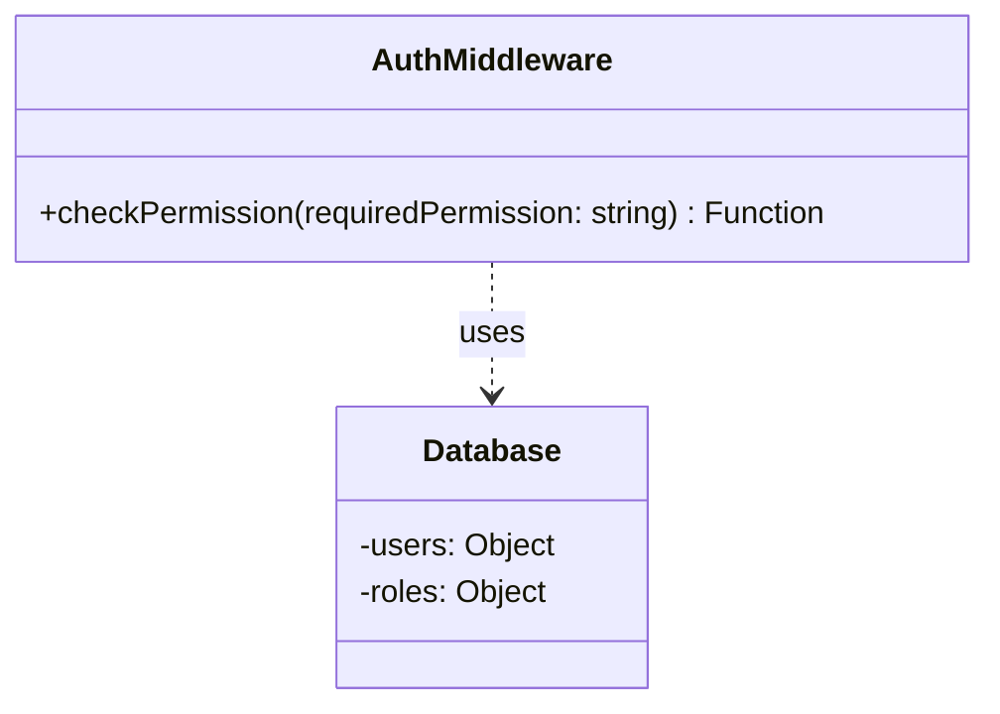
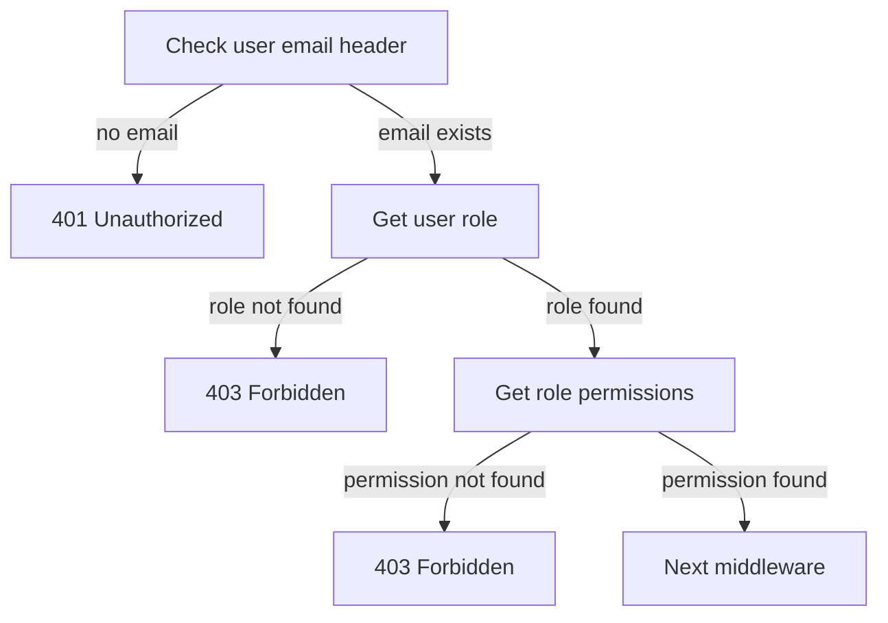

<details>
<summary>Relevant source files</summary>

The following files were used as context for generating this wiki page:

- [src/index.js](https://github.com/aanickode/access-control-service/blob/main/src/index.js)
- [src/routes.js](https://github.com/aanickode/access-control-service/blob/main/src/routes.js)
- [src/authMiddleware.js](https://github.com/aanickode/access-control-service/blob/main/src/authMiddleware.js)
- [src/db.js](https://github.com/aanickode/access-control-service/blob/main/src/db.js)

</details>

# System Architecture

## Introduction

This wiki page covers the system architecture of an Access Control Service, which is a critical component responsible for managing user authentication, authorization, and access control within the project. The service provides a set of APIs for retrieving user information, managing roles and permissions, and generating access tokens for authenticated users.

The Access Control Service follows a role-based access control (RBAC) model, where users are assigned roles, and roles are associated with specific permissions. This architecture ensures that only authorized users with the appropriate permissions can perform certain actions or access sensitive resources within the system.

Sources: [src/routes.js](), [src/authMiddleware.js]()

## Express.js Application

The Access Control Service is built using the Express.js framework, which provides a minimalistic and flexible web application server for Node.js. The main entry point of the application is the `index.js` file, which sets up the Express app, configures middleware, and defines the API routes.



Sources: [src/index.js]()

## API Routes

The API routes are defined in the `routes.js` file, which imports the necessary dependencies, including the `checkPermission` middleware function from `authMiddleware.js` and the in-memory database (`db.js`).

### User Management

The `/users` route retrieves a list of all registered users and their associated roles. This route is protected by the `checkPermission` middleware, which ensures that only users with the `view_users` permission can access this endpoint.



Sources: [src/routes.js:5-8]()

### Role Management

The `/roles` route allows creating a new role by providing a name and an array of associated permissions. This route is protected by the `checkPermission` middleware, which requires the `create_role` permission.



Sources: [src/routes.js:10-17]()

The `/permissions` route retrieves a list of all defined roles and their associated permissions. This route is protected by the `checkPermission` middleware, which requires the `view_permissions` permission.



Sources: [src/routes.js:19-22]()

### Token Generation

The `/tokens` route allows generating an access token for a user by providing the user's email and their associated role. This route is not protected by any middleware, as it is intended for initial user authentication and token generation.



Sources: [src/routes.js:24-30]()

## Authentication Middleware

The `authMiddleware.js` file exports a `checkPermission` function, which is used as a middleware to protect certain routes based on the user's permissions. This middleware checks the `x-user-email` header to identify the authenticated user and their associated role. It then verifies if the user's role has the required permission to access the requested resource.



The `checkPermission` middleware function follows this logic:



Sources: [src/authMiddleware.js]()

## In-Memory Database

The Access Control Service uses an in-memory database (`db.js`) to store user information, roles, and permissions. This database is a simple JavaScript object with two properties:

- `users`: An object that maps user emails to their associated roles.
- `roles`: An object that maps role names to an array of permitted actions.

```javascript
const db = {
  users: {
    'user1@example.com': 'admin',
    'user2@example.com': 'viewer',
    // ...
  },
  roles: {
    'admin': ['view_users', 'create_role', 'view_permissions'],
    'viewer': ['view_users'],
    // ...
  }
};
```

Sources: [src/db.js]()

## Summary

The Access Control Service provides a robust and secure system for managing user authentication, authorization, and access control within the project. It follows a role-based access control (RBAC) model, where users are assigned roles, and roles are associated with specific permissions. The service exposes a set of APIs for retrieving user information, managing roles and permissions, and generating access tokens for authenticated users. The architecture leverages the Express.js framework, middleware functions for authorization checks, and an in-memory database for storing user, role, and permission data.