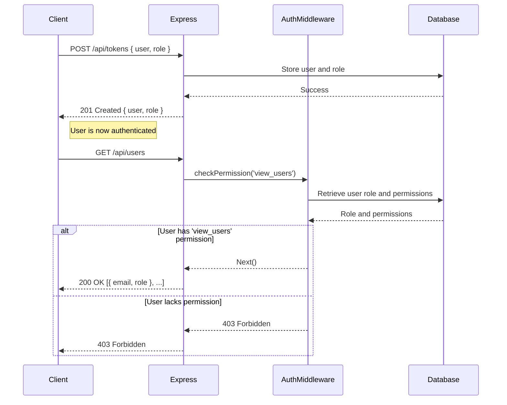
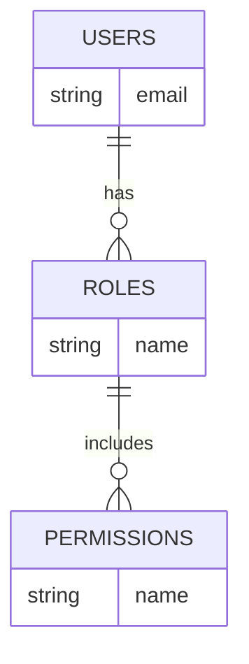

<details>
<summary>Relevant source files</summary>

The following files were used as context for generating this wiki page:

- [src/index.js](https://github.com/aanickode/access-control-service/blob/main/src/index.js)
- [src/routes.js](https://github.com/aanickode/access-control-service/blob/main/src/routes.js)
- [src/authMiddleware.js](https://github.com/aanickode/access-control-service/blob/main/src/authMiddleware.js)
- [src/db.js](https://github.com/aanickode/access-control-service/blob/main/src/db.js)

</details>

# System Architecture

## Introduction

The provided source files implement an Access Control Service, which is a component responsible for managing user roles, permissions, and authentication within a larger system or application. This service acts as a centralized authority for defining roles, assigning permissions to roles, and verifying user permissions before granting access to protected resources or functionalities.

The Access Control Service follows a role-based access control (RBAC) model, where permissions are grouped into roles, and users are assigned one or more roles based on their responsibilities and access requirements. This approach simplifies the management of permissions and allows for easier auditing and maintenance of access control policies.

Sources: [src/routes.js](), [src/authMiddleware.js]()

## Express.js Application Setup

The Access Control Service is built using the Express.js framework for Node.js. The main entry point is the `index.js` file, which sets up the Express application, configures middleware, and defines the API routes.

```javascript
import express from 'express';
import dotenv from 'dotenv';
import routes from './routes.js';

dotenv.config();

const app = express();
app.use(express.json());
app.use('/api', routes);

const port = process.env.PORT || 8080;

app.listen(port, () => {
  console.log(`Access Control Service listening on port ${port}`);
});
```

The application uses the `express.json()` middleware to parse incoming JSON request bodies. The `routes` module is imported and mounted at the `/api` path, handling all API endpoints for the Access Control Service.

Sources: [src/index.js]()

## API Routes and Endpoints

The Access Control Service exposes several API endpoints for managing users, roles, and permissions. These endpoints are defined in the `routes.js` file using the Express.js router.

### User Management

#### GET `/api/users`

This endpoint retrieves a list of all registered users and their assigned roles.

```javascript
router.get('/users', checkPermission('view_users'), (req, res) => {
  res.json(Object.entries(db.users).map(([email, role]) => ({ email, role })));
});
```

The `checkPermission` middleware is used to ensure that only users with the `view_users` permission can access this endpoint.

Sources: [src/routes.js:4-7]()

### Role Management

#### POST `/api/roles`

This endpoint allows creating a new role with a set of permissions.

```javascript
router.post('/roles', checkPermission('create_role'), (req, res) => {
  const { name, permissions } = req.body;
  if (!name || !Array.isArray(permissions)) {
    return res.status(400).json({ error: 'Invalid role definition' });
  }
  db.roles[name] = permissions;
  res.status(201).json({ role: name, permissions });
});
```

The `checkPermission` middleware is used to ensure that only users with the `create_role` permission can access this endpoint. The request body must contain a `name` and an array of `permissions` for the new role. If the role definition is invalid, a 400 Bad Request response is returned.

Sources: [src/routes.js:9-16]()

#### GET `/api/permissions`

This endpoint retrieves a list of all defined roles and their associated permissions.

```javascript
router.get('/permissions', checkPermission('view_permissions'), (req, res) => {
  res.json(db.roles);
});
```

The `checkPermission` middleware is used to ensure that only users with the `view_permissions` permission can access this endpoint.

Sources: [src/routes.js:18-21]()

### User Authentication

#### POST `/api/tokens`

This endpoint is used to authenticate a user and assign them a role.

```javascript
router.post('/tokens', (req, res) => {
  const { user, role } = req.body;
  if (!user || !role) {
    return res.status(400).json({ error: 'Missing user or role' });
  }
  db.users[user] = role;
  res.status(201).json({ user, role });
});
```

The request body must contain a `user` (e.g., email or username) and a `role` to assign to the user. If either the `user` or `role` is missing, a 400 Bad Request response is returned. Upon successful authentication, the user's role is stored in the `db.users` object, and a 201 Created response is returned with the assigned user and role.

Sources: [src/routes.js:23-30]()

## Authentication Middleware

The Access Control Service includes an authentication middleware (`authMiddleware.js`) responsible for verifying user permissions before allowing access to protected routes or resources.

```javascript
export function checkPermission(requiredPermission) {
  return function (req, res, next) {
    const userEmail = req.headers['x-user-email'];
    if (!userEmail || !db.users[userEmail]) {
      return res.status(401).json({ error: 'Unauthorized: no user context' });
    }

    const role = db.users[userEmail];
    const permissions = db.roles[role] || [];

    if (!permissions.includes(requiredPermission)) {
      return res.status(403).json({ error: 'Forbidden: insufficient permissions' });
    }

    next();
  };
}
```

The `checkPermission` function takes a `requiredPermission` as an argument and returns a middleware function. This middleware function checks if the user's email is present in the `x-user-email` header and if the user is registered in the `db.users` object. If the user is not authenticated or not found, a 401 Unauthorized response is returned.

If the user is authenticated, the middleware retrieves the user's role from the `db.users` object and the associated permissions from the `db.roles` object. If the required permission is not included in the user's permissions, a 403 Forbidden response is returned.

If the user has the required permission, the middleware calls the `next` function to proceed to the next middleware or route handler.

Sources: [src/authMiddleware.js]()

## Data Storage

The Access Control Service uses an in-memory data store (`db.js`) to store user information, roles, and permissions. This data store is a simple JavaScript object with two properties:

- `users`: An object that maps user emails to their assigned roles.
- `roles`: An object that maps role names to an array of associated permissions.

```javascript
const db = {
  users: {},
  roles: {}
};

export default db;
```

While this implementation is suitable for demonstration purposes, in a production environment, a more robust and persistent data storage solution (e.g., a database) would be recommended.

Sources: [src/db.js]()

## Sequence Diagram: User Authentication and Permission Verification

The following sequence diagram illustrates the flow of user authentication and permission verification when accessing a protected API endpoint:



1. The client sends a `POST /api/tokens` request with the user's credentials and desired role.
2. The Express server stores the user and assigned role in the in-memory database.
3. The server responds with a 201 Created status, indicating successful authentication.
4. The client, now authenticated, sends a `GET /api/users` request to retrieve the list of users and roles.
5. The Express server invokes the `checkPermission` middleware with the required `view_users` permission.
6. The middleware retrieves the user's role and associated permissions from the database.
7. If the user has the `view_users` permission, the middleware allows the request to proceed to the route handler.
8. The route handler retrieves the list of users and roles from the database and returns a 200 OK response with the data.
9. If the user lacks the required permission, the middleware returns a 403 Forbidden response.

Sources: [src/routes.js](), [src/authMiddleware.js]()

## Role-Based Access Control (RBAC) Model

The Access Control Service follows a role-based access control (RBAC) model, where permissions are grouped into roles, and users are assigned one or more roles based on their responsibilities and access requirements. This approach simplifies the management of permissions and allows for easier auditing and maintenance of access control policies.

The key components of the RBAC model in this implementation are:

- **Users**: Represented by a unique identifier (e.g., email or username).
- **Roles**: Named groups of permissions (e.g., `admin`, `manager`, `viewer`).
- **Permissions**: Granular access privileges (e.g., `view_users`, `create_role`, `delete_resource`).

The relationships between these components are illustrated in the following diagram:



In this model, users are assigned one or more roles, and each role includes a set of permissions. When a user attempts to access a protected resource or functionality, the Access Control Service checks if the user's assigned role(s) include the required permission(s) for that operation.

Sources: [src/routes.js](), [src/authMiddleware.js](), [src/db.js]()

## Conclusion

The Access Control Service provides a centralized solution for managing user roles, permissions, and authentication within a larger system or application. By following a role-based access control (RBAC) model, it simplifies the management of access control policies and allows for granular control over user permissions.

The service exposes several API endpoints for managing users, roles, and permissions, as well as authenticating users and verifying their permissions before granting access to protected resources. The authentication middleware plays a crucial role in enforcing access control rules and ensuring that only authorized users with the required permissions can access sensitive functionality.

While the current implementation uses an in-memory data store for simplicity, in a production environment, a more robust and persistent data storage solution (e.g., a database) would be recommended to ensure data integrity and scalability.

Overall, the Access Control Service provides a solid foundation for implementing secure and granular access control mechanisms within a larger application or system.