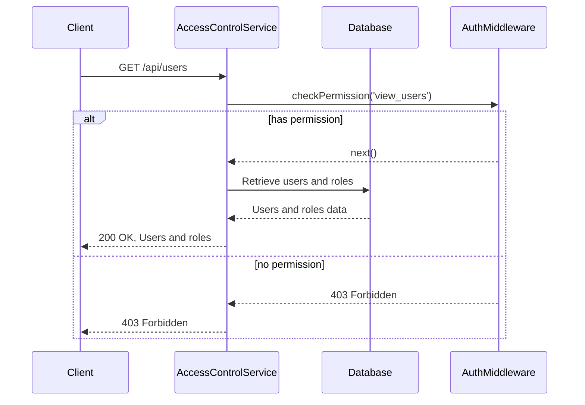
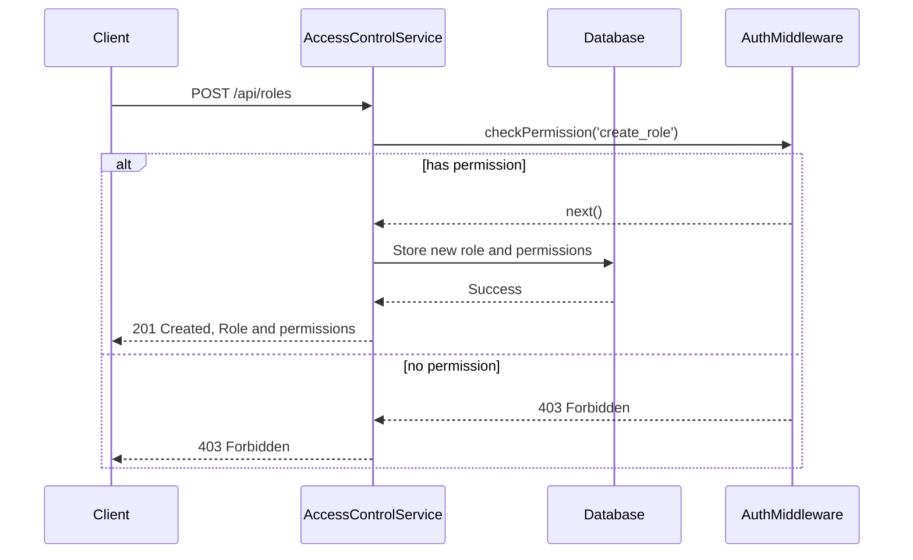
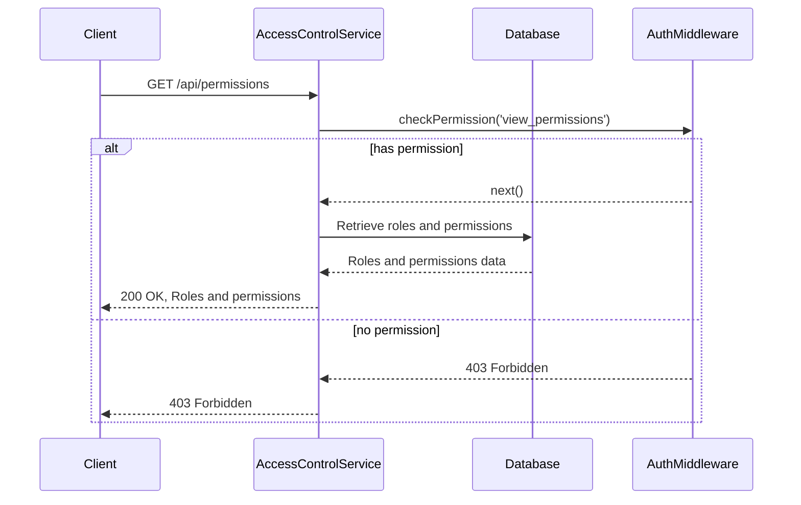
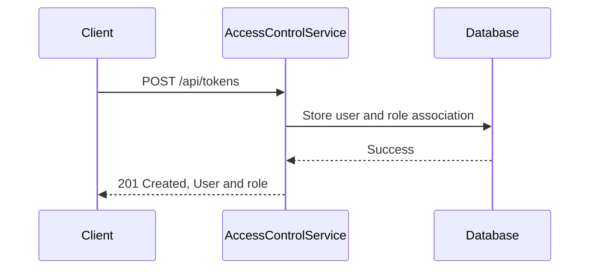
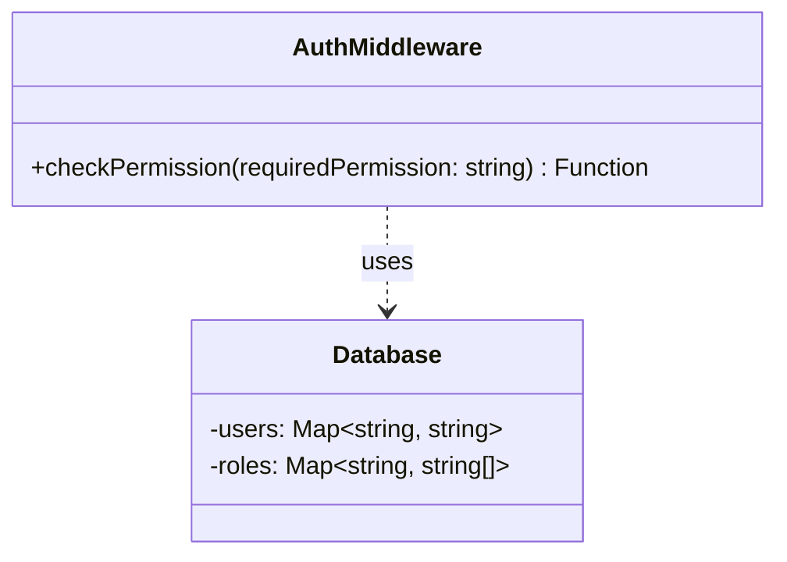

<details>
<summary>Relevant source files</summary>

The following files were used as context for generating this wiki page:

- [src/index.js](https://github.com/aanickode/access-control-service/blob/main/src/index.js)
- [src/routes.js](https://github.com/aanickode/access-control-service/blob/main/src/routes.js)
- [src/authMiddleware.js](https://github.com/aanickode/access-control-service/blob/main/src/authMiddleware.js)
- [src/db.js](https://github.com/aanickode/access-control-service/blob/main/src/db.js)

</details>

# System Architecture

## Introduction

The provided source files implement an Access Control Service, which is a component responsible for managing user roles, permissions, and authentication within a larger system or application. This service exposes a set of API endpoints that allow other parts of the application to perform operations related to user management, role creation, and permission checking.

The Access Control Service follows a simple architecture built on top of the Express.js framework for Node.js. It consists of an `index.js` file that sets up the Express application, a `routes.js` file that defines the API routes and their corresponding handlers, an `authMiddleware.js` file containing a middleware function for permission checking, and a `db.js` file that serves as an in-memory data store for users, roles, and permissions.

Sources: [src/index.js](), [src/routes.js](), [src/authMiddleware.js](), [src/db.js]()

## API Routes and Handlers

The Access Control Service exposes the following API routes:

### GET `/api/users`

This route retrieves a list of all registered users and their associated roles.



Sources: [src/routes.js:4-7]()

### POST `/api/roles`

This route creates a new role with a specified set of permissions.



Sources: [src/routes.js:8-14]()

### GET `/api/permissions`

This route retrieves a list of all defined roles and their associated permissions.



Sources: [src/routes.js:15-18]()

### POST `/api/tokens`

This route associates a user with a specific role.



Sources: [src/routes.js:19-25]()

## Authentication and Authorization

The Access Control Service uses a middleware function `checkPermission` to enforce authorization based on user roles and required permissions for each API route.



The `checkPermission` middleware function performs the following steps:

1. Retrieves the user's email from the `x-user-email` header in the request.
2. Looks up the user's role in the `users` map in the database.
3. Retrieves the permissions associated with the user's role from the `roles` map in the database.
4. Checks if the required permission is present in the user's permissions.
5. If the user has the required permission, the request is allowed to proceed to the next middleware or route handler.
6. If the user does not have the required permission, a `403 Forbidden` response is sent.

Sources: [src/authMiddleware.js]()

## Data Storage

The Access Control Service uses an in-memory data store implemented in the `db.js` file to store user, role, and permission data. This data store is a simple JavaScript object with two properties:

- `users`: A map that associates user emails with their respective roles.
- `roles`: A map that associates role names with their respective sets of permissions.

```javascript
const db = {
  users: {
    'user1@example.com': 'admin',
    'user2@example.com': 'viewer',
    // ...
  },
  roles: {
    'admin': ['view_users', 'create_role', 'view_permissions'],
    'viewer': ['view_users', 'view_permissions'],
    // ...
  }
};
```

In a production environment, this data store would likely be replaced with a more robust and persistent storage solution, such as a relational database or a NoSQL database.

Sources: [src/db.js]()

## Conclusion

The Access Control Service provides a simple yet effective way to manage user roles, permissions, and authentication within a larger application. It follows a straightforward architecture built on top of the Express.js framework and leverages middleware functions for authorization checks. The service exposes a set of API routes that allow other components of the application to perform user management, role creation, and permission checking operations.

While the current implementation uses an in-memory data store for simplicity, in a production environment, it would be necessary to integrate a more robust and persistent storage solution to ensure data durability and scalability.