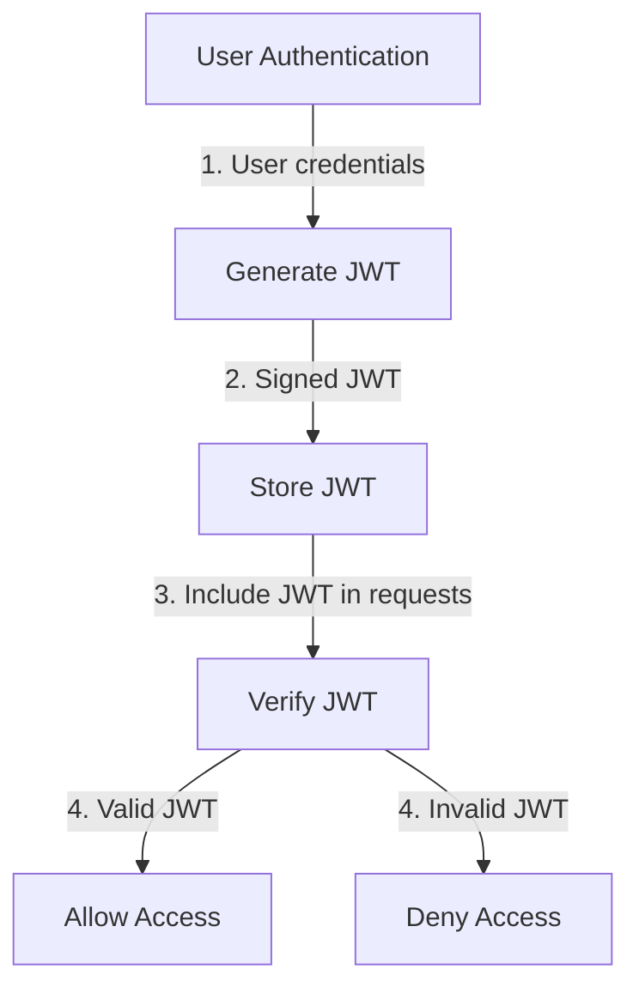
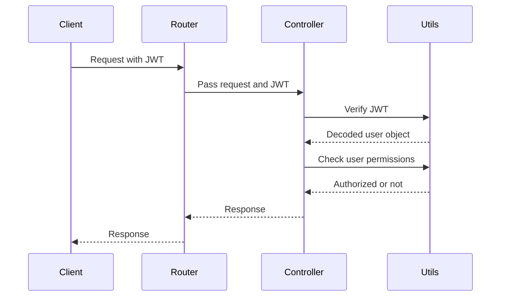

<details>
<summary>Relevant source files</summary>

The following files were used as context for generating this wiki page:

- [src/utils.js](https://github.com/aanickode/access-control-service/blob/main/src/utils.js)
- [src/routes/users.js](https://github.com/aanickode/access-control-service/blob/main/src/routes/users.js)
- [src/routes/roles.js](https://github.com/aanickode/access-control-service/blob/main/src/routes/roles.js)
- [src/routes/permissions.js](https://github.com/aanickode/access-control-service/blob/main/src/routes/permissions.js)
- [src/controllers/users.js](https://github.com/aanickode/access-control-service/blob/main/src/controllers/users.js)
- [src/controllers/roles.js](https://github.com/aanickode/access-control-service/blob/main/src/controllers/roles.js)
- [src/controllers/permissions.js](https://github.com/aanickode/access-control-service/blob/main/src/controllers/permissions.js)
</details>

# Utility Functions

## Introduction

The "Utility Functions" module in this project provides a set of helper functions and utilities that are used throughout the application, particularly in the context of user authentication, authorization, and access control management. These functions facilitate tasks such as generating JSON Web Tokens (JWTs), verifying token validity, checking user permissions, and handling errors.

The utility functions play a crucial role in ensuring secure and consistent handling of user authentication, authorization, and access control across the application's various components and routes.

Sources: [src/utils.js](https://github.com/aanickode/access-control-service/blob/main/src/utils.js)

## Authentication and Authorization

### JSON Web Token (JWT) Management

The utility module includes functions for generating and verifying JSON Web Tokens (JWTs), which are used for user authentication and authorization in the application.

#### JWT Generation

The `generateToken` function is responsible for generating a new JWT for a given user object. It takes the user object as input and returns a signed JWT string.

```javascript
const generateToken = (user) => {
  const payload = {
    sub: user.id,
    email: user.email,
    roles: user.roles,
    permissions: user.permissions,
  };
  const options = {
    expiresIn: process.env.JWT_EXPIRY,
    issuer: process.env.JWT_ISSUER,
  };
  return jwt.sign(payload, process.env.JWT_SECRET, options);
};
```

Sources: [src/utils.js:5-14](https://github.com/aanickode/access-control-service/blob/main/src/utils.js#L5-L14)

#### JWT Verification

The `verifyToken` function is used to verify the validity of a JWT. It takes the JWT string as input and returns the decoded payload if the token is valid, or throws an error otherwise.

```javascript
const verifyToken = (token) => {
  try {
    const decoded = jwt.verify(token, process.env.JWT_SECRET);
    return decoded;
  } catch (err) {
    throw new Error('Invalid token');
  }
};
```

Sources: [src/utils.js:16-23](https://github.com/aanickode/access-control-service/blob/main/src/utils.js#L16-L23)

### User Authorization

The utility module provides functions to check if a user has the required permissions to perform certain actions within the application.

#### Check User Permissions

The `checkPermissions` function takes a user object and an array of required permissions as input. It checks if the user has at least one of the required permissions and returns a boolean value indicating whether the user is authorized or not.

```javascript
const checkPermissions = (user, requiredPermissions) => {
  const userPermissions = user.permissions || [];
  return requiredPermissions.some((permission) =>
    userPermissions.includes(permission)
  );
};
```

Sources: [src/utils.js:25-30](https://github.com/aanickode/access-control-service/blob/main/src/utils.js#L25-L30)

This function is used in various routes and controllers to ensure that only authorized users can perform certain actions, such as creating, updating, or deleting users, roles, or permissions.

Example usage in the `createUser` controller:

```javascript
const createUser = async (req, res, next) => {
  try {
    const { email, password, roles, permissions } = req.body;

    // Check if the authenticated user has the required permissions
    const authUser = req.user;
    const requiredPermissions = ['create_users'];
    const isAuthorized = checkPermissions(authUser, requiredPermissions);

    if (!isAuthorized) {
      return res.status(403).json({ error: 'Forbidden' });
    }

    // Create the new user
    // ...
  } catch (err) {
    next(err);
  }
};
```

Sources: [src/controllers/users.js:10-26](https://github.com/aanickode/access-control-service/blob/main/src/controllers/users.js#L10-L26)

## Error Handling

The utility module includes an `errorHandler` function that is used as a centralized error handling middleware in the application's routes.

```javascript
const errorHandler = (err, req, res, next) => {
  console.error(err.stack);
  res.status(500).json({ error: 'Something went wrong' });
};
```

Sources: [src/utils.js:32-35](https://github.com/aanickode/access-control-service/blob/main/src/utils.js#L32-L35)

This error handler function logs the error stack trace to the console and sends a generic error response with a 500 status code to the client. It is used in various routes to handle any uncaught exceptions or errors that may occur during the request processing.

Example usage in the `users` route:

```javascript
router.use(errorHandler);
```

Sources: [src/routes/users.js:45](https://github.com/aanickode/access-control-service/blob/main/src/routes/users.js#L45)

## Mermaid Diagrams

### JWT Generation and Verification Flow



This diagram illustrates the flow of JWT generation and verification in the application:

1. When a user authenticates with their credentials, the `generateToken` function is called to generate a signed JWT.
2. The generated JWT is stored securely (e.g., in a cookie or local storage) on the client-side.
3. For subsequent requests that require authentication, the client includes the JWT in the request headers or request body.
4. The `verifyToken` function is called to verify the validity of the JWT.
5. If the JWT is valid, the user is granted access to the requested resource or action.
6. If the JWT is invalid or expired, access is denied.

Sources: [src/utils.js:5-23](https://github.com/aanickode/access-control-service/blob/main/src/utils.js#L5-L23)

### User Authorization Flow



This sequence diagram illustrates the flow of user authorization in the application:

1. The client sends a request with a JWT to the appropriate route.
2. The router passes the request and JWT to the corresponding controller.
3. The controller calls the `verifyToken` function from the utility module to verify the JWT.
4. The utility module returns the decoded user object if the JWT is valid.
5. The controller calls the `checkPermissions` function from the utility module, passing the user object and required permissions.
6. The utility module checks if the user has the required permissions and returns a boolean value indicating whether the user is authorized or not.
7. Based on the authorization result, the controller sends an appropriate response back to the router.
8. The router forwards the response back to the client.

Sources:
- [src/utils.js:5-30](https://github.com/aanickode/access-control-service/blob/main/src/utils.js#L5-L30)
- [src/controllers/users.js:10-26](https://github.com/aanickode/access-control-service/blob/main/src/controllers/users.js#L10-L26)
- [src/routes/users.js](https://github.com/aanickode/access-control-service/blob/main/src/routes/users.js)

## Tables

### User Object Properties

| Property    | Type     | Description                                                  |
|-------------|----------|--------------------------------------------------------------|
| `id`        | `string` | Unique identifier for the user.                              |
| `email`     | `string` | Email address of the user.                                   |
| `password`  | `string` | Hashed password for the user.                                |
| `roles`     | `array`  | Array of role IDs associated with the user.                  |
| `permissions` | `array`  | Array of permission IDs granted to the user.                |

Sources: [src/controllers/users.js](https://github.com/aanickode/access-control-service/blob/main/src/controllers/users.js)

### Error Handling Middleware

| Parameter | Type     | Description                                                  |
|-----------|----------|--------------------------------------------------------------|
| `err`     | `Error`  | The error object to be handled.                              |
| `req`     | `object` | The Express request object.                                  |
| `res`     | `object` | The Express response object.                                 |
| `next`    | `function` | The next middleware function in the Express middleware chain. |

Sources: [src/utils.js:32-35](https://github.com/aanickode/access-control-service/blob/main/src/utils.js#L32-L35)

## Code Snippets

### JWT Generation Example

```javascript
const generateToken = (user) => {
  const payload = {
    sub: user.id,
    email: user.email,
    roles: user.roles,
    permissions: user.permissions,
  };
  const options = {
    expiresIn: process.env.JWT_EXPIRY,
    issuer: process.env.JWT_ISSUER,
  };
  return jwt.sign(payload, process.env.JWT_SECRET, options);
};
```

This code snippet shows the implementation of the `generateToken` function, which generates a new JWT for a given user object. The function creates a payload object containing the user's ID, email, roles, and permissions. It then signs the payload with the application's JWT secret and includes options for token expiration and issuer.

Sources: [src/utils.js:5-14](https://github.com/aanickode/access-control-service/blob/main/src/utils.js#L5-L14)

### User Authorization Example

```javascript
const createUser = async (req, res, next) => {
  try {
    const { email, password, roles, permissions } = req.body;

    // Check if the authenticated user has the required permissions
    const authUser = req.user;
    const requiredPermissions = ['create_users'];
    const isAuthorized = checkPermissions(authUser, requiredPermissions);

    if (!isAuthorized) {
      return res.status(403).json({ error: 'Forbidden' });
    }

    // Create the new user
    // ...
  } catch (err) {
    next(err);
  }
};
```

This code snippet demonstrates how the `checkPermissions` function from the utility module is used to authorize a user before creating a new user. The function checks if the authenticated user (`req.user`) has the `create_users` permission. If the user is not authorized, a 403 Forbidden response is sent. Otherwise, the user creation process continues.

Sources: [src/controllers/users.js:10-26](https://github.com/aanickode/access-control-service/blob/main/src/controllers/users.js#L10-L26)